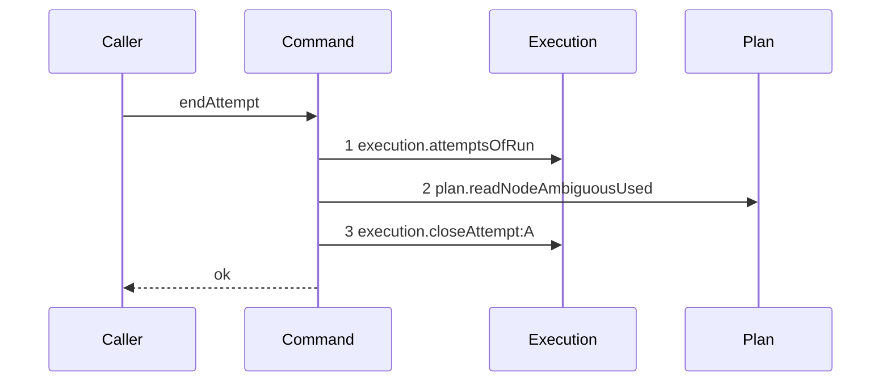

# Story 3 — A settlement over a closed attempt writes nothing

Epic: `.agents/plan/epics/054.1-the-end-attempt-command.md`
Depends on: Story 1 (`01-a-semantic-ending-and-an-accepted-one`), for the command and its close;
Story 2 (`02-an-ambiguous-ending-increments-the-counter`), for the charge the no-op must skip;
EPIC 054 Story 3 (`03-the-close-writes-the-termination`), amended so the close answers `null` over an
already-closed attempt.
Kind: story-implement

Diagrams: end-attempt-settled

Seams: end-attempt-settled: +execution.attemptsOfRun, +plan.readNodeAmbiguousUsed, +execution.closeAttempt:A

This story reads the close's `null` and returns. It leaves the proposal to Story 4
(`04-the-proposal-records-the-command`), and it calls the command from no product path.

**A no-op settlement is not a refusal, and the terminal says so.** The earlier termination stands, no
second `attempt.ended` is appended, and the command reports the settlement as already settled. The
caller's own refusal is unchanged, because the client's request is refused either way. A late write
would otherwise replace an `infrastructure` or `ambiguous` termination with a `semantic` one and move
the attempt limit for an ending it did not cause.

**It depends on one amendment to another epic, it does not apply that amendment, and the target text
currently forbids it.** `src/services/execution/sqlite.ts:305` — `row === undefined` throws
`ExecutionError("attempt-not-open", …)` today, so the zero-row result reaches no caller as a value.
EPIC 054 Story 3 (`03-the-close-writes-the-termination`) states the opposite of what this epic needs
at
`.agents/plan/stories/054-attempt-classification-and-the-supervisor/03-the-close-writes-the-termination.md:118`
— `The zero-row path does not change`, and again in its constraint at
`.agents/plan/stories/054-attempt-classification-and-the-supervisor/03-the-close-writes-the-termination.md:152`
— `ExecutionErrorCode`, and its case 4 at
`.agents/plan/stories/054-attempt-classification-and-the-supervisor/03-the-close-writes-the-termination.md:198`
— `"attempt-not-open"` asserts the throw. Two plan documents therefore disagree, and the report of
this epic raises it as a blocker. **The amendment is recorded in `index.md` and a human applies it
before dispatch.** This story draws the trace the amendment produces and edits
`src/services/execution/sqlite.ts` and `src/services/execution/index.ts` not at all.

**The amendment, stated once so the human can apply it in one edit.** EPIC 054 Story 3 declares
`closeAttempt(transaction, input): AttemptRecord | null` and returns `null` where it now throws, and
repairs the five shipped callers that assume a record:
`src/commands/node/release-node.ts:124` — `closeAttempt`,
`src/commands/node/release-node.ts:166` — `closeAttempt`,
`src/commands/node/release-node.ts:262` — `closeAttempt`,
`src/commands/startup/recover-expired-leases.ts:113` — `closeAttempt` and
`src/commands/startup/recover-expired-leases.ts:196` — `closeAttempt`. Each of those five already
skips a settled attempt before it calls — `src/commands/node/release-node.ts:260` — `continue` and
`src/commands/startup/recover-expired-leases.ts:111` — `continue` — so a `null` there is an invariant
breach and each throws a bare `Error` on it. `"attempt-not-open"` stays in
`src/services/execution/index.ts:83` — `attempt-not-open` for now, because removing a code is EPIC
057's slice and no other epic reads it.

## The path

### `end-attempt-settled`

Fixture: Story 1's fixture with one change — `attempt_a` is already closed, with `outcome` of
`"cancelled"`, `termination` of `"infrastructure"` and `ended_at` of `1700000002000`, as another
operation left it. The input is Story 1's semantic input unchanged, so the command is asked to store
`"semantic"` over a row that is no longer open. The alias table maps `attempt_a` to `A`.



**The absent `events.append` token is what proves the no-op at the seam.** The diagram states three
steps and one terminal, so any fourth call the implementation makes fails
`test/helpers/sequence-conformance.ts:318` — `assertConformance` by equality. A command that appended
a second `attempt.ended` and returned the same result would pass every value assertion of this story
and fail this diagram.

**The absent `plan.incrementNodeAmbiguousUsed` token proves the charge is skipped too.** Story 2
charges between the close and the append, and this path never reaches that statement, so a settlement
over a closed attempt cannot move the node's budget.

**No `Events` participant is declared.** `test/helpers/sequence-conformance.ts:195` — `allowed` admits
a participant only from the recorded dependency keys, and a declared participant with no step would
state a call the recorder never saw. The scenario still passes `events` to the recorder, so a stray
append records a token and fails the comparison.

**Steps 1 and 2 still run, and that is the epic's read order and not an accident.** The counter is
read on every path because the payload carries it, and the command cannot know the close will answer
`null` until it calls the close. Reading the counter on a path that publishes nothing is the cost of
having exactly one settlement guard.

**The command does not branch on `subject.outcome`, and the diagram is what forbids it.** Reading the
row's `outcome` at step 1 and returning before step 3 would draw two steps, not three. The close is
the settlement guard, and no read stands in for it:
`src/services/execution/sqlite.ts:294` — `UPDATE attempt SET outcome` carries
`WHERE id = ? AND outcome IS NULL` and `RETURNING`, so the decision and the write are one statement.

**The terminal is `ok`.** `test/helpers/sequence-conformance.ts:303` — `resultTerminal` reads `ok`
from any object that is not an `Error` and does not carry `ok: false`, and
`{ settlement: "already-settled" }` carries neither key. A `refuse:` terminal would state that this
command refuses, and it does not.

**Its prior set is empty, so all three tokens are `+` and this story declares no `Baselines:` line.**

Add `test/sequence/scenarios/end-attempt-settled.ts`.

## Change

**Edit `src/commands/attempt/end-attempt.ts` — return the already-settled result when the close
answers `null`.** The boundary is one guard immediately after the close, before the charge Story 2
added.

### 1 — the guard

Insert immediately below the close statement, above the charge:

```ts
if (closed === null) {
  return { settlement: "already-settled" };
}
```

**It sits above the charge and above the append**, so neither runs. It is the one statement that
consumes the `null`, and after it `closed` narrows to `AttemptRecord` for the rest of the command,
which is what removes the type error Story 1 left.

**The result arm carries no accounting.** The command computed no snapshot for this path and the
earlier termination is the record, so a caller that needs the values reads the earlier
`attempt.ended` event. Returning a projected snapshot here would publish a count for an ending that
never happened.

### 2 — no catch, and no re-read

**Write no `try`/`catch` around the close.** The `null` is a value, and an `ExecutionError` escaping
this command still states a real breach.

**Write no second read of the attempt row.** Step 1 already read it, and branching on its `outcome`
would take the decision from the statement that makes it.

## Constraints

- The already-settled arm reaches no write seam and no event. The diagram proves no write seam is
  reached after step 3; case 1's byte-identical comparison proves the operation wrote nothing, and
  both are required.
- The guard precedes `plan.incrementNodeAmbiguousUsed`. A charge before it would move the node's
  budget for an ending another operation settled.
- Do not change `src/services/execution/sqlite.ts` or `src/services/execution/index.ts`. The close's
  signature is EPIC 054 Story 3's amendment, and case 5 is this epic's control that it landed.
- `EndAttemptResult` keeps `settlement` as its discriminant and carries no `ok` key and no `refusal`
  key, or the terminal derivation reads a refusal.

## Verify

```
node --test src/commands/attempt/end-attempt.test.ts src/services/execution/sqlite.test.ts test/sequence/conformance.test.ts
```

Extend `src/commands/attempt/end-attempt.test.ts`, reusing Story 1's fixture builder. Snapshot with
`test/helpers/database.ts:117` — `databaseBytes` before the call and compare with `Buffer.compare`,
and read the attempt row back with a raw `SELECT` inside `fixture.storage.transact`.

Add, each as a separate `it`:

1. `"a settlement over an already closed attempt writes nothing and appends nothing"` — the diagram's
   fixture. Assert the returned result deep-equals `{ settlement: "already-settled" }`. Assert the
   attempt row deep-equals the pre-call row by value, with `outcome` of `"cancelled"`, `termination`
   of `"infrastructure"` and `ended_at` of `1700000002000`, so the earlier termination is
   byte-identical. Assert `SELECT COUNT(*) FROM event WHERE type = 'attempt.ended'` is `0`. Assert
   `databaseBytes` is byte-identical to the pre-call snapshot under `Buffer.compare`. This is the
   epic's gate row 10.

2. `"the control: the same case with the attempt still open writes both"` — the identical fixture with
   `attempt_a` open. Assert the returned result's `settlement` is `"ended"`, that the row's
   `termination` is `"semantic"`, that one `attempt.ended` row exists, and that `databaseBytes`
   differs from the pre-call snapshot. Without it case 1 passes for a command that writes nothing on
   any path. This is the epic's gate row 10 control.

3. `"a settlement over a closed attempt charges no ambiguous budget"` — the diagram's fixture with
   `evidence: { kind: "run-expired" }`, which Story 2 charges, and `ambiguous_used` seeded to `1`.
   Assert `SELECT ambiguous_used FROM node WHERE id = 'task_a'` reads `1` afterwards and the result
   is `{ settlement: "already-settled" }`. The control is Story 2's case 1, which charges.

4. `"an accepted settlement over a closed attempt writes nothing"` — the diagram's fixture with
   `{ outcome: "accepted", headOid: "c".repeat(40) }`. Assert the result is
   `{ settlement: "already-settled" }`, that `head_oid` on the row is still `null`, and that
   `databaseBytes` is byte-identical. The accepted arm shares the guard, so a per-arm guard would
   fail here.

5. `"closeAttempt answers null over an already closed attempt and does not throw"` — extend
   `src/services/execution/sqlite.test.ts`. Close an attempt with
   `{ outcome: "failed", at: AT, termination: "infrastructure" }`, then close it again with
   `{ outcome: "cancelled", at: AT + 1, termination: "semantic" }` and assert the second call returns
   `null` by value rather than throwing. Assert in the same `it` that the stored `outcome`,
   `termination` and `ended_at` are byte-identical to the first close's. The second close names a
   different outcome and a different termination, so a statement that lost its `outcome IS NULL` guard
   fails on the stored values and not only on the return. This is this epic's control that EPIC 054
   Story 3's amendment landed, and the mechanism the whole diagram rests on. **It replaces that
   story's case 4**, which asserts the throw; a human applies the amendment and that story's case
   changes with it.

Add `test/sequence/scenarios/end-attempt-settled.ts`, building the fixture the diagram names with
`attempt_a` already closed, running the real `endAttempt` directly over real SQLite behind the
recorder, passing `{ execution, plan, events }` to
`test/helpers/sequence-conformance.ts:99` — `recordSeams` with the alias `{ attempt_a: "A" }` even
though no `Events` step is drawn, so a stray append records a token and fails the comparison, passing
`ambiguousBudget` and `instanceId` outside the recorder, opening the transaction with
`fixture.storage.transact`, and returning the recorder and the result.

`pnpm run verify` exits 0.

Proof: PASS line delivered — `src/commands/attempt/end-attempt.test.ts` and
`src/services/execution/sqlite.test.ts` in `PASS EPIC-054.1`.
