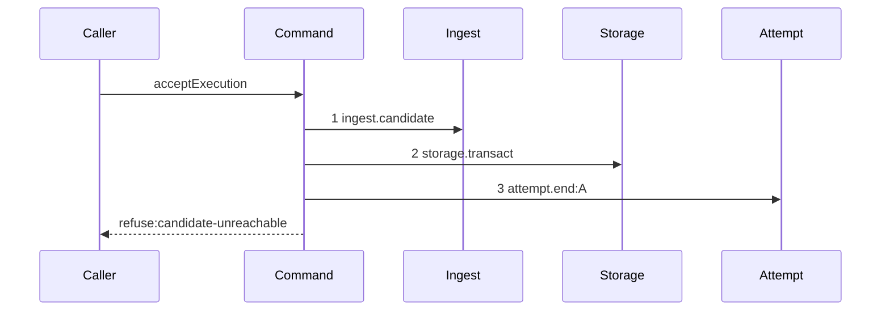

# Story 1 — The unreachable candidate pays its attempt

Epic: `.agents/plan/epics/054.2-the-execution-accept-pays-its-attempt.md`
Depends on: EPIC 054.1 Story 1 (`01-a-semantic-ending-and-an-accepted-one`), for `endAttempt`,
`EndAttemptDependencies`, `EndAttemptInput` and `EndAttemptResult`; EPIC 054, for the
`daemon-rejected` evidence value and `TerminationEvidence`; EPIC 051.4 Story 1
(`01-the-gate-refuses-an-unreachable-candidate`), for `acceptExecution`, its refusal union and the
diagram this one supersedes; EPIC 051.6 Story 3
(`03-the-report-reaps-on-every-settled-terminal`), for the capture-reap-raise block this story edits.
Kind: story-implement

Diagrams: report-refusal-candidate-unreachable-settled

Supersedes: EPIC 051.4 report-refusal-candidate-unreachable

Seams: report-refusal-candidate-unreachable-settled: +storage.transact, +attempt.end:A

This story opens the boundary every later story of the epic writes through: the two dependency keys,
the returned rejection, the recorder projection and the first settlement. Stories 2 to 5 add one
settlement each and change nothing else.

**It registers the epic as authored.** Insert `"054.2"` into `scripts/epic-sequence-range.ts:1` —
`authoredEpics` after `"054.1"`, and into the pinned literal at
`test/sequence/conformance.test.ts:275` — `authoredEpics.slice` reads. **Verify that `"054.1"` is the
last entry before inserting.** Story 8 (`08-the-ceiling-the-order-and-the-proposal`) appends
`"054.2"` to `shippedEpics`, and it is last in dispatch order.

## The path

`acceptExecution` is drawn by EPIC 051.4, so this diagram has that diagram as its prior set. It draws
no `baseline-` diagram, and it declares `Supersedes:` where a first change declares `Baselines:`.
`.agents/plan/authoring.md:252` — `The two lines never appear together` states it.

### `report-refusal-candidate-unreachable-settled`

Supersedes: EPIC 051.4 report-refusal-candidate-unreachable

Fixture: the fixture of `report-refusal-candidate-unreachable` — run `R` on task `T`, one open
attempt `A`, and **no** ref at `refs/kanthord/candidate/<runId>/<attemptNo>` in the loopback bare
home; the report names an oid. Nothing about it changes:
`.agents/plan/epics/054.2-the-execution-accept-pays-its-attempt.md:52` — `Every superseded diagram keeps its fixture`
states why — the gate's git-dependent checks run outside every transaction, exactly as they do today.



**Step 1 is unchanged, and steps 2 and 3 are the whole insertion.** The gate step still runs first and
still refuses, and the settlement follows the refusal decision rather than preceding it.

**This path reaches no `candidate.discard` at this seam, on either inner branch, and the absence is
the assertion.** `.agents/plan/epics/051.4-the-acceptance-gate-and-the-report-route.md:28` —
`candidate.discard` states the missing-ref branch performs none, because the ref never existed. **The
second inner branch — a ref that exists and does not reach the reported oid — discards inside
`ingest.candidate`**, which
`.agents/plan/stories/051.4-the-acceptance-gate-and-the-report-route/01-the-gate-refuses-an-unreachable-candidate.md:39`
— `ingest-candidate-unreachable` draws as that nested unit's own step. Neither branch reaches an outer
discard, which is why one diagram covers both. The attempt is still paid on both, because the
rejection is the daemon's own verdict on the report. Cases 3 and 3a carry the two branches.

**Step 2 is the only transaction this command opens on a rejection arm, and there is no third.**
`.agents/plan/epics/051.4-the-acceptance-gate-and-the-report-route.md:36` — `acceptExecution` gives
the command two spans on an acceptance, both inside `land.begin` and `land.settle`. This path reaches
neither, so its count is one. Story 8 asserts the per-arm count.

**Step 3 is one step, because a nested command is one step.** The scenario binds `endAttempt` to
unrecorded dependencies, so the two reads, the close and the `attempt.ended` append inside it produce
no token here. Each is drawn by EPIC 054.1.

**The terminal is unchanged, and the returned rejection is what keeps it.**
`test/helpers/sequence-conformance.ts:310` — `value.ok === false` derives `refuse:<code>` from a
returned object as well as from a thrown error, so the disposition of change step 2 leaves this
diagram's terminal at `refuse:candidate-unreachable`.

**The drawn set is every branch of this path.** `ingest.candidate` refuses `candidate-unreachable` on
two inner paths — a missing ref and a ref that does not reach the reported oid — and both produce the
same outer tokens at the same positions, so one outer diagram covers both, exactly as EPIC 051.4
Story 1 (`01-the-gate-refuses-an-unreachable-candidate`) states.

Add `test/sequence/scenarios/report-refusal-candidate-unreachable-settled.ts`.

## Change

**Edit `src/commands/checkpoint/accept-execution.ts` to hold a transaction, a settlement and a
returned rejection.**

### 1 — the two dependency keys

`AcceptExecutionDependencies` at
`.agents/plan/stories/051.4-the-acceptance-gate-and-the-report-route/01-the-gate-refuses-an-unreachable-candidate.md:56`
— `AcceptExecutionDependencies` holds five keys. It gains two:

```ts
export type AcceptExecutionDependencies = Readonly<{
  git: Git;
  ingest: Ingest;
  candidate: Candidate;
  commands: Commands;
  land: Land;
  storage: Storage;
  attempt: Readonly<{
    end(transaction: Transaction, input: EndAttemptInput): EndAttemptResult;
  }>;
}>;
```

**The key is `attempt` and the method is `end`, so the diagram token is `attempt.end`.** A diagram
step is `<key>.<method>`, and the epic's bare `endAttempt` is not a token. It follows
`accept.execution` of
`.agents/plan/stories/051.4-the-acceptance-gate-and-the-report-route/index.md:221` — `The nested command's seam key`,
which rules the same question for `acceptExecution`. **It is an object capability, not a bare
callable**: `test/helpers/sequence-conformance.ts:113` — `typeof capability` returns a function
dependency unwrapped, so a bare callable would draw no step at all.

**`AcceptExecutionInput` gains two fields, and it already carries the other four.** `runId` and
`attemptNo` come from the `ingest.candidate` call of
`.agents/plan/stories/051.4-the-acceptance-gate-and-the-report-route/01-the-gate-refuses-an-unreachable-candidate.md:109`
— `ingest.candidate`, and `nodeId` and `attemptId` from
`.agents/plan/stories/051.4-the-acceptance-gate-and-the-report-route/06-the-gate-refuses-a-contended-land.md:132`
— `attemptId`. `EndAttemptCommon` at
`.agents/plan/stories/054.1-the-end-attempt-command/01-a-semantic-ending-and-an-accepted-one.md:143`
— `EndAttemptCommon` also requires `at` and `attemptLimit`, so the input gains

```ts
at: number;
attemptLimit: number;
```

**Both arrive on the input and neither is read here.** A `clock.now` call would add a token to all
five refusal diagrams, and `attemptLimit` lives on the run row at
`src/services/execution/index.ts:16` — `attemptLimit`, which `acceptExecution` may not read: it holds
no `execution` key and opening a span to read one would breach the ceiling. `reportOutcome` holds the
clock and reads the run inside its prelude — `src/commands/outcome/report-outcome.ts:245` —
`attemptLimit` is the shipped read — so it passes both.

### 2 — the returned rejection, at the five gate arms

Add the rejection type beside the union at
`.agents/plan/stories/051.4-the-acceptance-gate-and-the-report-route/01-the-gate-refuses-an-unreachable-candidate.md:87`
— `AcceptExecutionRefusal`:

```ts
export type AcceptExecutionRejection = Readonly<{
  ok: false;
  refusal: AcceptExecutionRefusal;
  details: unknown;
}>;

export type AcceptExecutionResult = NodeReportResult | AcceptExecutionRejection;
```

`NodeReportResult` carries no `ok` key, so `"ok" in result` discriminates the union.

**All six arms return, and `AcceptExecutionError` is deleted.** The contended arm raises after
`land.settle:contended` has committed its own transaction, so it is not the rollback case — but one
command that answers a refusal two ways is one every caller must know twice, and
`.agents/plan/epics/054.2-the-execution-accept-pays-its-attempt.md:36` — `one refusal protocol` rules
it. **`report-refusal-contended` of EPIC 051.4 Story 6 (`06-the-gate-refuses-a-contended-land`) does
not move**: `test/helpers/sequence-conformance.ts:310` — `value.ok === false` derives
`refuse:contended` from the returned shape exactly as it derived it from the thrown one, so that
diagram keeps its nine steps and its terminal. Delete the class declared at
`.agents/plan/stories/051.4-the-acceptance-gate-and-the-report-route/01-the-gate-refuses-an-unreachable-candidate.md:96`
— `AcceptExecutionError`; with every arm returning it has no producer.
`src/http/server/node/refusals.ts:67` — `reportOutcomeRefusal` is unchanged, because `reportOutcome`
still raises a `ReportOutcomeError`.

**Consumers of the deleted class, resolved against the plan tree.** `acceptExecution`'s six throw
sites, all in `src/commands/checkpoint/accept-execution.ts`, become returns. The one importer outside
that file is `reportOutcome`, at
`.agents/plan/stories/051.6-the-post-expiry-reap-on-the-run-operations/03-the-report-reaps-on-every-settled-terminal.md:173`
— `settled`, whose `catch` change step 5 removes. `src/http/server/node/refusals.ts` never named the
class — `.agents/plan/stories/051.6-the-post-expiry-reap-on-the-run-operations/03-the-report-reaps-on-every-settled-terminal.md:206`
— `reportOutcomeRefusal` says so — so no handler edit follows. Its only other appearances are in
`src/commands/checkpoint/accept-execution.test.ts`, which this story and Stories 2 to 5 rewrite.

### 3 — the settlement, and the order

At the `candidate-unreachable` arm, replace the throw with:

```ts
dependencies.storage.transact((transaction) => {
  dependencies.attempt.end(transaction, {
    attemptId: input.attemptId,
    runId: input.runId,
    nodeId: input.nodeId,
    attemptNo: input.attemptNo,
    at: input.at,
    attemptLimit: input.attemptLimit,
    outcome: "rejected",
    evidence: { kind: "daemon-rejected", refusal: "candidate-unreachable" },
  });
});
return { ok: false, refusal: "candidate-unreachable", details };
```

`"rejected"` is a member of `src/domain/attempt.ts:7` — `attemptOutcomes`. `daemon-rejected` is
`semantic` for both drivers, per
`.agents/plan/epics/054-attempt-classification-and-the-supervisor.md:54` — `daemon-rejected`, and it
carries no fields.

**The settlement transaction closes before the `return`, and that is the whole reason for the
disposition.** A throw inside the callback would roll the settlement back with it.

### 4 — the recorder projection

**Edit `test/helpers/sequence-conformance.ts` to project the nested end-attempt.**
`test/helpers/sequence-conformance.ts:50` — `projections` gains one entry, beside
`test/helpers/sequence-conformance.ts:64` — `execution.closeAttempt`, which it mirrors:

```ts
  "attempt.end": (input, context) => [field(input, "attemptId", context)],
```

**The projection reads the last argument, not the first.**
`test/helpers/sequence-conformance.ts:121` — `args.at(-1)` takes the final argument of the call, so a
method shaped `end(transaction, input)` projects `input.attemptId` and never the transaction.

**Verify before adding, and report a divergence rather than re-applying.** EPIC 054.4 already draws
the token at
`.agents/plan/stories/054.4-the-run-lifecycle-pays-its-attempt/01-the-expiry-pass-ends-the-attempt.md:140`
— `owns it`, which assigns this entry to this story, and EPIC 054.3 draws it too.

### 5 — the caller raises what the command returned

**Edit `src/commands/outcome/report-outcome.ts` to raise from the returned rejection.**
`.agents/plan/stories/051.6-the-post-expiry-reap-on-the-run-operations/03-the-report-reaps-on-every-settled-terminal.md:173`
— `settled` is the shipped-by-EPIC-051.6 block. With no arm throwing an `AcceptExecutionError`, its
`try`/`catch` collapses to a straight-line disposition test. The one reap statement and the one throw
site keep their positions:

```ts
const answered =
  decided.kind === "accept"
    ? await dependencies.accept.execution(decided.input)
    : decided.result;
const settled =
  "ok" in answered
    ? {
        kind: "refused" as const,
        error: new ReportOutcomeError(
          answered.refusal,
          `report refused: ${answered.refusal}`,
          answered.details,
        ),
      }
    : { kind: "ok" as const, result: answered };
await dependencies.candidate.reap(decided.expired);
if (settled.kind === "refused") throw settled.error;
return settled.result;
```

**Removing the `catch` preserves the untyped-throw property, it does not drop it.**
`.agents/plan/stories/051.6-the-post-expiry-reap-on-the-run-operations/03-the-report-reaps-on-every-settled-terminal.md:215`
— `only captures` requires an untyped throw to reach no reap, and an uncaught throw
propagates past the reap statement by construction. Case 8 asserts it.

**The reap still runs once, after the settle and before the raise**, so `report-checkpoint-reap` of
EPIC 051.6 Story 3 (`03-the-report-reaps-on-every-settled-terminal`) draws the same tokens in the same
order and this story signs none of them. `reportOutcome` still raises `ReportOutcomeError`, so
`src/http/server/node/refusals.ts:67` — `reportOutcomeRefusal` and the six 409 codes are unchanged.

### 6 — the composition root

**Edit `src/main.ts` to bind the nested end-attempt.** `src/main.ts:271` —
`boundAggregateInitiative` is the shipped shape of a bound nested command; add beside it

```ts
const boundEndAttempt = {
  end(transaction: Transaction, input: EndAttemptInput): EndAttemptResult {
    return endAttempt(
      { execution, plan, events, ambiguousBudget, instanceId },
      transaction,
      input,
    );
  },
};
```

`EndAttemptDependencies` at
`.agents/plan/stories/054.1-the-end-attempt-command/01-a-semantic-ending-and-an-accepted-one.md:135`
— `EndAttemptDependencies` declares those five keys and no `Clock`. Pass `storage` and
`attempt: boundEndAttempt` into the `acceptExecution` dependency object EPIC 051.4 Story 8
(`08-the-report-route-enforces-the-gate`) builds. `src/main.ts:301` — `boundReportOutcome` is
unchanged apart from that literal.

## Constraints

- The settlement is one `storage.transact` and the command opens no second one on any rejection arm.
  Story 8 asserts the count.
- The settlement commits before the `return`. Do not return from inside the callback.
- Do not add a `candidate.discard` to this path. The ref never existed.
- Do not widen the `execution.closeAttempt` projection. Six authored diagrams draw
  `execution.closeAttempt:A`, and `test/helpers/sequence-conformance.ts:64` — `execution.closeAttempt`
  keeps its shipped `attemptId` projection.
- Do not change the six refusal codes, their order, their 409 status or their details schemas.
- Convert all six arms, including `contended`, and delete `AcceptExecutionError`. A surviving throw
  site leaves the command with two refusal protocols.
- Do not change `report-refusal-contended`. Its nine steps and its `refuse:contended` terminal are
  EPIC 051.4 Story 6 (`06-the-gate-refuses-a-contended-land`)'s and the returned shape reproduces both.
- Do not wrap `accept.execution` in a `try`. An untyped throw must propagate past the reap.
- The evidence is `{ kind: "daemon-rejected", refusal: <this arm's code> }` on all five gate arms.
  The kind carries the code per
  `.agents/plan/epics/054-attempt-classification-and-the-supervisor.md:65` — `daemon-rejected`
  carries, which EPIC 054.3 asked for so twenty daemon verdicts stay distinguishable in the audit
  row. Pass the arm's own refusal and invent no second field.
- Do not add a `Clock` or an `Execution` key to `AcceptExecutionDependencies`. `at` and `attemptLimit`
  arrive on the input, and either key would put a token on all five diagrams or a span past the
  ceiling.

## Verify

```
node --test src/commands/checkpoint/accept-execution.test.ts src/commands/outcome/report-outcome.test.ts src/http/server/node/report-node.test.ts test/sequence/conformance.test.ts
```

Extend `src/commands/checkpoint/accept-execution.test.ts`, the file EPIC 051.4 Story 1
(`01-the-gate-refuses-an-unreachable-candidate`) created over
`test/helpers/database.ts:32` — `createMigratedStorage`, `test/helpers/rows.ts:21` — `seedRegistry`,
`test/helpers/rows.ts:102` — `seedGraph` and `test/helpers/rows.ts:329` — `seedNodeState`. Read the
attempt row back with a raw `SELECT`, as `src/commands/outcome/report-outcome.test.ts:425` —
`attemptRows` does.

Add, each as a separate `it`:

1. `"a missing candidate ref stores a semantic termination with daemon-rejected evidence"` — run
   `acceptExecution` over the fixture with `at` fixed to the literal `1_700_000_000_000`, then read the
   `attempt` row and assert `outcome === "rejected"`, `termination === "semantic"` and
   `endedAt === 1_700_000_000_000` by value; assert the one
   appended `attempt.ended` event has `subjectKind === "attempt"`, `subjectId === attemptId`, and a
   payload whose `evidence` deep-equals
   `{ kind: "daemon-rejected", refusal: "candidate-unreachable" }`. **The control is any other gate
   arm of Stories 2 to 5**, whose `evidence.refusal` is that arm's own code; without it the assertion
   passes for a command that hard-codes one code. This is the epic's gate row 1.

2. `"the missing-ref refusal answers candidate-unreachable over the route"` — in
   `src/http/server/node/report-node.test.ts`, build the handler with
   `src/http/server/node/report-node.ts:15` — `reportNodeHandler` over the real `reportOutcome`, and
   assert the response status is `409` and its code is `candidate-unreachable`. **The handler, not the
   daemon**: `AGENTS.md` forbids a test importing `src/main.ts`, and this assertion needs the refusal
   mapping of `src/http/server/node/refusals.ts:67` — `reportOutcomeRefusal` and nothing further out.
   This is the second half of the epic's gate row 1, and it proves the settlement did not change the
   wire answer.

3. `"the missing-ref refusal reaches candidate.discard zero times"` — substitute a `Candidate` double
   counting every method call and assert `discard` records `0`; assert the namespace is byte-identical
   before and after through `git.listRefs({ prefix: "refs/kanthord/candidate/" })`. **The control is
   case 3b of this story**, which records `1` over the same double on the same fixture shape; without
   it this assertion passes for a command that reaches no seam at all. This is the epic's gate row 2.

3a. `"an existing candidate ref that does not reach the reported oid also settles and discards nothing
    at this seam"` — build the second inner branch: the ref exists at an oid the report does not name.
Assert the stored `termination` is `"semantic"`, and assert the outer `Candidate` double's
`discard` count is `0` — the discard of that branch is inside `ingest.candidate` and invisible
here. Without this case the diagram claims two branches and one is never executed.

3b. `"a refusal that does hold a ref discards it exactly once"` — the control for cases 3 and 3a: run
the foreign-repository fixture of Story 2 (`02-the-foreign-repository-pays-its-attempt`) against
the same `Candidate` double and assert `discard` records `1`. It lives here, beside the two
assertions it controls, because `/work` dispatches one case per turn and a control in a later
story does not exist when the case first runs.

4. `"acceptExecution returns the rejection rather than throwing"` — assert the call resolves, that the
   resolved value deep-equals `{ ok: false, refusal: "candidate-unreachable", details }` by value, and
   that no error was raised. This is the first half of the epic's gate row 3.

5. `"the settlement survives the refusal reportOutcome raises"` — drive the real `reportOutcome`,
   catch the `ReportOutcomeError`, and then read the `attempt` row and assert its `termination` is
   `"semantic"`. **The control is the same case with the settlement moved inside the returned value's
   own throw**, which loses the row. This is the second half of the epic's gate row 3, and it is what
   a throw inside `storage.transact` would fail.

6. `"reportOutcome raises a ReportOutcomeError and not an AcceptExecutionError"` — assert
   `raised instanceof ReportOutcomeError` and `raised.refusal === "candidate-unreachable"`, over
   `src/commands/outcome/report-outcome.test.ts:348` — `refused`. Without it the returned rejection
   could reach `src/http/server/node/refusals.ts:67` — `reportOutcomeRefusal` unmapped.

7. `"an untyped throw out of accept.execution reaches no reap and no translation"` — substitute an
   `accept.execution` double that throws a bare `Error`, and assert `reportOutcome` rejects with that
   same error instance, that the `Candidate` double's `reap` count is `0`, and that no
   `ReportOutcomeError` was constructed. **The control is case 6**, where a returned rejection does
   reap once and does translate. This is the property the removed `catch` used to carry, and without
   this case the collapse of change step 5 is unproven.

8. `"a contended land answers refuse:contended through the returned shape"` — drive the contended
   fixture of EPIC 051.4 Story 6 (`06-the-gate-refuses-a-contended-land`) and assert
   `acceptExecution` resolves to `{ ok: false, refusal: "contended", details }` rather than throwing,
   that `reportOutcome` raises a `ReportOutcomeError` whose `refusal` is `"contended"`, and that
   `AcceptExecutionError` is not exported from `src/commands/checkpoint/accept-execution.ts`. **The
   control is the recorded token list**: assert it still equals the nine steps
   `report-refusal-contended` draws, so the shape change moved no seam.

9. `"authoredEpics holds 054.2 after 054.1"` — assert
   `scripts/epic-sequence-range.ts:1` — `authoredEpics` ends with `"054.2"`, that `"054.1"` precedes
   it, and that `test/sequence/conformance.test.ts:275` — `authoredEpics.slice` still passes. This is
   a build check and it opens no new behaviour.

Add `test/sequence/scenarios/report-refusal-candidate-unreachable-settled.ts`, building the fixture
the diagram names, running the real `acceptExecution` over real SQLite and the loopback git fixture
behind the recorder, binding `ingest`, `candidate`, `commands`, `land` and `attempt` to unrecorded
dependencies as `test/sequence/scenarios/claim-refusal-objective-busy.ts:107` — `expiry` does,
aliasing the attempt as `A`, and returning the recorder and the returned rejection as `result`.

`pnpm run verify` exits 0.

Proof: PASS line delivered — `src/commands/checkpoint/accept-execution.test.ts`,
`src/commands/outcome/report-outcome.test.ts` and `src/http/server/node/report-node.test.ts` in
`PASS EPIC-054.2`.
