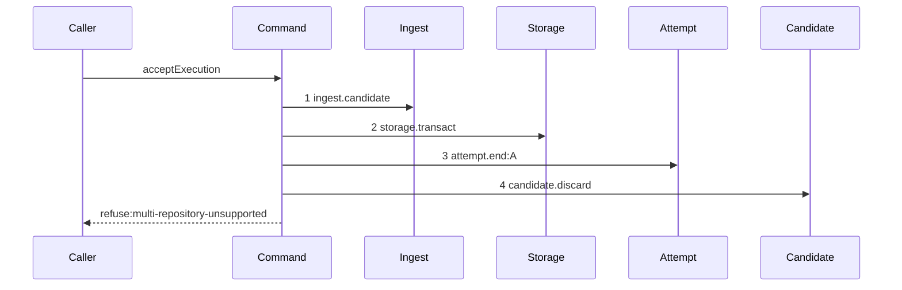

# Story 2 — The foreign repository pays its attempt

Epic: `.agents/plan/epics/054.2-the-execution-accept-pays-its-attempt.md`
Depends on: Story 1 (`01-the-unreachable-candidate-pays-its-attempt`), for the two dependency keys,
the returned rejection and the recorder projection; EPIC 051.4 Story 2
(`02-the-gate-refuses-a-foreign-repository`), for the repository step and the diagram this one
supersedes.
Kind: story-implement

Diagrams: report-refusal-multi-repository-settled

Supersedes: EPIC 051.4 report-refusal-multi-repository

Seams: report-refusal-multi-repository-settled: +storage.transact, +attempt.end:A

This story is the first of the four refusals that hold a candidate ref, and it fixes the order every
later one repeats: settle, discard, refuse.

## The path

`acceptExecution` is drawn by EPIC 051.4, so this diagram has that diagram as its prior set. It draws
no `baseline-` diagram, and it declares `Supersedes:` where a first change declares `Baselines:`.

### `report-refusal-multi-repository-settled`

Supersedes: EPIC 051.4 report-refusal-multi-repository

Fixture: the fixture of `report-refusal-multi-repository`, unchanged — run `R` on task `T`, one open
attempt `A`, a candidate ref that reaches the reported oid, and one `run_base` row naming
`repository_alpha` while the report names `repository_beta`. The composite key
`src/services/storage/migration-0012-run-model.ts:40` — `PRIMARY` permits two base rows for one run,
and the fixture records one because the writer produces one.



**`candidate.discard` is renumbered and not moved, so this story signs it as no token.** It was step 2
and it is step 4, and
`.agents/plan/authoring.md:289` — `renumbered` states that inserting a step renumbers every later
ordinal and moves nothing. It is a context token of the prior diagram, and a context token is not
declared.

**The discard is last, and the order is the epic's decision rather than the implementer's.**
`.agents/plan/epics/054.2-the-execution-accept-pays-its-attempt.md:38` — `deletes the ref` states it:
a discard before the termination write would break condition 6 of the six-condition rule of
`AGENTS.md`, which requires the caller to settle its logical outcome before it attempts the deletion.

**The discard runs after the settlement transaction commits, and all six conditions hold.**
`.agents/plan/epics/054.2-the-execution-accept-pays-its-attempt.md:46` — `The six conditions hold`
establishes each one for every discard this epic sequences.

**Step 3 is one step, because a nested command is one step.** The scenario binds `endAttempt` to
unrecorded dependencies.

**The drawn set is every branch of this path.** `repositoryVerdict` is pure, so its refusal has one
shape whatever the mismatch is; the passing branch is Story 3
(`03-the-broken-ancestry-pays-its-attempt`)'s diagram.

Add `test/sequence/scenarios/report-refusal-multi-repository-settled.ts`.

## Change

**Edit `src/commands/checkpoint/accept-execution.ts` to settle before the repository discard.**

At the `multi-repository-unsupported` arm, put the settlement of Story 1 change step 3 **before** the
existing `dependencies.candidate.discard` call, and replace the throw with
`return { ok: false, refusal: "multi-repository-unsupported", details }`. The `details` value is
`{ reported, base }` and it does not change:
`.agents/plan/stories/051.4-the-acceptance-gate-and-the-report-route/09-the-contract-and-the-proposal.md:66`
— `multiRepositoryDetails` pins the key set.

The settlement body is the one Story 1 wrote, with `"daemon-rejected"` evidence and
`outcome: "rejected"`. Five arms write the identical seven-field input. **How that repetition is
factored is the implementer's choice and no case proves it**, because a local helper is syntax and
not behaviour; the obligation is the settlement itself, which cases 1 and 3 prove by value.

## Constraints

- One `storage.transact` on this arm, and it is Story 1's. Do not open a second.
- `candidate.discard` is called exactly once and it is last. Do not move it before the settlement, and
  do not add a second call site.
- The settlement transaction commits before the discard runs. The discard is git I/O and
  `AGENTS.md` forbids it inside a storage transaction.
- The refusal code, its 409 status and its `details` key set are unchanged.

## Verify

```
node --test src/commands/checkpoint/accept-execution.test.ts test/sequence/conformance.test.ts
```

Extend `src/commands/checkpoint/accept-execution.test.ts`, the file Story 1
(`01-the-unreachable-candidate-pays-its-attempt`) extended.

Add, each as a separate `it`:

1. `"a foreign repository stores a semantic termination and discards the candidate once"` — run
   `acceptExecution` over the fixture, read the `attempt` row and assert `outcome === "rejected"` and
   `termination === "semantic"`; assert the `Candidate` double's `discard` count is exactly `1`; and
   assert the candidate namespace is empty afterwards through
   `git.listRefs({ prefix: "refs/kanthord/candidate/" })`. This is the first half of the epic's
   gate row 4, and it is the control Story 1 case 3 names.

2. `"the termination is committed before the discard runs"` — substitute a `Storage` double and a
   `Candidate` double that both append to **one shared ordinal log**, the storage double appending on
   span close and the candidate double on call, and assert the log reads
   `["storage:close", "candidate:discard"]` by value. **The control is a second assertion over the
   same log that the inverse order fails**: build the same log from a hand-written pair in the
   opposite order and assert the comparison rejects it, so the oracle is shown to distinguish the two.
   A control that asks the implementer to move production code is not runnable, and this one is. This
   is the second half of the epic's gate row 4, and no diagram proves it:
   `.agents/plan/authoring.md:27` — `An asynchronous seam needs begin and end records` says a
   one-step asynchronous seam records invocation only.

3. `"the foreign-repository refusal answers multi-repository-unsupported with its shipped details"` —
   assert the returned value deep-equals
   `{ ok: false, refusal: "multi-repository-unsupported", details: { reported, base } }` by value.
   Without it the disposition change could silently drop `details`, which
   `src/http/contract/errors.ts:41` — `PreconditionCode` makes mandatory for a 409.

Add `test/sequence/scenarios/report-refusal-multi-repository-settled.ts`, building the fixture the
diagram names, running the real `acceptExecution` over real SQLite and the loopback git fixture behind
the recorder, binding `ingest`, `commands`, `land` and `attempt` to unrecorded dependencies, aliasing the
attempt as `A`, and returning the recorder and the returned rejection as `result`.

`pnpm run verify` exits 0.

Proof: PASS line delivered — `src/commands/checkpoint/accept-execution.test.ts` in `PASS EPIC-054.2`.
