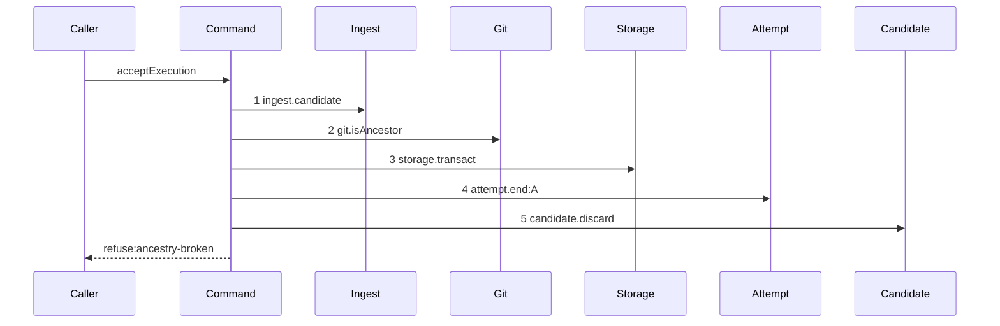

# Story 3 — The broken ancestry pays its attempt

Epic: `.agents/plan/epics/054.2-the-execution-accept-pays-its-attempt.md`
Depends on: Story 1 (`01-the-unreachable-candidate-pays-its-attempt`), for the two dependency keys and
the returned rejection; Story 2 (`02-the-foreign-repository-pays-its-attempt`), for the
settle-discard-refuse order; EPIC 051.4 Story 3 (`03-the-gate-refuses-broken-ancestry`), for the
ancestry step and the diagram this one supersedes.
Kind: story-implement

Diagrams: report-refusal-ancestry-broken-settled

Supersedes: EPIC 051.4 report-refusal-ancestry-broken

Seams: report-refusal-ancestry-broken-settled: +storage.transact, +attempt.end:A

This story owns the proof that the charge reaches the accounting, because a semantic termination is
what `accountAttempts` counts.

## The path

`acceptExecution` is drawn by EPIC 051.4, so this diagram has that diagram as its prior set. It draws
no `baseline-` diagram, and it declares `Supersedes:` where a first change declares `Baselines:`.

### `report-refusal-ancestry-broken-settled`

Supersedes: EPIC 051.4 report-refusal-ancestry-broken

Fixture: the fixture of `report-refusal-ancestry-broken`, unchanged — run `R` on task `T`, one open
attempt `A`, a candidate ref reaching the reported oid, and an input whose `baseRepositoryIds` holds
the reported repository alone at base oid `B`; the candidate head sits on a branch cut **before** `B`,
so it is not a descendant of `B`.



**Steps 1 and 2 are unchanged, and `candidate.discard` is renumbered and not moved.** It was step 3
and it is step 5, so it stays a context token of the prior diagram and this story signs it as no
token.

**`git.isAncestor` carries no label.** It appears once in this diagram, and a `:ancestry` label would
name the call site rather than a value the call receives. The reachability call of the same method
sits inside `ingest.candidate`, which is a nested unit.

**The settlement is inserted after the verdict and before the discard**, per
`.agents/plan/epics/054.2-the-execution-accept-pays-its-attempt.md:38` — `deletes the ref`.

**The drawn set is every branch of this path.** `ancestryVerdict` is pure and takes one boolean, so it
has one refusing shape; the passing branch is Story 4
(`04-the-undeclared-path-pays-its-attempt`)'s diagram.

Add `test/sequence/scenarios/report-refusal-ancestry-broken-settled.ts`.

## Change

**Edit `src/commands/checkpoint/accept-execution.ts` to settle before the ancestry discard.**

At the `ancestry-broken` arm, put the settlement helper of Story 2
(`02-the-foreign-repository-pays-its-attempt`) **before** the existing
`dependencies.candidate.discard` call, and replace the throw with
`return { ok: false, refusal: "ancestry-broken", details }`. The `details` value is `{ base, head }`
and it does not change:
`.agents/plan/stories/051.4-the-acceptance-gate-and-the-report-route/09-the-contract-and-the-proposal.md:67`
— `ancestryBrokenDetails` pins the key set.

## Constraints

- One `storage.transact` on this arm. Do not open a second.
- The settlement runs after `git.isAncestor` returns its verdict, never before it. A charge levied
  before the daemon has a verdict would price a report the gate had not judged.
- `candidate.discard` is called exactly once and it is last.
- The refusal code, its 409 status and its `details` key set are unchanged.

## Verify

```
node --test src/commands/checkpoint/accept-execution.test.ts test/sequence/conformance.test.ts
```

Extend `src/commands/checkpoint/accept-execution.test.ts`.

Add, each as a separate `it`:

1. `"a broken ancestry stores a semantic termination"` — run `acceptExecution` over the fixture, read
   the `attempt` row and assert `outcome === "rejected"` and `termination === "semantic"`. This is the
   first half of the epic's gate row 5.

2. `"the broken-ancestry charge advances semanticCount by one"` — read the run's attempts through
   `src/services/execution/index.ts:115` — `attemptsOfRun`, pass them to
   `src/domain/attempt-accounting.ts:32` — `accountAttempts` with the shipped limit, and assert
   `semanticCount` is exactly one higher than the same projection taken before the report. **The
   control is Story 6 (`06-the-contended-land-pays-no-attempt`) case 2**, where the same projection
   does not move. This is the second half of the epic's gate row 5, and it is what proves the stored
   class reaches the limit rather than only the row.

3. `"a run whose earlier attempt already carried a semantic termination reaches semanticCount two"` —
   seed run `R` with two attempts, the first already closed carrying
   `termination: "semantic"` and the second open, report the ancestry refusal on the open one, and
   assert `semanticCount` is two. **The closed row must satisfy both CHECKs migration `16` adds** —
   `.agents/plan/epics/054-attempt-classification-and-the-supervisor.md:42` —
   `Only a non-accepted attempt carries a termination` — so it carries `outcome = 'rejected'`,
   `termination = 'semantic'` and a non-null `ended_at`, and `attempt` is keyed
   `UNIQUE (run_id, attempt_no)`, so the two rows take `attempt_no` `1` and `2` under one `run_id`.
   Seed the closed row with a raw `INSERT`, as
   `test/sequence/scenarios/expiry-pass-one-due.ts:24` — `transaction.run` seeds a `run` row. Without it case 2 passes
   for a charge that overwrites rather than accumulates. **A second attempt of one run is seeded and
   never claimed**: `src/commands/node/claim-node.ts:403` — `openAttempt` is the one attempt-opening
   writer and it runs only on a claim, and the run is already active.

Add `test/sequence/scenarios/report-refusal-ancestry-broken-settled.ts`, building the fixture the
diagram names, running the real `acceptExecution` over real SQLite and the loopback git fixture behind
the recorder, binding `ingest`, `commands`, `land` and `attempt` to unrecorded dependencies, aliasing the
attempt as `A`, and returning the recorder and the returned rejection as `result`.

`pnpm run verify` exits 0.

Proof: PASS line delivered — `src/commands/checkpoint/accept-execution.test.ts` in `PASS EPIC-054.2`.
