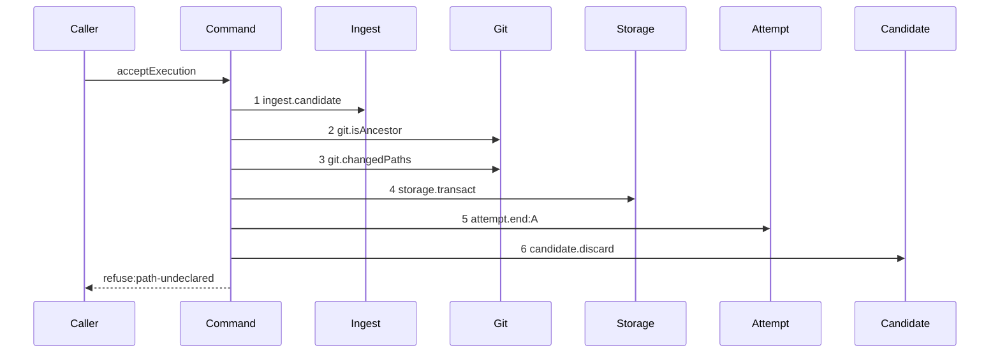

# Story 4 — The undeclared path pays its attempt

Epic: `.agents/plan/epics/054.2-the-execution-accept-pays-its-attempt.md`
Depends on: Story 1 (`01-the-unreachable-candidate-pays-its-attempt`), for the two dependency keys and
the returned rejection; Story 2 (`02-the-foreign-repository-pays-its-attempt`), for the settlement
helper and the settle-discard-refuse order; EPIC 051.4 Story 4
(`04-the-gate-refuses-an-undeclared-path`), for the name-only diff and the diagram this one
supersedes.
Kind: story-implement

Diagrams: report-refusal-path-undeclared-settled

Supersedes: EPIC 051.4 report-refusal-path-undeclared

Seams: report-refusal-path-undeclared-settled: +storage.transact, +attempt.end:A

This story owns the exhausted-limit proof of the gate refusals, and it states in one sentence what
that proof can and cannot reach.

## The path

`acceptExecution` is drawn by EPIC 051.4, so this diagram has that diagram as its prior set. It draws
no `baseline-` diagram, and it declares `Supersedes:` where a first change declares `Baselines:`.

### `report-refusal-path-undeclared-settled`

Supersedes: EPIC 051.4 report-refusal-path-undeclared

Fixture: the fixture of `report-refusal-path-undeclared`, unchanged — run `R` on task `T`, one open
attempt `A`, a candidate ref reaching the reported oid, a candidate head descending from base oid `B`,
`T` declaring `verify.paths: ["/src/a.ts"]`, and a commit touching `src/a.ts` and `src/b.ts`. The
declared entry is absolute and the changed entry is repository-relative, per
`src/domain/verify-block.ts:5` — `verifyPath`.



**Steps 1 to 3 are unchanged, and `candidate.discard` is renumbered and not moved.** It was step 4 and
it is step 6, so it stays a context token of the prior diagram and this story signs it as no token.

**Steps 2 and 3 are two methods on one participant, not one method twice**, so neither carries a label
and no discriminator is needed.

**The drawn set is every branch of this path.** `declaredPathVerdict` is pure and takes two lists, so
its refusal has one shape whatever the gap is; the passing branch is Story 5
(`05-the-failed-command-pays-its-attempt`)'s diagram.

Add `test/sequence/scenarios/report-refusal-path-undeclared-settled.ts`.

## Change

**Edit `src/commands/checkpoint/accept-execution.ts` to settle before the path discard.**

At the `path-undeclared` arm, put the settlement helper of Story 2
(`02-the-foreign-repository-pays-its-attempt`) **before** the existing
`dependencies.candidate.discard` call, and replace the throw with
`return { ok: false, refusal: "path-undeclared", details }`. The `details` value carries the verdict's
`undeclared` list verbatim, already sorted with `comparePaths` and in repository-relative form:
`.agents/plan/stories/051.4-the-acceptance-gate-and-the-report-route/09-the-contract-and-the-proposal.md:67`
— `pathUndeclaredDetails` pins the key set.

**No node state is written on this arm, and no run is ended.** `endAttempt` closes the attempt and
appends the event, and
`.agents/plan/epics/054.1-the-end-attempt-command.md:15` — `endAttempt` names its whole effect. The
`blocked` write under `attempt-limit` belongs to the worker-report arm at
`src/commands/outcome/report-outcome.ts:247` — `taskReportEffect`, which an `accepted` body never
reaches.

**A refused report leaves the run `active`, the node `running` and no open attempt, and only the
expiry recovers it.** The worker cannot report again —
`src/commands/outcome/report-outcome.ts:222` — `no open attempt` refuses it — and it cannot release
either: `src/commands/node/release-node.ts:16` — `no-open-attempt` refuses a release of a run holding
none. The expiry pass reads no attempt — `src/commands/run/expire-runs.ts:30` — `expireDueRuns` — so it
ends the run at its deadline and the node becomes claimable. Case 2 asserts the absent writes and
case 4 asserts both halves of that state by value. **Whether the worker should be able to hand the run
back is an open ruling**, recorded in `index.md`; this story asserts the behaviour the code has and
invents none.

## Constraints

- One `storage.transact` on this arm. Do not open a second.
- The settlement runs after `declaredPathVerdict` returns its refusal, never before it.
- `candidate.discard` is called exactly once and it is last.
- Do not add a `plan.setNodeState` call to any gate refusal arm. It would add a token no diagram of
  this epic draws, and the node transition of a refused report is not this epic's decision.
- The refusal code, its 409 status and its `details` key set are unchanged.

## Verify

```
node --test src/commands/checkpoint/accept-execution.test.ts test/sequence/conformance.test.ts
```

Extend `src/commands/checkpoint/accept-execution.test.ts`.

Add, each as a separate `it`:

1. `"an undeclared path stores a semantic termination"` — run `acceptExecution` over the fixture, read
   the `attempt` row and assert `outcome === "rejected"` and `termination === "semantic"`. This is the
   first half of the epic's gate row 6.

2. `"the undeclared-path refusal writes no node state and ends no run"` — assert the `node` row's
   `state` is byte-identical to its pre-call value and reads `"running"`, and that the `run` row's
   `state` and `fence` are byte-identical. **The control is a nearby forbidden case, not case 1**:
   run the same oracle over a worker-reported `rejected` body, which reaches
   `src/commands/outcome/report-outcome.ts:247` — `taskReportEffect` and does move the node, and
   assert the oracle reports a difference. Case 1 proves only that the fixture ran; it does not prove
   this assertion can see a node write.

3. `"a third semantic charge of one run reports exhausted"` — seed run `R` at
   `attemptLimit` three with two attempts already closed carrying `termination: "semantic"` and a
   third open. **Each closed row carries `outcome = 'rejected'`, `termination = 'semantic'` and a
   non-null `ended_at`**, which the two CHECKs of migration `16` require, and the three rows take
   `attempt_no` `1`, `2` and `3` under one `run_id`, which `UNIQUE (run_id, attempt_no)` requires.
   Seed them by raw `INSERT` as
   `test/sequence/scenarios/expiry-pass-one-due.ts:24` — `transaction.run` seeds a `run` row; report
   the undeclared path on the open attempt, then project the run's attempts through
   `src/domain/attempt-accounting.ts:32` — `accountAttempts` and assert `exhausted` is `true` and
   `semanticCount` is three. **The control is the same fixture with one earlier closed attempt instead
   of two**, where `exhausted` is `false` and `semanticCount` is two. This is the reachable half of
   the epic's gate row 6.

4. `"after the refusal the run is releasable by nothing and recoverable only by the expiry"` — two
   assertions over the post-refusal fixture. First, `releaseNode` over the same run raises
   `ReleaseNodeError` with refusal `"no-open-attempt"`, asserted by value. Second, the real
   `expireRuns` at a `now` past the run's deadline ends the run, appends one `run.expired`, leaves the
   `attempt` row byte-identical — the same `outcome`, `termination` and `ended_at` the refusal wrote —
   and appends no second `attempt.ended`. **The control for the first half is the same release over a
   run whose attempt is still open**, which succeeds; without it the refusal assertion passes for a
   release that is broken for every run. This pins the state the epic's Decisions describe, and it is
   the case a later ruling on that state would have to change.

Add `test/sequence/scenarios/report-refusal-path-undeclared-settled.ts`, building the fixture the
diagram names, running the real `acceptExecution` over real SQLite and the loopback git fixture behind
the recorder, binding `ingest`, `commands`, `land` and `attempt` to unrecorded dependencies, aliasing the
attempt as `A`, and returning the recorder and the returned rejection as `result`.

`pnpm run verify` exits 0.

Proof: PASS line delivered — `src/commands/checkpoint/accept-execution.test.ts` in `PASS EPIC-054.2`.
