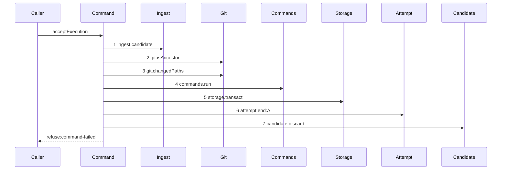

# Story 5 — The failed command pays its attempt

Epic: `.agents/plan/epics/054.2-the-execution-accept-pays-its-attempt.md`
Depends on: Story 1 (`01-the-unreachable-candidate-pays-its-attempt`), for the two dependency keys and
the returned rejection; Story 2 (`02-the-foreign-repository-pays-its-attempt`), for the settlement
helper and the settle-discard-refuse order; EPIC 051.4 Story 5
(`05-the-gate-refuses-a-failed-command`), for the command run and the diagram this one supersedes.
Kind: story-implement

Diagrams: report-refusal-command-failed-settled

Supersedes: EPIC 051.4 report-refusal-command-failed

Seams: report-refusal-command-failed-settled: +storage.transact, +attempt.end:A

This story is the last of the five gate refusals, and it closes the seventh-code question EPIC 051.2
deferred by charging one class for every `command-failed`.

## The path

`acceptExecution` is drawn by EPIC 051.4, so this diagram has that diagram as its prior set. It draws
no `baseline-` diagram, and it declares `Supersedes:` where a first change declares `Baselines:`.

### `report-refusal-command-failed-settled`

Supersedes: EPIC 051.4 report-refusal-command-failed

Fixture: the fixture of `report-refusal-command-failed`, unchanged — run `R` on task `T`, one open
attempt `A`, a candidate ref reaching the reported oid, a candidate head descending from base oid `B`
touching only declared paths, and `T` declaring **one** command that exits non-zero. The fixture states
a length of one, because a list of two produces two identical `commands.run` tokens at this seam.



**Steps 1 to 4 are unchanged, and `candidate.discard` is renumbered and not moved.** It was step 5 and
it is step 7, so it stays a context token of the prior diagram and this story signs it as no token.

**`commands.run` is a nested command**, so the per-command checkout, the `verify.run` and the worktree
removal inside it are invisible at this seam.

**The drawn set is every branch of this path.** EPIC 051.2 draws three inner paths for `commands.run`
— one command passing, no command, and one command failing — and the first two produce the same outer
token at the same position and reach the land, which is EPIC 051.4 Story 6
(`06-the-gate-refuses-a-contended-land`)'s and Story 7
(`07-the-gate-accepts-and-writes-the-checkpoint`)'s diagrams. Only the failing inner path stops here.

Add `test/sequence/scenarios/report-refusal-command-failed-settled.ts`.

## Change

**Edit `src/commands/checkpoint/accept-execution.ts` to settle before the command discard.**

At the `command-failed` arm, put the settlement helper of Story 2
(`02-the-foreign-repository-pays-its-attempt`) **before** the existing
`dependencies.candidate.discard` call, and replace the throw with
`return { ok: false, refusal: "command-failed", details }`. The `details` value carries
`commandIndex` and `command` verbatim from the nested refusal, and the key is `commandIndex` and not
`index`:
`.agents/plan/stories/051.4-the-acceptance-gate-and-the-report-route/09-the-contract-and-the-proposal.md:68`
— `commandFailedDetails` pins the key set.

**Every non-`passed` outcome charges the same class, and this story adds no seventh code.**
`.agents/plan/stories/051.4-the-acceptance-gate-and-the-report-route/index.md:240` —
`This epic ships six refusal codes and no seventh` deferred the daemon-fault question to this family.
The answer is that the charge does not depend on it: a command that exits non-zero and a command the
daemon could not run are both `daemon-rejected`, so a seventh code would change the wire answer and
never the price. Case 2 asserts it.

## Constraints

- One `storage.transact` on this arm. Do not open a second.
- The settlement runs after `commands.run` refuses, never before it.
- `candidate.discard` is called exactly once and it is last.
- Do not add a seventh refusal code. `AcceptExecutionRefusal` keeps its six members.
- The refusal code, its 409 status and its `details` key set are unchanged.

## Verify

```
node --test src/commands/checkpoint/accept-execution.test.ts test/sequence/conformance.test.ts
```

Extend `src/commands/checkpoint/accept-execution.test.ts`.

Add, each as a separate `it`:

1. `"a failed declared command stores a semantic termination"` — run `acceptExecution` over the
   fixture, read the `attempt` row and assert `outcome === "rejected"` and
   `termination === "semantic"`, and assert the appended `attempt.ended` payload's `evidence`
   deep-equals `{ kind: "daemon-rejected" }`. This is the first half of the epic's gate row 7.

2. `"a command-failed refusal of a daemon fault stores the same class"` — substitute a `Commands`
   double that refuses `command-failed` with `details` naming a spawn failure rather than a non-zero
   exit, and assert the stored `termination` is `"semantic"` and the evidence is the same value.
   **The control is case 1**, which reaches the same row through a real non-zero exit. This is the
   second half of the epic's gate row 7, and it is what makes the deferred seventh-code question a
   wire question and not a charge question.

3. `"the failed-command refusal reaches no land"` — assert the `Land` double's `begin` and `settle`
   call counts are both `0`, and that `git.refUpdate` records `0`. **The control is the passing
   fixture**: the same doubles over a command that exits zero record `begin` `1`, `settle` `1` and
   `git.refUpdate` `1`, which proves the three counters can see a land. Without it cases 1 and 2 pass
   for a command that settled the attempt after landing, and this case passes for doubles that count
   nothing.

Add `test/sequence/scenarios/report-refusal-command-failed-settled.ts`, building the fixture the
diagram names, running the real `acceptExecution` over real SQLite and the loopback git fixture behind
the recorder, binding `ingest`, `commands`, `land` and `attempt` to unrecorded dependencies, aliasing the
attempt as `A`, and returning the recorder and the returned rejection as `result`.

`pnpm run verify` exits 0.

Proof: PASS line delivered — `src/commands/checkpoint/accept-execution.test.ts` in `PASS EPIC-054.2`.
