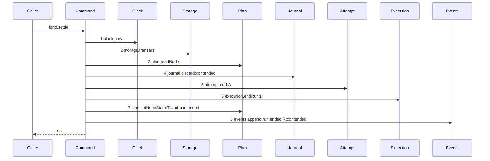

# Story 6 — The contended land pays no attempt

Epic: `.agents/plan/epics/054.2-the-execution-accept-pays-its-attempt.md`
Depends on: EPIC 054.1 Story 1 (`01-a-semantic-ending-and-an-accepted-one`), for `endAttempt` and its
input union; EPIC 054, for the `contended` evidence value; EPIC 051.3 Story 5 (`05-the-contended-settle`), for `landSettle`, its contended arm and the
diagram this one supersedes; Story 1 (`01-the-unreachable-candidate-pays-its-attempt`), for the
`attempt.end` recorder projection.
Kind: story-implement

Diagrams: land-settle-contended-paid

Supersedes: EPIC 051.3 land-settle-contended

Seams: land-settle-contended-paid: +attempt.end:A, -execution.closeAttempt:A

This story changes the caller of the close and nothing else about the contended arm. Story 7
(`07-the-accepted-land-closes-through-the-command`) makes the same swap on the accepted arm, and the
two together leave `landSettle` with no direct close.

## The path

`landSettle`'s contended arm is drawn by EPIC 051.3, so this diagram has that diagram as its prior
set. It draws no `baseline-` diagram, and it declares `Supersedes:` where a first change declares
`Baselines:`.

### `land-settle-contended-paid`

Supersedes: EPIC 051.3 land-settle-contended

Fixture: the fixture of `land-settle-contended`, unchanged — the `land-settle-accepted` fixture with
the objective ref `refs/heads/objective_a` standing at a third oid the fixture creates, so the swap
from `commit1` lost and the ref was never moved. Task `T` under run `R` at fence `1`, one open attempt
`A`, its journal row `open`.



**One token changes, and every ordinal stays.** Step 5 was `execution.closeAttempt:A` and it is now
`attempt.end:A`. Steps 1 to 4 and 6 to 8 are EPIC 051.3's, unchanged, and this story signs none of
them.

**The settlement is inside the transaction step 2 opens, and this epic adds none.** `landSettle` is
one half of a journaled write, so its two transactions are legal by `AGENTS.md`, and `endAttempt`
takes the caller's transaction and opens none:
`.agents/plan/epics/054.1-the-end-attempt-command.md:25` — `No transaction of its own` states it.

**Step 5 sits where the close sat, before `execution.endRun`.** The shipped order is attempt close,
run end, state write, and EPIC 051.3 Story 5 (`05-the-contended-settle`) cites
`src/commands/node/release-node.ts:166` — `closeAttempt` as its precedent. Moving the settlement after
the run end would change an order this story has no reason to change.

**Step 5 is one step, because a nested command is one step.** The scenario binds `endAttempt` to
unrecorded dependencies, so the two reads, the close and the `attempt.ended` append inside it produce
no token here. `execution.endRun:R` at step 6 is the outer's own call and is unaffected.

**A contention is `infrastructure`, so the attempt limit does not move.**
`.agents/plan/epics/054-attempt-classification-and-the-supervisor.md:58` — `contended` gives the kind
its class for both drivers, and
`.agents/plan/epics/054-attempt-classification-and-the-supervisor.md:81` —
`Contention is` records the ruling. Case 2 asserts the unchanged count, and Story 3
(`03-the-broken-ancestry-pays-its-attempt`) case 2 is its control.

**The drawn set is every branch of this arm.** The settle is unconditional: the caller has already
observed the lost swap, so the unit takes no decision and has no refusal. The objective branch takes
the same eight steps with one label changed, so it is a value and not a call set, exactly as
EPIC 051.3 Story 5 (`05-the-contended-settle`) states.

Add `test/sequence/scenarios/land-settle-contended-paid.ts`, and delete
`test/sequence/scenarios/land-settle-contended.ts` when Story 8
(`08-the-ceiling-the-order-and-the-proposal`) appends `"054.2"` to `shippedEpics`, and not before.

## Change

**Edit `src/commands/checkpoint/land-execution.ts` to close the contended attempt through the
command.**

### 1 — the dependency key and the input field

`LandSettleDependencies` at
`.agents/plan/stories/051.3-the-checkpoint-and-the-land/04-the-accepted-settle.md:124` —
`LandSettleDependencies` gains one key beside its six, and beside the `objective` key EPIC 053
Story 8 (`08-the-accepted-settle-aggregates-the-parent`) added:

```ts
attempt: Readonly<{
  end(transaction: Transaction, input: EndAttemptInput): EndAttemptResult;
}>;
```

`LandSettleInput` at
`.agents/plan/stories/051.3-the-checkpoint-and-the-land/04-the-accepted-settle.md:133` —
`LandSettleInput` gains two fields:

```ts
attemptNo: number;
attemptLimit: number;
```

**Both arrive on the input and neither is derived.** `EndAttemptCommon` at
`.agents/plan/stories/054.1-the-end-attempt-command/01-a-semantic-ending-and-an-accepted-one.md:143`
— `EndAttemptCommon` requires `attemptNo`, `at` and `attemptLimit`. This arm performs no
`execution.attemptsOfRun` read and `Execution` declares no read by run id, so deriving either would
add a token this diagram does not draw. Both callers already hold both: `acceptExecution` reads them
on its own input, and `reconcileMergeLand` reads the run and its open attempt at
`.agents/plan/stories/051.3-the-checkpoint-and-the-land/06-startup-reconciles-an-open-merge-row.md:235`
— `attemptId`, which is the same pair of reads.

**`at` needs no input field.** It is the `now` step 1 already read, and one clock read stamps every
write of the transaction.

**`execution` stays on the dependency object.** Step 6 is `execution.endRun` and the accepted arm
reads and writes four more methods.

### 2 — the swap

Replace item 3 of
`.agents/plan/stories/051.3-the-checkpoint-and-the-land/05-the-contended-settle.md:104` —
`closeAttempt` with

```ts
dependencies.attempt.end(transaction, {
  attemptId: input.attemptId,
  runId: input.runId,
  nodeId: input.nodeId,
  attemptNo: input.attemptNo,
  at: now,
  attemptLimit: input.attemptLimit,
  outcome: "cancelled",
  evidence: { kind: "contended" },
});
```

`"cancelled"` is the outcome EPIC 051.3 Story 5 (`05-the-contended-settle`) already writes, and no
`headOid` is passed, because the work never landed. `contended` classifies `infrastructure`.

### 3 — the two callers that construct `LandSettleInput`

Widening the input widens every site that builds one, and there are two.

**Edit `src/commands/checkpoint/accept-execution.ts` to forward the two fields.** Its `land.settle`
call at
`.agents/plan/stories/051.4-the-acceptance-gate-and-the-report-route/06-the-gate-refuses-a-contended-land.md:132`
— `attemptId` already forwards eleven fields from `AcceptExecutionInput`; it adds
`attemptNo: input.attemptNo` and `attemptLimit: input.attemptLimit`, both of which Story 1
(`01-the-unreachable-candidate-pays-its-attempt`) put on that input.

**Edit `src/commands/startup/reconcile-journal.ts` to derive and forward the two fields.** Its settle
call at
`.agents/plan/stories/051.3-the-checkpoint-and-the-land/06-startup-reconciles-an-open-merge-row.md:251`
— `journalRowId` builds the input from the derived record of `:235` — `attemptId`, which already reads
the run and its one open attempt. That record gains `attemptNo` from the same attempt row and
`attemptLimit` from the same run row, so the reconcile adds no read and its diagram
`reconcile-merge-land` keeps its eight steps.

**Neither edit changes a drawn token.** `land.settle:accepted` projects `disposition`, so a wider
input is invisible at every seam that draws it.

### 4 — the composition root

**Edit `src/main.ts` to pass the bound end-attempt into the settle.** Add `attempt: boundEndAttempt` — the
value Story 1 (`01-the-unreachable-candidate-pays-its-attempt`) change step 6 binds — to the
`landSettle` dependency literal, beside the `objective` key EPIC 053 Story 8
(`08-the-accepted-settle-aggregates-the-parent`) placed there. `src/main.ts:271` —
`boundAggregateInitiative` is the shipped placement of a bound nested command.

## Constraints

- One transaction, and it is step 2's. `endAttempt` joins it and opens none.
- Step 5 stays before `execution.endRun`. Do not reorder the tail.
- The attempt outcome is `"cancelled"` and the evidence is `{ kind: "contended" }`. Do not pass a
  `headOid`.
- Do not call `execution.closeAttempt` from this file on this arm. It is the token this story removes.
- `journal.discard:contended`, `plan.setNodeState:T:land-contended` and
  `events.append:run.ended:R:contended` are unchanged, labels included. Changing `reason` changes the
  diagram.
- Do not delete `test/sequence/scenarios/land-settle-contended.ts` in this story. `"054.2"` is not in
  `shippedEpics` yet, so `test/sequence/conformance.test.ts:104` — `validateScenarioFiles` still
  requires it.

## Verify

```
node --test src/commands/checkpoint/land-execution.test.ts src/main.test.ts test/sequence/conformance.test.ts
```

Extend `src/commands/checkpoint/land-execution.test.ts`, the file EPIC 051.3 Story 4
(`04-the-accepted-settle`) created and EPIC 053 Story 8
(`08-the-accepted-settle-aggregates-the-parent`) extended.

Add, each as a separate `it`:

1. `"a contended land writes an infrastructure termination"` — run the real `landSettle` on the
   contended arm, read the `attempt` row and assert `outcome === "cancelled"`,
   `termination === "infrastructure"` and `headOid` null; assert the one appended `attempt.ended`
   event has `subjectKind === "attempt"` and a payload whose `evidence` deep-equals
   `{ kind: "contended" }`. This is the first half of the epic's gate row 8.

2. `"a contended land leaves semanticCount unchanged"` — project the run's attempts through
   `src/domain/attempt-accounting.ts:32` — `accountAttempts` before and after the settle and assert
   `semanticCount` is byte-identical. **The control is Story 3
   (`03-the-broken-ancestry-pays-its-attempt`) case 2**, which advances it by one over the same
   projection. This is the second half of the epic's gate row 8.

3. `"the contended settlement is inside the settle transaction"` — wrap `events.append` in a proxy
   that throws on the call whose `type` is `run.ended`, run `landSettle`, catch, and assert the
   `attempt` row's `outcome`, `termination` and `ended_at` are all byte-identical to their pre-call
   values. **The control is the same case without the injected failure**, which writes all three.
   This proves the settlement joined the caller's transaction rather than opening one of its own.

4. `"acceptExecution opens exactly two spans on a contended land"` — substitute a `Storage` double
   recording every span, drive the real `acceptExecution` over the contended fixture, and assert the
   count is exactly `2` — `land.begin`'s and `land.settle`'s. This is the epic's gate row 9, and it is
   the count `.agents/plan/epics/051.4-the-acceptance-gate-and-the-report-route.md:36` —
   `acceptExecution` pinned.

5. `"the contended arm calls execution.closeAttempt zero times"` — substitute an `Execution` double
   counting every method call and assert `closeAttempt` records `0` while `endRun` records `1`. **The
   `endRun` count is the control**; without it the assertion passes for a settle that reaches no
   execution seam at all.

6. `"land.settle carries attemptNo and attemptLimit from the startup reconcile too"` — drive
   `reconcileMergeLand` over an `open` `merge` row whose ref did move, and assert the settle received
   the run's open attempt's `attemptNo` and the run row's `attemptLimit`, both by value. Without it
   the two new input fields are unset on one of the settle's two callers and the `attempt.ended`
   payload names attempt zero at limit zero.

Add `test/sequence/scenarios/land-settle-contended-paid.ts`, building the fixture the diagram names,
running the real `landSettle` over real SQLite behind the recorder with the real journal, binding
`attempt.end` to the real `endAttempt` over **unrecorded** dependencies as
`test/sequence/scenarios/claim-refusal-objective-busy.ts:107` — `expiry` does, aliasing the task, the
run and the attempt as `T`, `R` and `A`, and returning the recorder and the result.

`pnpm run verify` exits 0.

Proof: PASS line delivered — `src/commands/checkpoint/land-execution.test.ts` and `src/main.test.ts`
in `PASS EPIC-054.2`.
