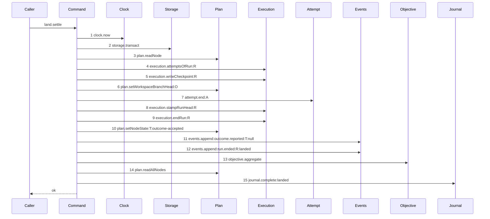

# Story 7 — The accepted land closes through the command

Epic: `.agents/plan/epics/054.2-the-execution-accept-pays-its-attempt.md`
Depends on: Story 6 (`06-the-contended-land-pays-no-attempt`), for the `attempt` dependency key, the
two new input fields and the composition-root binding; EPIC 053 Story 8
(`08-the-accepted-settle-aggregates-the-parent`), for the diagram this one supersedes; EPIC 054.1
Story 1 (`01-a-semantic-ending-and-an-accepted-one`), for the accepted member of `EndAttemptInput`
and for `EndAttemptResult`.
Kind: story-implement

Diagrams: land-settle-aggregate-paid

Supersedes: EPIC 053 land-settle-aggregate

Seams: land-settle-aggregate-paid: +attempt.end:A, -execution.closeAttempt:A

This story is the last drawing story of the epic, and it is what leaves `landSettle` with no direct
close on either arm. Story 8 (`08-the-ceiling-the-order-and-the-proposal`) records the behaviour and
ships the range.

## The path

`landSettle`'s accepted arm is drawn by EPIC 053, so this diagram has that diagram as its prior set.
It draws no `baseline-` diagram, and it declares `Supersedes:` where a first change declares
`Baselines:`. Drawing a `baseline-` diagram for a path an earlier epic owns would claim that epic
never landed.

### `land-settle-aggregate-paid`

Supersedes: EPIC 053 land-settle-aggregate

Fixture: the fixture of `land-settle-aggregate`, unchanged — task `T` landing under run `R` with one
open attempt `A`, its journal row `open`, the objective `O` above it `running`, and the two sibling
tasks of `T` already `done`, so `T`'s own terminal write makes every task of `O` terminal and the
aggregation reaches its write.



**One token changes, and every ordinal stays.** Step 7 was `execution.closeAttempt:A` and it is now
`attempt.end:A`. Every other step is EPIC 053's or EPIC 051.3's, unchanged, and this story signs none
of them. **This epic reverses no rule of EPIC 053**: step 13 still sits after step 10 and before
step 14, which is the ordering that makes `objectiveState` a post-transition value.

**The accepted close appends the event, and that is a vocabulary decision and not a new effect.**
`.agents/plan/epics/054-attempt-classification-and-the-supervisor.md:117` — `An acceptance is an ending`
rules it: a vocabulary whose `attempt.ended` excluded the commonest ending would make the type filter
of `src/http/contract/event.ts:14` — `type` unusable. The `attempt.ended` append is inside step 7 and
draws no token here, because a nested command is one step.

**The accepted member carries `headOid` and no evidence, so the row keeps a null `termination`.**
`.agents/plan/epics/054-attempt-classification-and-the-supervisor.md:111` — `The payload is a two-member union`
declares the two members, and
`.agents/plan/epics/054-attempt-classification-and-the-supervisor.md:42` —
`Only a non-accepted attempt carries a termination` is the CHECK that refuses the other shape.

**Step 7 is one step, because a nested command is one step.** The scenario binds `endAttempt` to
unrecorded dependencies. Its own read of the run's attempts is invisible here, and step 4 is the
outer's own read, which the checkpoint and the response projection need.

**The settlement is inside the transaction step 2 opens.** `landSettle` is one half of a journaled
write, so its two transactions are legal by `AGENTS.md`, and `endAttempt` opens none.

**The report route does not move.** `report-execution-checkpoint` of EPIC 051.4 Story 7
(`07-the-gate-accepts-and-writes-the-checkpoint`) and `report-checkpoint-reap` of EPIC 051.6 Story 3
(`03-the-report-reaps-on-every-settled-terminal`) each hold `land.settle:accepted` as one token, and
the close is inside it.

**The drawn set is every branch of this arm that changes.** The atomic-objective branch takes the same
fifteen steps with two labels changed, so it is a value and not a call set, exactly as EPIC 051.3
Story 4 (`04-the-accepted-settle`) states. The contended arm is Story 6
(`06-the-contended-land-pays-no-attempt`)'s diagram.

Add `test/sequence/scenarios/land-settle-aggregate-paid.ts`, and delete
`test/sequence/scenarios/land-settle-aggregate.ts` when Story 8
(`08-the-ceiling-the-order-and-the-proposal`) appends `"054.2"` to `shippedEpics`, and not before.

## Change

**Edit `src/commands/checkpoint/land-execution.ts` to close the accepted attempt through the
command.**

### 1 — the swap

Replace item 3b of
`.agents/plan/stories/051.3-the-checkpoint-and-the-land/04-the-accepted-settle.md:195` —
`closeAttempt` with

```ts
const ended = dependencies.attempt.end(transaction, {
  attemptId: input.attemptId,
  runId: input.runId,
  nodeId: input.nodeId,
  attemptNo: input.attemptNo,
  at: now,
  attemptLimit: input.attemptLimit,
  outcome: "accepted",
  headOid: input.acceptedOid,
});
```

`input.acceptedOid` is the oid `ingest.candidate` pinned, and it is the value the shipped close writes
as `headOid`. The dependency key and the two input fields are Story 6
(`06-the-contended-land-pays-no-attempt`)'s, and `at` is the `now` step 1 read.

### 2 — the two values the close used to return

`.agents/plan/stories/051.3-the-checkpoint-and-the-land/04-the-accepted-settle.md:225` — `attemptNo`
builds the `outcome.reported` payload from the closed attempt the statement returned, and
`.agents/plan/stories/051.3-the-checkpoint-and-the-land/04-the-accepted-settle.md:242` —
`attemptsRemaining` takes three fields from the same value. `endAttempt` is the closer now, so both
sites read the input and the step 4 list instead:

- `attemptId` and `attemptNo` come from `input.attemptId` and `input.attemptNo`. They are the same two
  values the caller passed to the close.
- `attemptsRemaining` is `Math.max(0, input.attemptLimit - ended.semanticCountAfter)`, read from the
  `EndAttemptResult` of change step 1.
  `.agents/plan/stories/054.1-the-end-attempt-command/01-a-semantic-ending-and-an-accepted-one.md:107`
  — `EndAttemptResult` returns `semanticCountAfter` as the post-close count, so no second projection
  is needed. **The remaining count is now measured in semantic terminations**, which follows
  EPIC 054's change to `src/domain/attempt-accounting.ts:32` — `accountAttempts`, whose `exhausted` is
  `semanticCount >= limit`. Case 5 pins it by value.

**Do not add a second `execution.attemptsOfRun` call.** It is already step 4, and
`test/helpers/sequence-conformance.ts:284` — `duplicate token in diagram` refuses a repeat.

### 3 — no other write moves

`execution.stampRunHead`, `execution.endRun`, `plan.setNodeState`, the two `events.append` calls,
`objective.aggregate`, `plan.readAllNodes` and `journal.complete` keep their order and their inputs.
`LandSettleResult` is unchanged.

## Constraints

- One transaction, and it is step 2's. `endAttempt` joins it and opens none.
- Step 7 stays between `plan.setWorkspaceBranchHead:O` and `execution.stampRunHead:R`. Neither
  neighbour moves.
- Step 13 stays after step 10 and before step 14. EPIC 053 owns that ordering and this story does not
  touch it.
- The accepted member carries `headOid` and no `evidence`. The row keeps a null `termination`, which
  the CHECK requires.
- Do not call `execution.closeAttempt` from this file on either arm after this story.
- Do not add a second `execution.attemptsOfRun` read.
- Do not delete `test/sequence/scenarios/land-settle-aggregate.ts` in this story.

## Verify

```
node --test src/commands/checkpoint/land-execution.test.ts src/commands/outcome/report-outcome.test.ts src/main.test.ts test/sequence/conformance.test.ts
```

Extend `src/commands/checkpoint/land-execution.test.ts`.

Add, each as a separate `it`:

1. `"an accepted settle stores the acceptance with a null termination and the reported head"` — run
   the real `landSettle` on the accepted arm, read the `attempt` row and assert
   `outcome === "accepted"`, `termination === null` and `headOid === acceptedOid`, each by value. This
   is the first half of the epic's gate row 9a.

2. `"an accepted settle appends exactly one attempt.ended carrying the accepted member"` — assert
   exactly one event of type `attempt.ended` was appended, that its `subjectKind` is `"attempt"` and
   its `subjectId` is the attempt id, and that its payload deep-equals the accepted member by value —
   `attemptId`, `runId`, `nodeId`, `attemptNo`, `outcome: "accepted"`, `headOid`,
   `semanticCountAfter`, `attemptLimit`, `ambiguousUsedAfter` and `ambiguousBudget`, with **no**
   `termination` key and **no** `evidence` key, asserted by key set. This is the second half of the
   epic's gate row 9a.

3. `"the accepted settle reaches execution.closeAttempt only through endAttempt"` — substitute an
   `Execution` double that records the call stack of each `closeAttempt` call, run the real
   `landSettle` with `attempt.end` bound to the real `endAttempt`, and assert exactly one
   `closeAttempt` call whose caller frame is `end-attempt.ts`. **The control is the same case with
   `attempt.end` bound to a no-op**, where the count is `0`; without it the assertion passes for a
   settle that still closes directly and never calls the command. This is the first half of the
   epic's gate row 9b.

4. `"the aggregation still runs after the node transition and before the sibling scan"` — assert the
   recorded seam order places `objective.aggregate` after `plan.setNodeState` and before
   `plan.readAllNodes`, and assert `result.objectiveState` equals `"awaiting_approval"` on a last
   `done` task, which is the post-transition value. **The control is the same case with
   `objective.aggregate` moved after `plan.readAllNodes`**, where `objectiveState` reads the
   pre-transition value. This is the second half of the epic's gate row 9b, and it is the property
   EPIC 053 Story 8 (`08-the-accepted-settle-aggregates-the-parent`) owns and this story must not
   break.

5. `"the NodeReportResult still carries the attempt the caller named"` — assert `result.attemptId`
   equals `input.attemptId`, `result.attemptNo` equals `input.attemptNo`, and `result.attemptsRemaining`
   equals `input.attemptLimit` minus `ended.semanticCountAfter`, each by value. This is what change step 2
   replaces, and without it the two fields silently become `undefined` in the response body.

6. `"a failure at the attempt.ended append leaves the whole settle unwritten"` — wrap `events.append`
   in a proxy that throws on the call whose `type` is `attempt.ended`, run `landSettle`, catch, and
   assert the `attempt` row, the `checkpoint` row, the node state, the run row and the event count are
   all byte-identical to their pre-call values. **The control is the same case without the injected
   failure**, which writes all five. This proves the settlement and the settle are one transaction.

7. `"landSettle calls execution.closeAttempt zero times on either arm"` — substitute an `Execution`
   double, bind `attempt.end` to a recording no-op, and run **both** arms: assert `closeAttempt`
   records `0` on the accepted arm and `0` on the contended arm, and that the no-op records `1` on
   each. **The no-op counts are the control**; without them the assertion passes for a settle that
   reaches no execution seam at all. Both arms are asserted here rather than one here and one in
   Story 6 (`06-the-contended-land-pays-no-attempt`), because `/work` dispatches one case per turn and
   a two-story pair is not a proof at either turn.

Add `test/sequence/scenarios/land-settle-aggregate-paid.ts`, building the fixture the diagram names,
running the real `landSettle` over real SQLite behind the recorder with the real journal, binding
`objective.aggregate` to the real `aggregateObjective` and `attempt.end` to the real `endAttempt`,
both over **unrecorded** dependencies, aliasing the task, the objective, the run and the attempt as
`T`, `O`, `R` and `A`, and returning the recorder and the result.

`pnpm run verify` exits 0.

Proof: PASS line delivered — `src/commands/checkpoint/land-execution.test.ts`,
`src/commands/outcome/report-outcome.test.ts` and `src/main.test.ts` in `PASS EPIC-054.2`.
