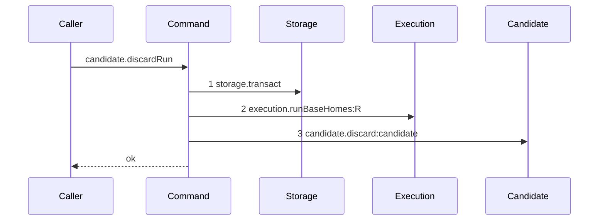

# Story 1 — The run-scoped candidate discard

Epic: `.agents/plan/epics/054.3-the-report-members-pay-their-attempt.md`
Depends on: EPIC 051.1 Story 4 (`04-the-candidate-ref-is-deleted`), for `discardCandidate` and
`DiscardCandidateInput`; EPIC 051.1 Story 2 (`02-the-candidate-ref-is-missing`), for `candidateRef`
and `CANDIDATE_REF_PREFIX`; EPIC 051.1 Story 8 (`08-the-candidate-namespace-is-enumerated`), for the
attempt-aware sweep this unit relies on to retry a failed deletion; EPIC 051.5 Story 2
(`02-the-run-base-home-is-one-read`), for `runBaseHomes` and `RunBaseHome`; EPIC 051.5 Story 3
(`03-an-expiry-pass-that-ended-no-run-reaps-nothing`), for the totality contract this unit copies.
Kind: story-implement

Diagrams: discard-run-candidate

Seams: discard-run-candidate: +storage.transact, +execution.runBaseHomes:R, +candidate.discard:candidate

This story is first in dispatch order, and it exists so the unit Story 2
(`02-the-worker-failure-pays-its-attempt`) calls has a drawn trace of its own.
`.agents/plan/authoring.md:208` — `A nested command is one step` states why: a nested command is one
step at its caller and carries its own diagram, so a command created and never drawn would be the one
unit whose failure mode is a leaked git ref and whose order nothing replays.

**Dispatch prerequisite, and it is a human edit.** EPIC 051.1 Story 8
(`08-the-candidate-namespace-is-enumerated`) must already carry the attempt-aware sweep predicate this
story's constraints name. Without it condition 5 of the six-condition rule fails for a below-limit
worker failure, and the deletion this unit performs becomes a journaled write. `## Constraints` states
the predicate and `index.md` records the ask.

## The path

`discardRunCandidate` does not exist, so this diagram has an empty prior set. It draws no `baseline-`
diagram and declares no `Baselines:` line, which is the one case where an implement story holds a
single diagram — `.agents/plan/authoring.md:148` — `A path this epic writes from nothing`.

### `discard-run-candidate`

Fixture: run `R` already read as `ended` by its caller, holding **exactly one** `run_base` row whose
home is the loopback bare repository, and `refs/kanthord/candidate/<runId>/1` present in that home;
the input is `{ runId, attemptNo: 1 }`.
**The fixture states a length of one on purpose.** `test/helpers/sequence-conformance.ts:50` —
`projections` declares no entry for `candidate.discard`, so a second home would emit a second
`candidate.discard` token and `test/helpers/sequence-conformance.ts:284` —
`duplicate token in diagram` refuses a repeat. The two-home case is asserted by the command's own
test, at case 2.



**Step 1 is the only transaction this unit opens, and it closes before step 3.** A git deletion may
not sit inside a storage transaction — `AGENTS.md` forbids git I/O there — so the read commits and the
deletions follow it. That is the same split
`.agents/plan/stories/051.5-the-targeted-post-expiry-candidate-cleanup/05-an-ended-runs-candidate-ref-is-deleted.md:101`
— `homes` already makes for the reap.

**Step 2 is a read and not a write, and the transaction exists only to hold it.**
`.agents/plan/stories/051.5-the-targeted-post-expiry-candidate-cleanup/02-the-run-base-home-is-one-read.md:22`
— `runBaseHomes` takes a run-id list, and this unit passes a list of one. The projection is
`test/helpers/sequence-conformance.ts:57` — `execution.runById` in shape: a run-scoped method
projects the run id, so `execution.runBaseHomes` needs its own entry and change step 3 adds it.

**Step 3 carries the label `candidate`, and the recorder is what puts it there.**
`candidate.discard` takes `{ gitDir, ref }` —
`.agents/plan/stories/051.1-the-candidate-and-the-git-primitives/04-the-candidate-ref-is-deleted.md:51`
— `DiscardCandidateInput` — and neither field is a run id or a node id. The projection change step 3
adds reads the namespace of the ref through
`.agents/plan/stories/051.1-the-candidate-and-the-git-primitives/04-the-candidate-ref-is-deleted.md:105`
— `refNamespaces`, which maps `refs/kanthord/candidate/` to the literal `candidate`, so every
candidate deletion draws one stable token and no ref name leaks into a diagram.

**No `git` participant appears.** The unit calls `candidate.discard` and never `git.deleteRef`, for
the reason `.agents/plan/stories/051.5-the-targeted-post-expiry-candidate-cleanup/05-an-ended-runs-candidate-ref-is-deleted.md:82`
— `It calls` gives: the deletion is a nested unit of its own, drawn by EPIC 051.1 Story 4
(`04-the-candidate-ref-is-deleted`).

**The terminal is `ok` on every input.** The unit is total: it returns after a failed read and after a
failed deletion, so `test/helpers/sequence-conformance.ts:303` — `resultTerminal` reads `ok` from its
`undefined` return. **A failure arm is therefore not a second diagram**: a failed read stops at step 2
and a failed deletion stops at step 3, and both are prefixes of this trace with the same terminal, so
`.agents/plan/authoring.md:165` —
`Draw a path only when its seam set or its seam order differs from a path already drawn` admits one
diagram. Cases 3 and 4 carry the two failures.

**The drawn set is every branch of this path.** A run with no `run_base` row reaches step 2 and makes
no deletion, which is a prefix and not a new order; a run with two homes repeats step 3, which the
fixture length fixes at one and case 2 asserts. Neither is a second diagram.

Add `test/sequence/scenarios/discard-run-candidate.ts`.

## Change

**Create `src/commands/checkpoint/discard-run-candidate.ts`** — one nested command that deletes one
run's candidate ref from every base home of that run.

### 1 — the file, its dependencies and its input

```ts
export type DiscardRunCandidateDependencies = Readonly<{
  storage: Storage;
  execution: Execution;
  candidate: Readonly<{
    discard(input: Readonly<{ gitDir: string; ref: string }>): Promise<void>;
  }>;
}>;

export type DiscardRunCandidateInput = Readonly<{
  runId: string;
  attemptNo: number;
}>;

export async function discardRunCandidate(
  dependencies: DiscardRunCandidateDependencies,
  input: DiscardRunCandidateInput,
): Promise<void>;
```

**`candidate` is a locally declared structural type and never an imported one.**
`.agents/plan/stories/051.5-the-targeted-post-expiry-candidate-cleanup/03-an-expiry-pass-that-ended-no-run-reaps-nothing.md:105`
— `candidate` gives the reason: `eslint.config.js` disallows a cross-command import, so each consumer
declares the shape it needs. **It is an object with a method and never a function-valued key**, per
the same story at `:109` — `candidate`.

**Import no other command.** `src/domain/layout.test.ts:184` — `no file under src/commands/` refuses a
relative import into `src/commands/` from any file under it, so `discardCandidate` arrives injected
and `candidateRef` comes from `src/domain/candidate-ref.ts`, which is domain and not a command.

### 2 — the body, in four statements

```ts
let homes: readonly RunBaseHome[];
try {
  homes = dependencies.storage.transact((transaction) =>
    dependencies.execution.runBaseHomes(transaction, [input.runId]),
  );
} catch {
  return;
}
const ref = candidateRef({ runId: input.runId, attemptNo: input.attemptNo });
for (const home of homes) {
  try {
    await dependencies.candidate.discard({ gitDir: home.home_path, ref });
  } catch {
    continue;
  }
}
```

**The ref is computed once, outside the loop.**
`.agents/plan/stories/051.1-the-candidate-and-the-git-primitives/02-the-candidate-ref-is-missing.md:48`
— `candidateRef` is pure and its value depends on neither the home nor the iteration.

**It walks the home list rather than taking one `gitDir`, so a multi-base run is correct by
construction.** `reportOutcome` holds no git seam and reads no repository home, so it could not supply
one — `.agents/plan/epics/054.3-the-report-members-pay-their-attempt.md:52` —
`The caller reaches the discard`.

**It awaits each deletion before the next, and it never returns a partial list.** The order is the
home list's order, which `runBaseHomes` fixes. Nothing downstream reads a result, so the return is
`void`.

### 3 — the two projections

**Edit `test/helpers/sequence-conformance.ts` to project the two new methods.**
`test/helpers/sequence-conformance.ts:50` — `projections` gains two entries, beside
`test/helpers/sequence-conformance.ts:57` — `execution.runById`, which the first mirrors:

```ts
  "execution.runBaseHomes": (input, context) => [setName(input, context)],
  "candidate.discard": (input, context) => [
    refNamespace(input, context),
  ],
```

**`execution.runBaseHomes` takes an array, so it projects a declared set and not a field.**
`test/helpers/sequence-conformance.ts:29` — `setName` matches a sorted id list against the scenario's
declared sets and refuses zero matches and two, and `test/helpers/sequence-conformance.ts:67` —
`execution.activeRunsOfNodes` is the shipped precedent for an array-valued input. The scenario
therefore declares the one-element set `R`.

**`candidate.discard` projects the ref's namespace and never the ref.** Add a `refNamespace` helper
beside `setName`, reading the table at
`.agents/plan/stories/051.1-the-candidate-and-the-git-primitives/04-the-candidate-ref-is-deleted.md:105`
— `refNamespaces`, so a ref under `refs/kanthord/candidate/` projects the literal `candidate`.
Projecting the ref itself would put a run id and an attempt number inside the token and split one
drawn path per attempt.

**Verify before adding, and report a divergence rather than re-applying.** EPIC 051.1 Story 4
(`04-the-candidate-ref-is-deleted`) and EPIC 051.5 Story 5
(`05-an-ended-runs-candidate-ref-is-deleted`) both draw `candidate.discard`, so one of those trees may
already carry the entry and the `refNamespace` helper.

### 4 — the composition root

**Edit `src/main.ts` to bind the unit.** `src/main.ts:271` — `boundAggregateInitiative` is the shipped
shape of a bound nested command. Bind

```ts
const boundDiscardRunCandidate = (
  input: Readonly<{ runId: string; attemptNo: number }>,
): Promise<void> =>
  discardRunCandidate(
    {
      storage,
      execution,
      candidate: {
        discard: (discardInput) => discardCandidate({ git }, discardInput),
      },
    },
    input,
  );
```

The inner `candidate.discard` binding is the one
`.agents/plan/stories/051.1-the-candidate-and-the-git-primitives/05-the-candidate-namespace-has-a-reaper.md:95`
— `discard` already builds for the startup sweep. Story 2
(`02-the-worker-failure-pays-its-attempt`) passes it into `reportOutcome` as
`candidate.discardRun`.

## Constraints

- One transaction, and it holds the read alone. No deletion sits inside it.
- The unit never throws. It returns after a failed read and continues after a failed deletion. A
  caller's `catch` is not the mechanism; this contract is, exactly as
  `.agents/plan/epics/051.6-the-post-expiry-reap-on-the-run-operations.md:66` — `candidate.reap` is
  total states for the sibling unit.
- It calls `candidate.discard` and never `git.deleteRef`. The `git` key does not appear on its
  dependency object.
- The ref is `candidateRef({ runId, attemptNo })` and nothing else. Do not delete a run prefix, and do
  not delete an attempt the input does not name.
- `candidate.discard` projects the ref's **namespace**. Do not project the ref, the run id or the
  attempt number.
- **`candidate.sweep` must already delete an attempt-scoped remnant of an active run.**
  `.agents/plan/stories/051.1-the-candidate-and-the-git-primitives/08-the-candidate-namespace-is-enumerated.md:141`
  — `active.has(runId)` skips every ref of an active run today, and a below-limit worker failure
  leaves its run `active`, so conditions 3 and 5 of the six-condition rule of `AGENTS.md` would fail
  and this deletion would be a journaled write. The predicate that repairs it deletes a ref whose
  attempt number is **below** the run's current open attempt, whatever the run state. Confirm it is in
  place before the first case opens, and stop rather than proceeding without it.
- Return `void`. Do not invent a findings list; nothing reads one, and `ReapFinding` belongs to
  another command that this one may not import.

## Verify

```
node --test src/commands/checkpoint/discard-run-candidate.test.ts src/main.test.ts test/sequence/conformance.test.ts
```

Add `src/commands/checkpoint/discard-run-candidate.test.ts`, over
`test/helpers/database.ts:32` — `createMigratedStorage`, `test/helpers/rows.ts:759` — `seedRunRow` and
the loopback git fixture of EPIC 005.

Add, each as a separate `it`:

1. `"the unit deletes the ref the input names from the one home of a single-base run"` — seed a run
   with one `run_base` row over a loopback bare home and both
   `refs/kanthord/candidate/<runId>/1` and `refs/kanthord/candidate/<runId>/2` in it, run
   `discardRunCandidate` with `attemptNo: 1`, and assert `/1` is absent and `/2` is present through
   `git.listRefs({ prefix: "refs/kanthord/candidate/" })`. **The `/2` ref is the control**: without it
   the assertion passes for a unit that deletes the whole run prefix.

2. `"the unit deletes the ref from every base home of a two-base run, in list order"` — seed a run
   with **two** `run_base` rows over two loopback bare homes, seed
   `refs/kanthord/candidate/<runId>/1` in both, run the unit, and assert both refs are absent and the
   recorded `candidate.discard` inputs deep-equal the two `{ gitDir, ref }` pairs in the order
   `runBaseHomes` returned. **The control is case 1's one-home run**, which records exactly one call;
   without it the assertion passes for a unit that walks nothing. This is the case the diagram cannot
   carry, because a second home repeats one token.

3. `"a failing home read returns and deletes nothing"` — bind `execution.runBaseHomes` to a double
   that throws, run the unit, and assert the returned promise resolves, no error escapes, and the
   `candidate.discard` double records `0` calls. **The control is the same case with a succeeding
   read**, which records `1`; without it the assertion passes for a unit that reaches no seam at all.

4. `"a failing deletion is swallowed and the remaining homes are still attempted"` — over the
   two-home fixture, bind `candidate.discard` to a double that rejects on the **first** home and
   resolves on the second, run the unit, and assert the promise resolves, that the double recorded
   `2` calls, and that the second home's ref is absent. **The control is the same case with both
   deletions rejecting**, where the promise still resolves and the count is still `2`. Together they
   prove the `continue` and not a bare `try` around the whole loop.

5. `"the unit opens exactly one transaction span"` — substitute a `Storage` double recording every
   span, run the unit over the one-home fixture, and assert the count is exactly `1` and that the span
   closed before the first `candidate.discard` call, asserted by recorded order. **This case needs no
   control**: both oracles are positive — a count of one and an index comparison over recorded events
   — and `.agents/plan/authoring.md:317` — `a proof whose only oracle is absence` asks for a control
   only where absence is the oracle. This is what `AGENTS.md` requires of a git write.

6. `"a run with no base row makes no deletion and still resolves"` — seed a run with zero `run_base`
   rows, run the unit, and assert the promise resolves and the `candidate.discard` double records `0`.
   **The control is case 1**, which records `1` over the same double.

7. `"the composition root binds the unit with the shipped discard"` — in `src/main.test.ts`, assert
   the daemon's `candidate` object exposes `discardRun`, and that calling it with a run id no row
   carries resolves without an error. This is a build-and-wire check, and it is what proves change
   step 4 landed.

Add `test/sequence/scenarios/discard-run-candidate.ts`, building the fixture the diagram names — the
`ended` run with one `run_base` row over the loopback bare home and one candidate ref — running the
real `discardRunCandidate` over real SQLite and the real loopback git fixture behind the recorder,
binding `candidate.discard` to the real `discardCandidate` over **unrecorded** dependencies, declaring
the one-element set `R` for the `runBaseHomes` projection, and returning the recorder and the result.

`pnpm run verify` exits 0.

Proof: PASS line delivered — `src/commands/checkpoint/discard-run-candidate.test.ts` and
`src/main.test.ts` in `PASS EPIC-054.3`.
