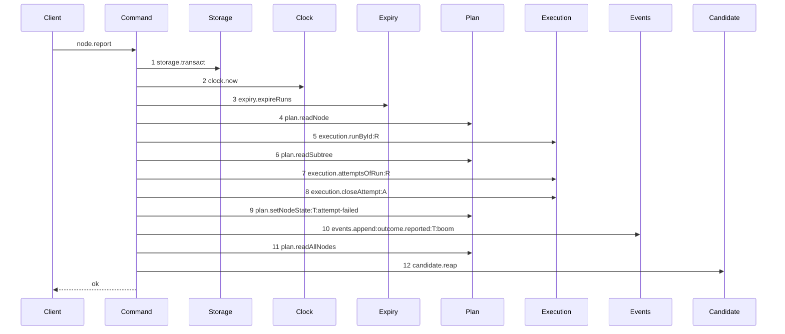
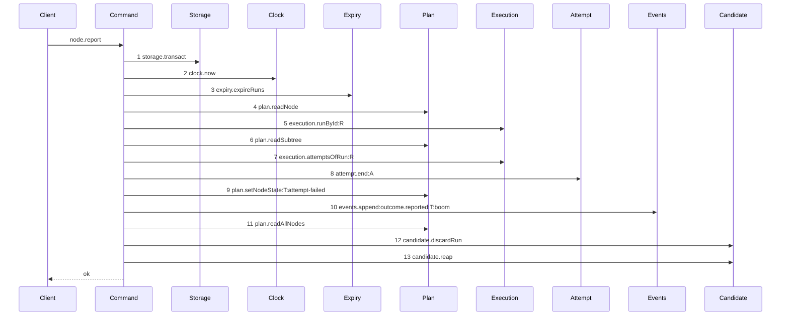

# Story 2 — The worker's own failure member pays its attempt

Epic: `.agents/plan/epics/054.3-the-report-members-pay-their-attempt.md`
Depends on: EPIC 054.1 Story 1 (`01-a-semantic-ending-and-an-accepted-one`), for `endAttempt`,
`EndAttemptDependencies`, `EndAttemptInput` and `EndAttemptResult`; EPIC 054 Story 6
(`06-the-evidence-union-and-the-classifiers`), for the `worker-reported-failure` evidence member;
EPIC 054 Story 7 (`07-accounting-by-class`), for `accountAttempts().semanticCount` and for the
`report-outcome.ts` projection this story repairs; EPIC 054.2 Story 1
(`01-the-unreachable-candidate-pays-its-attempt`), for the `attempt.end` projection entry; EPIC 050.4
Story 6 (`06-the-report-drops-the-lease`), for the collapsed single attempt read this path draws;
EPIC 051.6 Story 3 (`03-the-report-reaps-on-every-settled-terminal`), for the capture-reap-raise
block this story inserts the discard into; Story 1 (`01-the-run-scoped-candidate-discard`), for
`discardRunCandidate`, its `candidate.discard` projection and its composition-root binding.
Kind: story-implement

Diagrams: report-worker-failure-paid

Baselines: report-worker-failure-paid <- baseline-report-worker-failure

Seams: report-worker-failure-paid: +attempt.end:A, +candidate.discardRun, -execution.closeAttempt:A

This story opens the boundary the rest of the epic writes through: the `attempt` dependency key on
`reportOutcome`, the `discardRun` method on its `candidate` key and the termination projection. The
unit behind that method is Story 1 (`01-the-run-scoped-candidate-discard`)'s, drawn there. Story 3 (`03-an-exhausted-worker-report-ends-its-run`) reads all four and
adds one fixture; Stories 4 and 5 add the returned disposition; Stories 6 to 8 move the three
accepted closes.

**It registers the epic as authored.** Insert `"054.3"` into `scripts/epic-sequence-range.ts:1` —
`authoredEpics` after `"054.2"`, and into the pinned literal at
`test/sequence/conformance.test.ts:255` — `authoredEpics` reads. **Verify that `"054.2"` is the last
entry before inserting.** Story 10 (`10-the-proposal-records-the-report-arms`) appends `"054.3"` to
`shippedEpics`, and it is last in dispatch order.

## The shipped path

### `baseline-report-worker-failure`

Superseded by: EPIC 054.3 report-worker-failure-paid

Shipped path: `src/commands/outcome/report-outcome.ts:107-342`, as EPIC 050.2 Story 6
(`06-the-report-prelude`), EPIC 050.4 Story 6 (`06-the-report-drops-the-lease`) and EPIC 051.6
Story 3 (`03-the-report-reaps-on-every-settled-terminal`) leave it. **The prelude and the reap are
plan text, not this tree**: the tree is at EPIC 050.1, so steps 3, 5, 6 and 12 cite the story that
decides them and steps 1, 2, 4, 7, 8, 9, 10 and 11 cite the shipped file.

Fixture: task `T` running under run `R` of kind `execution` with exactly one open attempt `A`,
`attemptLimit` of `3` and no earlier closed attempt, so the limit is not reached; the body is
`{ report: "failed", runId, runFence, reason: "boom" }`; no run is expired, so `expiry.expireRuns`
finds nothing and still fires; the run holds one `run_base` row whose home is the loopback bare
repository, and `refs/kanthord/candidate/<runId>/1` exists in it.



Citations, one per step, caller anchor then callee anchor, with the fixture state that reaches it:

1. `src/commands/outcome/report-outcome.ts:107` — `transact` is the caller;
   `src/services/storage/index.ts:1` — `Transaction` declares the context it yields. Reached
   unconditionally.
2. `src/commands/outcome/report-outcome.ts:108` — `now` is the caller;
   `src/services/clock/index.ts:1` — `Clock` is the callee. Reached unconditionally.
3. `.agents/plan/stories/051.6-the-post-expiry-reap-on-the-run-operations/03-the-report-reaps-on-every-settled-terminal.md:119`
   — `Expiry` is the caller's declared key;
   `src/commands/run/expire-runs.ts:25` — `expireRuns` is the callee. Reached unconditionally, and
   the fixture has no due run, so it returns an empty list.
4. `src/commands/outcome/report-outcome.ts:110` — `readNode` is the caller;
   `src/services/plan/index.ts:70` — `PlanStore` is the callee. Reached unconditionally, and the
   fixture's `T` exists, so the `node-not-found` refusal at `:112` is not taken.
5. `.agents/plan/stories/050.2-the-run-renew-release-and-report/06-the-report-prelude.md:107` —
   `report-lease-free` names the prefix that holds it;
   `src/services/execution/index.ts:101` — `activeRunOfNode` is the shipped read the prelude replaces
   with `runById`. Reached because the body carries a `runId`.
6. `.agents/plan/stories/050.4-the-node-lease-removal/06-the-report-drops-the-lease.md:66` —
   `plan.readSubtree` is the drawn step;
   `src/services/plan/index.ts:70` — `PlanStore` is the callee. Reached because the authority check
   needs the subtree of `T`.
7. `src/commands/outcome/report-outcome.ts:215` — `attemptsOfRun` is the caller;
   `src/services/execution/index.ts:115` — `attemptsOfRun` is the callee. **One call, not two**:
   `.agents/plan/stories/050.4-the-node-lease-removal/06-the-report-drops-the-lease.md:110` —
   `the collapse` deletes the second read at `:242`. Reached because the fixture holds one open
   attempt, so the two throws at `:218` and `:222` are not taken.
8. `src/commands/outcome/report-outcome.ts:234` — `closeAttempt` is the caller;
   `src/services/execution/index.ts:111` — `closeAttempt` is the callee. Reached because the body is
   one of the four `TaskReportOutcome` values admitted at `:147` — `switch`, and the actor is a
   harness, so `:160` — `actor-forbidden` is not taken.
9. `src/commands/outcome/report-outcome.ts:258` — `setNodeState` is the caller;
   `src/services/plan/index.ts:70` — `PlanStore` is the callee. The label is
   `src/domain/outcome-report.ts:77` — `attempt-failed`, reached because the fixture is `failed` and
   the accounting is not exhausted.
10. `src/commands/outcome/report-outcome.ts:291` — `append` is the caller;
    `src/services/event/index.ts:49` — `EventLog` is the callee. The third label is
    `src/commands/outcome/report-outcome.ts:302` — `reason`, and the projection that appends it is
    `test/helpers/sequence-conformance.ts:81` — `reason`. The fixture's reason is the literal
    `"boom"`, so the token is `events.append:outcome.reported:T:boom`.
11. `src/commands/outcome/report-outcome.ts:310` — `readAllNodes` is the caller;
    `src/services/plan/index.ts:70` — `PlanStore` is the callee. Reached unconditionally, and it is
    the sibling read that builds `objectiveProjection`.
12. `.agents/plan/stories/051.6-the-post-expiry-reap-on-the-run-operations/03-the-report-reaps-on-every-settled-terminal.md:191`
    — `reap` is the caller;
    `.agents/plan/stories/051.5-the-targeted-post-expiry-candidate-cleanup/03-an-expiry-pass-that-ended-no-run-reaps-nothing.md:90`
    — `reapRunCandidates` is the callee. Reached on every settled terminal, and the fixture's empty
    expired list makes it return without a deletion.

**Re-verify this baseline against the real file before the first case opens.** The tree is at
EPIC 050.1, so the steps above are the composition six unshipped epics produce, not lines this
repository holds today. Read `src/commands/outcome/report-outcome.ts` at dispatch, confirm every
token and its order, and replace each plan-cited caller anchor with the `src/**` line that makes the
call. **Report a divergence rather than editing the diagram**: the diagram is authoritative over the
prose of its story, so a trace that disagrees with it makes the epic invalid and a human resolves
it.

**This baseline records three properties the story changes, and no fourth.** The close is a direct
`execution.closeAttempt` with no class and no event; the reported run's own candidate ref is never
deleted; and the accounting projection gives the closing attempt no `termination`, which after
EPIC 054 Story 7 (`07-accounting-by-class`) makes `semanticCount` blind to it. **`lease.read` and
`lease.release` are absent, and that is not an omission**: EPIC 050.4 Story 6
(`06-the-report-drops-the-lease`) deleted the release at `src/commands/outcome/report-outcome.ts:282`
— `release` and EPIC 050.2 Story 6 (`06-the-report-prelude`) replaced the read at `:173` — `read`
with `assertRunAuthority`, which is pure and is therefore no message.

### `report-worker-failure-paid`

Supersedes: EPIC 054.3 baseline-report-worker-failure

Fixture: the fixture of `baseline-report-worker-failure`, unchanged. Nothing about it moves, because
the settlement joins the transaction that is already open and the discard is one call after it
commits.



**Two tokens change and one is inserted.** Step 8 was `execution.closeAttempt:A` and is now
`attempt.end:A`; step 12 is new. Steps 1 to 7 and 9 to 11 are the baseline's, token for token and in
its order, and this story signs none of them.

**`candidate.reap` is renumbered from 12 to 13 and is not moved, so it stays a context token.**
`.agents/plan/authoring.md:289` — `renumbered` is the rule: inserting one call renames every later
ordinal and moves nothing.

**Step 8 is one step, because a nested command is one step.** The scenario binds `endAttempt` to
unrecorded dependencies, so its own attempt read, its node read, the close and the `attempt.ended`
append produce no token here. Each is drawn by EPIC 054.1 Story 1
(`01-a-semantic-ending-and-an-accepted-one`).

**Step 8 is inside the transaction step 1 opens, and this command still opens exactly one.**
`endAttempt` takes the caller's transaction and opens none —
`.agents/plan/epics/054.1-the-end-attempt-command.md:15` — `endAttempt` — and the whole worker arm of
`reportOutcome` is one `storage.transact` callback. Case 6 asserts the span count.

**Steps 12 and 13 are both outside that transaction, and their order is fixed.** The operation's own
ref goes first and the opportunistic sweep of other runs second, per
`.agents/plan/epics/054.3-the-report-members-pay-their-attempt.md:65` — `The order after the commit`.
Neither call rides with the settlement, and `candidate.sweep` retries either —
`.agents/plan/epics/051.1-the-candidate-and-the-git-primitives.md:97` — `candidate.sweep` deletes
every ref whose run is not `active`.

**Step 12 carries no label, and that is a decision.** `test/helpers/sequence-conformance.ts:50` —
`projections` declares no entry for `candidate.discardRun`, so the recorder emits the bare token, and
a bare token admits one call per diagram. This path makes exactly one, so no projection is added.
`candidate.reap` at step 13 is unlabelled for the same reason —
`.agents/plan/stories/051.6-the-post-expiry-reap-on-the-run-operations/03-the-report-reaps-on-every-settled-terminal.md:76`
— `candidate.reap` carries no label.

**The drawn set is every branch of this path.** The three worker-driven members `rejected`, `failed`
and `cancelled` reach one arm, and their call sets and order are identical: only the
`plan.setNodeState` trigger differs, at `src/domain/outcome-report.ts:73-78` — `trigger`. That is a
value and not a call set, so `.agents/plan/authoring.md:166` —
`A branch that changes a value and not the call` makes them one diagram, drawn against the `failed`
fixture, and cases 1 and 2 assert `rejected` and `cancelled` by value. The exhausted branch of the
same three members calls `execution.endRun` where this one does not, which is a call-set difference,
and Story 3 (`03-an-exhausted-worker-report-ends-its-run`) draws it. The `accepted` member is
`report-checkpoint-reap` of EPIC 051.6 Story 3
(`03-the-report-reaps-on-every-settled-terminal`), which this epic does not touch.

Add `test/sequence/scenarios/report-worker-failure-paid.ts`.

## Change

**Edit `src/commands/outcome/report-outcome.ts` to settle the worker's failure through the command
and to discard the reported run's candidate ref.**

### 1 — the `attempt` dependency key

`ReportOutcomeDependencies` at `src/commands/outcome/report-outcome.ts:52` —
`ReportOutcomeDependencies` gains one member:

```ts
attempt: Readonly<{
  end(transaction: Transaction, input: EndAttemptInput): EndAttemptResult;
}>;
```

**The key is `attempt` and the method is `end`, so the diagram token is `attempt.end`.** EPIC 054.2
Story 1 (`01-the-unreachable-candidate-pays-its-attempt`) settled both, at
`.agents/plan/stories/054.2-the-execution-accept-pays-its-attempt/01-the-unreachable-candidate-pays-its-attempt.md:117`
— `The key is` , and this epic inherits them. **It is an object capability, not a bare callable**:
`test/helpers/sequence-conformance.ts:113` — `typeof capability` returns a function-valued dependency
unwrapped, so a bare callable would draw no step at all.

**Add no `Clock` and no second `Execution` read for the two remaining input fields.**
`EndAttemptCommon` at
`.agents/plan/stories/054.1-the-end-attempt-command/01-a-semantic-ending-and-an-accepted-one.md:143`
— `EndAttemptCommon` requires `at` and `attemptLimit`. `at` is the `now` of step 2 at
`src/commands/outcome/report-outcome.ts:108` — `now`, and `attemptLimit` is `run.attemptLimit`, which
this command already reads at `src/commands/outcome/report-outcome.ts:245` — `attemptLimit`. Neither
adds a token.

### 2 — the close becomes the command

Replace `src/commands/outcome/report-outcome.ts:234-239` — `closeAttempt` with

```ts
dependencies.attempt.end(transaction, {
  attemptId: open.id,
  runId: run.id,
  nodeId: node.id,
  attemptNo: open.attemptNo,
  at: now,
  attemptLimit: run.attemptLimit,
  outcome: body.report,
  evidence: { kind: "worker-reported-failure" },
});
```

`body.report` is narrowed to `"rejected" | "failed" | "cancelled"` by the `switch` at
`src/commands/outcome/report-outcome.ts:147` — `switch` on this arm, and all three are members of
`src/domain/attempt.ts:7` — `attemptOutcomes` and of
`Exclude<AttemptOutcome, "accepted">`. `worker-reported-failure` is `semantic` for both drivers and
carries no fields — `.agents/plan/epics/054-attempt-classification-and-the-supervisor.md:55` —
`worker-reported-failure`.

**The evidence is a literal and it never reads the body.** A worker that reports "out of quota" still
pays a semantic attempt, because only a response the daemon's own transport received carries a
`responseHash` — `.agents/plan/epics/054.3-the-report-members-pay-their-attempt.md:44` —
`A worker's claim of quota exhaustion`. Case 3 is the trust boundary.

**The two values the close returned come from the step 7 list.** `src/commands/outcome/report-outcome.ts:299`
— `attemptId` and `:300` — `attemptNo` read `attempt.id` and `attempt.attemptNo` from the closed
record, and `:333` and `:334` read the same two into the response. `endAttempt` returns no attempt
record, so both sites read `open.id` and `open.attemptNo` — the same two values this change passes
to the close. **Do not add a second `execution.attemptsOfRun` read**:
`test/helpers/sequence-conformance.ts:284` — `duplicate token in diagram` refuses a repeat, and
EPIC 050.4 Story 6 (`06-the-report-drops-the-lease`) collapsed the two reads for exactly that reason.

**Discard the `EndAttemptResult`, and do not narrow it.** The command needs neither
`semanticCountAfter` nor `exhausted` from it, because change step 3 keeps `accountAttempts` as the one
source of both. The `"already-settled"` member is unreachable here: the attempt was proved open at
`src/commands/outcome/report-outcome.ts:220` — `open` inside the same transaction, and the close
carries `WHERE outcome IS NULL` —
`.agents/plan/epics/054-attempt-classification-and-the-supervisor.md:48` —
`The close already wins the first-writer race`.

### 3 — the accounting projection is confirmed, not rewritten

**Verify that `src/commands/outcome/report-outcome.ts:241` — `accountAttempts` projects the closing
attempt as `termination: "semantic" as const`, and report a divergence rather than editing it.**
EPIC 054 Story 7 (`07-accounting-by-class`) site 4 owns that statement and its case 8a proves it, so
this story inherits a correct projection and writes nothing here. The expected shape is

```ts
const accounting = accountAttempts({
  attempts: attempts.map((row) =>
    row.id === open.id
      ? {
          attemptNo: row.attemptNo,
          outcome: body.report,
          termination: "semantic" as const,
        }
      : {
          attemptNo: row.attemptNo,
          outcome: row.outcome,
          termination: row.termination,
        },
  ),
  limit: run.attemptLimit,
});
```

**Stop rather than proceeding on a pass-through.** EPIC 050.4 Story 6
(`06-the-report-drops-the-lease`) collapsed the two attempt reads into one taken **before** the close,
so `row` is the still-open row and `row.termination` is `null` on it. A projection that passes it
through prices the charge at zero, makes `semanticCount` blind to it and leaves the `attempt-limit`
branch of `src/domain/outcome-report.ts:57` — `exhausted` unreachable on this route. Story 3
(`03-an-exhausted-worker-report-ends-its-run`) is the story that cannot pass without it.

**The literal is provably what `endAttempt` stores, and case 5 asserts the equality.**
`worker-reported-failure` maps to `semantic` for both drivers at
`.agents/plan/epics/054-attempt-classification-and-the-supervisor.md:55` —
`worker-reported-failure`, and it is not an `ambiguous` kind, so `convertOnExhaustion` never reaches
it. That is why one statement may write the class as a literal while another derives it from the
evidence, and case 5 is what keeps the two from drifting.

**Nothing else in the projection moves.** `attemptsRemaining` at
`src/commands/outcome/report-outcome.ts:253` — `attemptsRemaining` reads
`accounting.semanticCount` after EPIC 054 Story 7 (`07-accounting-by-class`), and it stays as that
story leaves it.

### 4 — the `candidate` key gains `discardRun`, and the caller calls it once

`reportOutcome`'s `candidate` key is
`.agents/plan/stories/051.6-the-post-expiry-reap-on-the-run-operations/03-the-report-reaps-on-every-settled-terminal.md:135`
— `candidate`. It gains one method:

```ts
candidate: Readonly<{
  reap(runs: readonly ExpiredRun[]): Promise<unknown>;
  discardRun(
    input: Readonly<{ runId: string; attemptNo: number }>,
  ): Promise<unknown>;
}>;
```

**The transaction callback carries the discard target on every arm.** `decided` — the value the
transaction returns, per
`.agents/plan/stories/051.6-the-post-expiry-reap-on-the-run-operations/03-the-report-reaps-on-every-settled-terminal.md:146`
— `expired` — gains one field:

```ts
discard: Readonly<{ runId: string; attemptNo: number }> | null;
```

The worker arm sets it to `{ runId: run.id, attemptNo: open.attemptNo }`. **Every other arm sets it
to `null`** — the accepted execution member, the objective members and the `structural` and `review`
members of Stories 4 and 5 — because a structural report carries a patch and no object id and a
review claim writes no candidate ref at all
(`.agents/plan/epics/053.1-the-review-checkpoint.md:72` — `claim-success-review`), and the accepted
execution member discards inside `acceptExecution` at
`.agents/plan/stories/051.4-the-acceptance-gate-and-the-report-route/07-the-gate-accepts-and-writes-the-checkpoint.md:11`
— `candidate.discard`.

Insert one statement immediately before the reap of
`.agents/plan/stories/051.6-the-post-expiry-reap-on-the-run-operations/03-the-report-reaps-on-every-settled-terminal.md:191`
— `reap`, and change nothing else in that block:

```ts
if (decided.discard !== null) {
  await dependencies.candidate.discardRun(decided.discard);
}
await dependencies.candidate.reap(decided.expired);
```

**It sits after the `try`/`catch` and before the reap.** The settlement has committed, the reap has
not run, and the raise is still ahead — which is the settle, discard, refuse order EPIC 054.2 states
at
`.agents/plan/stories/054.2-the-execution-accept-pays-its-attempt/08-the-ceiling-the-order-and-the-proposal.md:40`
— `The discard order`. The one reap statement, the one throw site and the `catch` are unchanged, so
`report-checkpoint-reap` of EPIC 051.6 Story 3
(`03-the-report-reaps-on-every-settled-terminal`) draws the same tokens in the same order and this
story signs none of them.

### 5 — the composition root

**Edit `src/main.ts` to bind the settlement and the discard.** `src/main.ts:271` —
`boundAggregateInitiative` is the shipped shape of a bound nested command. Add beside it

```ts
const boundEndAttempt = {
  end(transaction: Transaction, input: EndAttemptInput): EndAttemptResult {
    return endAttempt(
      { execution, plan, events, ambiguousBudget, instanceId },
      transaction,
      input,
    );
  },
};
```

and give the `candidate` object `reportOutcome` already receives a second method,
`discardRun: boundDiscardRunCandidate`. That binding is Story 1
(`01-the-run-scoped-candidate-discard`) change step 4's; **verify it is in place and reuse it rather
than declaring a second one.** Pass `attempt: boundEndAttempt` into the `reportOutcome` dependency
object at `src/main.ts:301` — `boundReportOutcome`.

`EndAttemptDependencies` at
`.agents/plan/stories/054.1-the-end-attempt-command/01-a-semantic-ending-and-an-accepted-one.md:135`
— `EndAttemptDependencies` declares those five keys and no `Clock`. **Verify that EPIC 054.2 Story 1
(`01-the-unreachable-candidate-pays-its-attempt`) has already added `boundEndAttempt`, and reuse it
rather than declaring a second one.**

### 6 — the range entry

**Insert `"054.3"` into `scripts/epic-sequence-range.ts:1` — `authoredEpics`**, after `"054.2"`, and
into the pinned literal at `test/sequence/conformance.test.ts:255` — `authoredEpics`. Do not touch
`test/sequence/conformance.test.ts:274` — `["050", "050.1"]`; Story 10
(`10-the-proposal-records-the-report-arms`) appends there.

## Constraints

- One transaction, and it is step 1's. `endAttempt` joins it and opens none. Case 6 asserts the span
  count.
- Both post-commit calls stay outside the transaction, and their order is `discardRun` then `reap`.
  Do not move either inside the callback.
- Do not add a `try` around `candidate.discardRun`. Its totality is Story 1
  (`01-the-run-scoped-candidate-discard`)'s contract, and a caller's `catch` is not the mechanism.
- The evidence is the literal `{ kind: "worker-reported-failure" }` on all three worker-driven
  members. Do not read the body's reason, and do not invent a field.
- Do not add a projection entry for `candidate.discardRun` or `candidate.reap`. Both draw a bare
  token, and each path makes one call.
- Do not add the `attempt.end` entry to `test/helpers/sequence-conformance.ts:50` — `projections`.
  EPIC 054.2 Story 1 (`01-the-unreachable-candidate-pays-its-attempt`) owns it at
  `.agents/plan/stories/054.2-the-execution-accept-pays-its-attempt/01-the-unreachable-candidate-pays-its-attempt.md:221`
  — `attempt.end`.
- Do not widen the `execution.closeAttempt` projection at
  `test/helpers/sequence-conformance.ts:64` — `execution.closeAttempt`. Diagrams of EPIC 051.3,
  EPIC 052.1 and EPIC 053.1 still draw it.
- Do not add a second `execution.attemptsOfRun` read anywhere on this path.
- Do not call `execution.closeAttempt` from `src/commands/outcome/report-outcome.ts` after this
  story. The worker arm was its last site there.
- Do not change the six refusal codes of
  `src/commands/outcome/report-outcome.ts:79` — `ReportOutcomeRefusal`, their statuses or their
  details.
- `decided.discard` is `null` on every arm but the worker one. Do not default it to the run.

## Verify

```
node --test src/commands/outcome/report-outcome.test.ts src/http/server/node/report-node.test.ts src/main.test.ts test/sequence/conformance.test.ts
```

Extend `src/commands/outcome/report-outcome.test.ts`, over `test/helpers/database.ts:32` —
`createMigratedStorage`, `test/helpers/rows.ts:21` — `seedRegistry`, `test/helpers/rows.ts:102` —
`seedGraph` and `test/helpers/rows.ts:329` — `seedNodeState`, using
`src/commands/outcome/report-outcome.test.ts:185` — `createReportFixture` and
`src/commands/outcome/report-outcome.test.ts:322` — `report`. Read the attempt row back with
`src/commands/outcome/report-outcome.test.ts:425` — `attemptRows`, and snapshot with
`src/commands/outcome/report-outcome.test.ts:485` — `baseline` and
`src/commands/outcome/report-outcome.test.ts:494` — `assertNoWrite`.

Add, each as a separate `it`:

1. `"a failed report stores a semantic termination and one attempt.ended carrying worker-reported-failure"`
   — report `failed` over the fixture with the clock fixed to the literal `1_700_000_000_000`, then
   assert the `attempt` row has `outcome === "failed"`, `termination === "semantic"` and
   `endedAt === 1_700_000_000_000` by value; assert exactly one `attempt.ended` event was appended,
   with `subjectKind === "attempt"`, `subjectId === open.id`, and a payload whose `evidence`
   deep-equals `{ kind: "worker-reported-failure" }` and which holds **no** `headOid` key, asserted
   by key set. This is the first third of the epic's gate row 1.

2. `"a rejected and a cancelled report each store the same class and the same evidence"` — the same
   two assertions once for `rejected` and once for `cancelled`, in one case, and additionally assert
   the `plan.setNodeState` trigger by value — `attempt-rejected` and `report-cancelled` from
   `src/domain/outcome-report.ts:73` — `trigger` — through
   `src/commands/outcome/report-outcome.test.ts:455` — `setNodeStateCalls`. The three members write
   one class and three triggers, and this case is what proves no member writes a class of its own.
   This is the rest of the epic's gate row 1, and it is the value assertion the one diagram does not
   make.

3. `"a worker claiming quota exhaustion still stores semantic, and provider-quota stores infrastructure"`
   — report `failed` with the reason `"out of quota"` and assert the stored `termination` is
   `"semantic"` and the payload `evidence` deep-equals `{ kind: "worker-reported-failure" }`; then,
   in the same case, call the real `endAttempt` directly with
   `evidence: { kind: "provider-quota", providerId, responseHash }` over a second attempt and assert
   that row stores `"infrastructure"`. **The second half is the control**; without it the assertion
   passes for a classifier that answers `semantic` to everything. This is the epic's gate row 2, and
   it is the trust boundary asserted at the caller.

4. `"the failure member calls candidate.discardRun exactly once, after the commit and before the reap"`
   — substitute a `candidate` double recording the ordered method names and a `Storage` double
   recording span open and close, run the report, and assert the recorded order is
   span-close, `discardRun`, `reap`, and that `discardRun` recorded exactly `1` call whose input
   deep-equals `{ runId: run.id, attemptNo: 1 }`. Then, against the loopback fixture with the real
   `discardRunCandidate`, assert `refs/kanthord/candidate/<runId>/1` is present before the report and
   absent after, through
   `git.listRefs({ prefix: "refs/kanthord/candidate/" })`. **The control is the accepted member of
   the same fixture**, which records `0` on the same double. This is the epic's gate row 3.

5. `"the projection and the stored class agree, and the response counts the charge"` — over a fixture
   at `attemptLimit: 3` with no earlier closed attempt, report `failed`; assert
   `result.attemptsRemaining === 2` by value, assert the stored `attempt` row's `termination` is
   `"semantic"`, and assert `accountAttempts` over the **stored** rows returns the same
   `semanticCount` the response's arithmetic used, by value. **The control is a `Storage`-backed
   fixture whose one earlier attempt stores `"infrastructure"`**, where the same three assertions give
   `attemptsRemaining === 2` again while `semanticCount` is `1` and not `2` — so a projection that
   counted every closed attempt fails it. This is the case that keeps change step 3's literal and
   `endAttempt`'s classifier from drifting, and it needs no source mutation to detect a wrong
   projection.

6. `"a worker failure report opens exactly one transaction span"` — substitute a `Storage` double
   recording every span, bind `candidate` to a double so neither `discardRun` nor `reap` contributes
   a span of its own, run the report, and assert the count is exactly `1`. **The control is the
   accepted execution member of the same fixture**, which opens the spans EPIC 051.4 pinned at
   `.agents/plan/epics/051.4-the-acceptance-gate-and-the-report-route.md:36` — `acceptExecution`;
   without it the assertion passes for a command that opens no span at all. This is the epic's gate
   row 4.

7. `"a failure at the attempt.ended append leaves the whole report unwritten"` — wrap `events.append`
   in a proxy that throws on the call whose `type` is `attempt.ended`, run the report, catch, and
   assert the `attempt` row, the node state, the run row and the event count are byte-identical to
   their pre-call values through `src/commands/outcome/report-outcome.test.ts:485` — `baseline`.
   **The control is the same case without the injected failure**, which writes all four. This proves
   the settlement and the report are one transaction.

8. `"authoredEpics holds 054.3 after 054.2"` — assert `scripts/epic-sequence-range.ts:1` —
   `authoredEpics` ends with `"054.3"`, that `"054.2"` precedes it, and that
   `test/sequence/conformance.test.ts:254` — `shippedEpics is a prefix of authoredEpics` still
   passes. This is a build check and it opens no new behaviour.

Add `test/sequence/scenarios/report-worker-failure-paid.ts`, building the fixture the diagram names,
running the real `reportOutcome` over real SQLite and the loopback git fixture behind the recorder,
binding `expiry`, `accept`, `attempt` and `candidate` to unrecorded dependencies as
`test/sequence/scenarios/claim-refusal-objective-busy.ts:107` — `expiry` does, aliasing the task, the
run and the attempt as `T`, `R` and `A`, and returning the recorder and the result.

`pnpm run verify` exits 0.

Proof: PASS line delivered — `src/commands/outcome/report-outcome.test.ts` and
`src/http/server/node/report-node.test.ts` in `PASS EPIC-054.3`.
