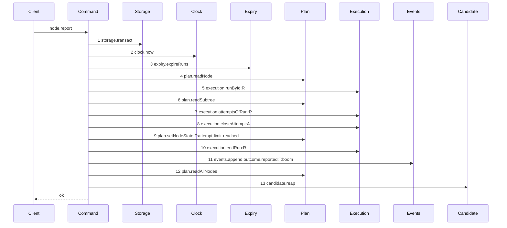
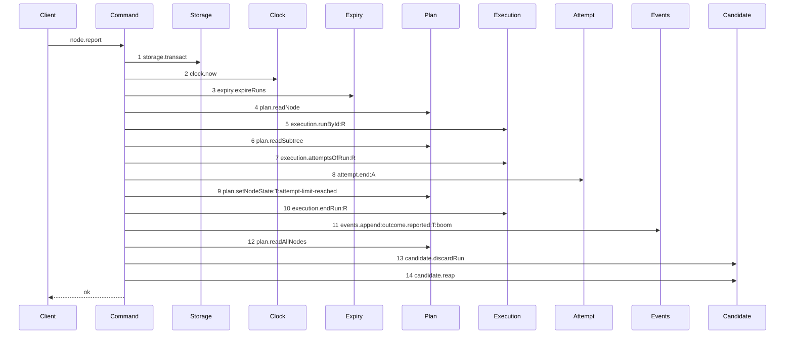

# Story 3 — An exhausted worker report ends its run and pays its attempt

Epic: `.agents/plan/epics/054.3-the-report-members-pay-their-attempt.md`
Depends on: Story 2 (`02-the-worker-failure-pays-its-attempt`), for the `attempt` dependency key, the
`discardRun` method, the run-scoped discard unit, the termination projection and the range entry;
EPIC 054 Story 7 (`07-accounting-by-class`), for `exhausted` reading `semanticCount`.
Kind: story-implement

Diagrams: report-worker-failure-exhausted-paid

Baselines: report-worker-failure-exhausted-paid <- baseline-report-worker-failure-exhausted

Seams: report-worker-failure-exhausted-paid: +attempt.end:A, +candidate.discardRun, -execution.closeAttempt:A

This story adds one fixture and no production edit beyond the one Story 2
(`02-the-worker-failure-pays-its-attempt`) already made to the same three statements. It leaves the
`attempt-limit` branch of the worker arm proven, which is the branch the termination projection makes
reachable.

## The shipped path

### `baseline-report-worker-failure-exhausted`

Superseded by: EPIC 054.3 report-worker-failure-exhausted-paid

Shipped path: `src/commands/outcome/report-outcome.ts:107-342`, the same statements
`baseline-report-worker-failure` draws, over a fixture that reaches
`src/commands/outcome/report-outcome.ts:268` — `effect.runEnd`.

Fixture: task `T` running under run `R` of kind `execution` with `attemptLimit` of `2`, **one earlier
attempt already closed `failed` with `termination = 'semantic'`**, and one open attempt `A`; the body
is `{ report: "failed", runId, runFence, reason: "boom" }`; no run is expired; the run holds one
`run_base` row whose home is the loopback bare repository, and
`refs/kanthord/candidate/<runId>/2` exists in it. The closing charge is the second semantic
termination under a limit of two, so `accountAttempts` reports `exhausted` and
`src/domain/outcome-report.ts:64` — `attempt-limit-reached` is the trigger.



Citations, one per step, caller anchor then callee anchor, with the fixture state that reaches it.
Steps 1 to 8, 11, 12 and 13 carry the anchors and the reachability
`02-the-worker-failure-pays-its-attempt.md` states for the same eight statements; the two that differ
are:

9. `src/commands/outcome/report-outcome.ts:258` — `setNodeState` is the caller;
   `src/services/plan/index.ts:70` — `PlanStore` is the callee. The label is
   `src/domain/outcome-report.ts:64` — `attempt-limit-reached`, reached because the fixture's second
   semantic charge makes `src/domain/outcome-report.ts:57` — `exhausted` true, so
   `src/domain/outcome-report.ts:61` — `blockReason` is `"attempt-limit"` and `nodeState` is
   `"blocked"`.
10. `src/commands/outcome/report-outcome.ts:275` — `endRun` is the caller;
    `src/services/execution/index.ts:108` — `endRun` is the callee. Reached because
    `src/domain/outcome-report.ts:62` — `runEnd` is `"blocked"` on the exhausted arm, where
    `src/domain/outcome-report.ts:71` — `runEnd: null` leaves it unreached below the limit.
    **`execution.stampRunHead` is not reached**, because
    `src/commands/outcome/report-outcome.ts:269` — `accepted` guards it on the body being `accepted`
    and this fixture is `failed`.

**Re-verify this baseline against the real file before the first case opens.** The tree is at
EPIC 050.1, so the steps above are the composition six unshipped epics produce, not lines this
repository holds today. Read `src/commands/outcome/report-outcome.ts` at dispatch, confirm every
token and its order, and replace each plan-cited caller anchor with the `src/**` line that makes the
call. **Report a divergence rather than editing the diagram**: the diagram is authoritative over the
prose of its story, so a trace that disagrees with it makes the epic invalid and a human resolves
it.

**This baseline records the same three properties as Story 2's and one more.** It reaches
`execution.endRun`, which is the call-set difference that makes it a second diagram —
`.agents/plan/epics/054.3-the-report-members-pay-their-attempt.md:42` —
`The worker arm is two drawn paths`. This is where the release precedent does not carry:
`src/commands/node/release-node.ts:123` — `projected.exhausted` already called `endRun` on both
branches, so its token sets were equal; here they are not.

### `report-worker-failure-exhausted-paid`

Supersedes: EPIC 054.3 baseline-report-worker-failure-exhausted

Fixture: the fixture of `baseline-report-worker-failure-exhausted`, unchanged.



**Two tokens change and one is inserted, exactly as on Story 2's path.** Step 8 was
`execution.closeAttempt:A` and is now `attempt.end:A`; step 13 is new. Every other step is the
baseline's, and `candidate.reap` is renumbered from 13 to 14 and moved nowhere, so it stays a context
token — `.agents/plan/authoring.md:289` — `renumbered`.

**Step 10 stays between step 9 and step 11, and it does not move.** `endAttempt` closes the attempt
and appends its event and does nothing else —
`.agents/plan/epics/054.1-the-end-attempt-command.md:15` — `endAttempt` — so the run ending stays
`reportOutcome`'s own statement at `src/commands/outcome/report-outcome.ts:275` — `endRun`.

**The run ends and the attempt is still `semantic`.** Ending the run is the node's consequence of an
exhausted limit; it is not a class. `worker-reported-failure` maps to `semantic` at
`.agents/plan/epics/054-attempt-classification-and-the-supervisor.md:55` —
`worker-reported-failure`, and the exhausted branch reads the same literal Story 2
(`02-the-worker-failure-pays-its-attempt`) passes.

**Steps 13 and 14 are outside the transaction step 1 opens, and their order is fixed** — discard then
reap, per `.agents/plan/epics/054.3-the-report-members-pay-their-attempt.md:65` —
`The order after the commit`. The attempt number in the discard is the closing attempt's, so the ref
this path deletes is `refs/kanthord/candidate/<runId>/2` and not `/1`.

**The drawn set is every branch of this path.** The three worker-driven members reach this arm with
one trigger each, and the trigger is `attempt-limit-reached` for all three on the exhausted branch —
`src/domain/outcome-report.ts:64` — `attempt-limit-reached` is outside the ternary that splits the
below-limit triggers — so unlike Story 2's path the label does not even differ, and one diagram
covers all three exactly. The below-limit branch is Story 2's diagram.

Add `test/sequence/scenarios/report-worker-failure-exhausted-paid.ts`.

## Change

**No production edit beyond Story 2's.** `src/commands/outcome/report-outcome.ts` already carries the
settlement, the projection and the discard after Story 2
(`02-the-worker-failure-pays-its-attempt`), and this branch runs the same three statements over a
fixture that reaches `src/commands/outcome/report-outcome.ts:268` — `effect.runEnd`.

### 1 — confirm the two statements the exhausted branch adds are untouched

`src/commands/outcome/report-outcome.ts:268-280` — `effect.runEnd` is the block that ends the run,
and `src/commands/outcome/report-outcome.ts:269` — `accepted` is the guard that keeps
`execution.stampRunHead` off this arm. **Verify both are unchanged and report a divergence rather
than editing them.** Story 2 touched `:234`, `:241` and the post-commit block, and none of the three
is inside `:268-280`.

### 2 — the scenario fixture

**Add `test/sequence/scenarios/report-worker-failure-exhausted-paid.ts`.** It seeds one closed
`failed` attempt with `termination = 'semantic'` before the open one, over
`test/helpers/rows.ts:789` — `seedAttemptRow`, and sets the run's `attempt_limit` to `2` through
`test/helpers/rows.ts:759` — `seedRunRow`. **The earlier attempt's `termination` is what makes the
branch reachable**: after EPIC 054 Story 7 (`07-accounting-by-class`), `exhausted` is
`semanticCount >= limit`, so an earlier row with a null `termination` counts zero and this fixture
would take Story 2's branch instead.

## Constraints

- One transaction, and it is step 1's. Story 2's ceiling holds on this branch too.
- `execution.endRun` stays between `plan.setNodeState` and `events.append`. Do not move it.
- `execution.stampRunHead` is reached zero times. The guard at
  `src/commands/outcome/report-outcome.ts:269` — `accepted` stays as it is.
- The termination is `"semantic"` on this branch as well. Ending the run is not a class.
- The discard names the **closing** attempt's number, not attempt one.
- Add no production statement in this story. A change to
  `src/commands/outcome/report-outcome.ts:268-280` is out of scope, and a divergence there is
  reported.

## Verify

```
node --test src/commands/outcome/report-outcome.test.ts test/sequence/conformance.test.ts
```

Extend `src/commands/outcome/report-outcome.test.ts`, using
`src/commands/outcome/report-outcome.test.ts:509` — `driveOutcomeToLimit` and
`src/commands/outcome/report-outcome.test.ts:530` — `assertBlockedAtLimit`, which already drive and
assert the shipped exhausted branch.

Add, each as a separate `it`:

1. `"an exhausted worker report stores semantic, blocks the node with attempt-limit and ends the run"`
   — over the fixture at `attemptLimit: 2` with one earlier `failed` attempt carrying
   `termination = 'semantic'`, report `failed` and assert three rows by value: the `attempt` row has
   `outcome === "failed"` and `termination === "semantic"`; the `node` row has `state === "blocked"`
   and `blockReason === "attempt-limit"`, read through
   `src/commands/outcome/report-outcome.test.ts:382` — `blockReasonOf`; and the `run` row has
   `state === "ended"` and `outcome === "blocked"`, read through
   `src/commands/outcome/report-outcome.test.ts:405` — `runRowOfNode`. **The control is Story 2's
   fixture at `attemptLimit: 3`**, which leaves the node `ready` and the run `active` — assert it in
   the same case, so a report that always ends its run fails one of the two halves. This is the
   epic's gate row 4a.

2. `"the exhausted arm reaches execution.endRun once and execution.stampRunHead zero times"` —
   substitute an `Execution` double counting both methods, run the exhausted report, and assert
   `endRun` records `1` and `stampRunHead` records `0`. **The control is the accepted member of the
   same fixture**, which records `1` on both; without it the `stampRunHead` assertion passes for a
   command that reaches no execution seam at all. This is the call-set difference that makes this a
   second diagram.

3. `"an earlier attempt with a null termination does not exhaust the limit"` — the same fixture with
   the earlier attempt's `termination` left `null`, report `failed`, and assert the node is `ready`
   and the run is still `active`. This is the legacy-row effect of
   `.agents/plan/epics/054-attempt-classification-and-the-supervisor.md:42` —
   `Only a non-accepted attempt carries a termination`, and it is the control that case 1's
   `exhausted` is decided by the stored class and not by the attempt count.

4. `"the exhausted arm discards the closing attempt's candidate ref exactly once"` — against the
   loopback fixture, seed both `refs/kanthord/candidate/<runId>/1` and
   `refs/kanthord/candidate/<runId>/2`, report `failed`, and assert `/2` is absent and `/1` is
   present. **The control is the `/1` ref**, which proves the deletion is attempt-scoped and not
   run-scoped; without it the assertion passes for a unit that deletes the whole run prefix.

5. `"a rejected and a cancelled report at the limit block the node the same way"` — run case 1's
   assertions once for `rejected` and once for `cancelled`, in one case, and assert the
   `plan.setNodeState` trigger is `attempt-limit-reached` for all three through
   `src/commands/outcome/report-outcome.test.ts:455` — `setNodeStateCalls`. This is what proves the
   one diagram covers three members exactly on this branch, where Story 2's covers three triggers.

Add `test/sequence/scenarios/report-worker-failure-exhausted-paid.ts`, building the fixture the
diagram names — the run at `attempt_limit: 2` and the earlier `failed` attempt carrying
`termination = 'semantic'` — running the real `reportOutcome` over real SQLite and the loopback git
fixture behind the recorder, binding `expiry`, `accept`, `attempt` and `candidate` to unrecorded
dependencies, aliasing the task, the run and the closing attempt as `T`, `R` and `A`, and returning
the recorder and the result.

`pnpm run verify` exits 0.

Proof: PASS line delivered — `src/commands/outcome/report-outcome.test.ts` in `PASS EPIC-054.3`.
