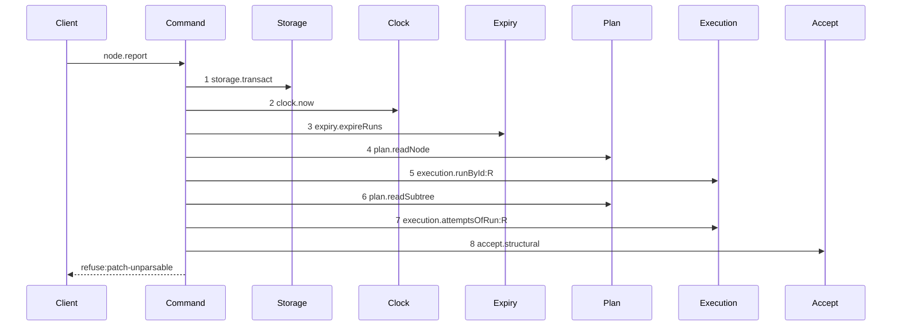
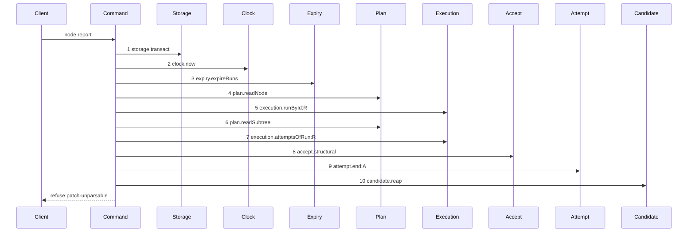

# Story 4 — A structural rejection pays its attempt

Epic: `.agents/plan/epics/054.3-the-report-members-pay-their-attempt.md`
Depends on: Story 2 (`02-the-worker-failure-pays-its-attempt`), for the `attempt` dependency key, the
`decided` descriptor and the range entry; EPIC 052.1 Story 2
(`02-an-unparsable-patch-reaches-no-seam`), for `acceptStructural`, `AcceptStructuralRefusal` and
`AcceptStructuralError`; EPIC 052.2 Story 2 (`02-the-report-route-carries-a-patch`), for the
`accept.structural` dependency member and the structural arm of the route; EPIC 054 Story 6
(`06-the-evidence-union-and-the-classifiers`), for the `daemon-rejected` evidence member;
EPIC 051.6 Story 3 (`03-the-report-reaps-on-every-settled-terminal`), for the capture-reap-raise
block this story routes the rejection through.
Kind: story-implement

Diagrams: report-structural-rejection

Baselines: report-structural-rejection <- baseline-report-structural-rejection

Seams: report-structural-rejection: +attempt.end:A, +candidate.reap

This story converts `acceptStructural` from a throwing command to one that returns its rejection, and
it is what lets the settlement commit. Story 5 (`05-a-review-rejection-pays-its-attempt`) makes the
same conversion for `acceptReview` and widens one union member this story introduces.

## The shipped path

### `baseline-report-structural-rejection`

Superseded by: EPIC 054.3 report-structural-rejection

Shipped path: the structural arm of `reportOutcome` as EPIC 052.2 Story 2
(`02-the-report-route-carries-a-patch`) leaves it, over the refusal EPIC 052.1 Story 2
(`02-an-unparsable-patch-reaches-no-seam`) raises. **`acceptStructural` does not exist in this
tree**: `src/commands/checkpoint/` holds no file, so steps 8 and the refusal cite the story that
decides them, and steps 1, 2, 4 and 7 cite `src/commands/outcome/report-outcome.ts`.

Fixture: expansion node `N` running under a `structural` run `R` with exactly one open attempt `A`,
`attemptLimit` of `3`, and the body is `{ report: "structural", runId, runFence, patch }` where
`patch` is the literal `"not-a-patch"`, which `graphPatch.safeParse` refuses. **No run is expired**,
so `expiry.expireRuns` finds nothing and the rollback this baseline suffers loses no committed row —
which is what makes the ship diagram's byte-identity claim checkable. The run holds no candidate ref,
because a structural report carries a patch and no object id.



Citations, one per step, caller anchor then callee anchor, with the fixture state that reaches it:

1. `src/commands/outcome/report-outcome.ts:107` — `transact` is the caller;
   `src/services/storage/index.ts:1` — `Transaction` is the context it yields. Reached
   unconditionally.
2. `src/commands/outcome/report-outcome.ts:108` — `now` is the caller;
   `src/services/clock/index.ts:1` — `Clock` is the callee. Reached unconditionally.
3. `.agents/plan/stories/051.6-the-post-expiry-reap-on-the-run-operations/03-the-report-reaps-on-every-settled-terminal.md:119`
   — `Expiry` is the caller's declared key; `src/commands/run/expire-runs.ts:25` — `expireRuns` is
   the callee. Reached unconditionally, and the fixture has no due run.
4. `src/commands/outcome/report-outcome.ts:110` — `readNode` is the caller;
   `src/services/plan/index.ts:70` — `PlanStore` is the callee. Reached unconditionally, and the
   `initiative-not-reportable` refusal at `src/commands/outcome/report-outcome.ts:116` — `initiative`
   is lifted for this member by
   `.agents/plan/stories/052.2-the-structural-report-route/02-the-report-route-carries-a-patch.md:109`
   — `lift`.
5. `.agents/plan/stories/052.2-the-structural-report-route/02-the-report-route-carries-a-patch.md:54`
   — `execution.runById:R` is the drawn step;
   `src/services/execution/index.ts:101` — `activeRunOfNode` is the shipped read the prelude replaces
   with `runById`. Reached because the body carries a `runId`.
6. `.agents/plan/stories/052.2-the-structural-report-route/02-the-report-route-carries-a-patch.md:55`
   — `plan.readSubtree` is the drawn step; `src/services/plan/index.ts:70` — `PlanStore` is the
   callee. Reached because the authority check and `subtreeIds` both need it.
7. `src/commands/outcome/report-outcome.ts:215` — `attemptsOfRun` is the caller;
   `src/services/execution/index.ts:115` — `attemptsOfRun` is the callee. Reached because the fixture
   holds one open attempt, so the throws at `:218` and `:222` are not taken.
8. `.agents/plan/stories/052.2-the-structural-report-route/02-the-report-route-carries-a-patch.md:138`
   — `accept.structural` is the caller;
   `.agents/plan/stories/052.1-the-structural-acceptance/02-an-unparsable-patch-reaches-no-seam.md:82`
   — `acceptStructural` is the callee. Reached because the arm branches on
   `body.report === "structural"` before the node-kind branches, per
   `.agents/plan/stories/052.2-the-structural-report-route/02-the-report-route-carries-a-patch.md:132`
   — `Branch on`.

The terminal:
`.agents/plan/stories/052.1-the-structural-acceptance/02-an-unparsable-patch-reaches-no-seam.md:162`
— `AcceptStructuralError` is thrown with the code at `:163` — `patch-unparsable`, and
`test/helpers/sequence-conformance.ts:303` — `resultTerminal` reads `refuse:patch-unparsable` from
the caught error.

**Re-verify this baseline against the real file before the first case opens.** The tree is at
EPIC 050.1, so the steps above are the composition six unshipped epics produce, not lines this
repository holds today. Read `src/commands/outcome/report-outcome.ts` at dispatch, confirm every
token and its order, and replace each plan-cited caller anchor with the `src/**` line that makes the
call. **Report a divergence rather than editing the diagram**: the diagram is authoritative over the
prose of its story, so a trace that disagrees with it makes the epic invalid and a human resolves
it.

**This baseline records three properties the story changes.** The rejection is a throw, so the
transaction rolls back and the attempt closes nowhere. The rollback also discards the expiry pass of
step 3 — `.agents/plan/stories/053.1-the-review-checkpoint/10-the-report-route-carries-a-verdict.md:159`
— `AcceptReviewError` states the same effect for the sibling command. And because the throw is
neither an `AcceptExecutionError` nor caught by
`.agents/plan/stories/051.6-the-post-expiry-reap-on-the-run-operations/03-the-report-reaps-on-every-settled-terminal.md:185`
— `AcceptExecutionError`, it escapes the capture-reap-raise block and **`candidate.reap` is never
reached**, which is why this baseline holds eight steps and not nine.

**Nothing replaces a removed read, because this story removes none.** Every read of steps 1 to 7
survives, and step 8 keeps its input unchanged.

### `report-structural-rejection`

Supersedes: EPIC 054.3 baseline-report-structural-rejection

Fixture: the fixture of `baseline-report-structural-rejection`, unchanged. The returned rejection
changes what the transaction does with the verdict, not what reaches the verdict.



**Two steps are inserted and no step moves.** Steps 1 to 8 are the baseline's, token for token and in
its order, and this story signs neither of the two removals it makes to nothing.

**Step 9 is one statement after the accept returns, and it is inside the transaction step 1 opens.**
`acceptStructural` takes the caller's transaction and opens none —
`.agents/plan/epics/052.1-the-structural-acceptance.md:35` — `takes the caller's transaction` — so
the verdict is reached inside the prelude and the termination write sits beside it. This command
therefore still opens exactly one span on this arm, and case 6 asserts the count.

**Step 9 is one step, because a nested command is one step.** The scenario binds `endAttempt` to
unrecorded dependencies, so the two reads, the close and the `attempt.ended` append inside it produce
no token here.

**Step 10 is new to this path, and the returned disposition is what reaches it.** With the throw, the
error escaped the capture block of
`.agents/plan/stories/051.6-the-post-expiry-reap-on-the-run-operations/03-the-report-reaps-on-every-settled-terminal.md:185`
— `AcceptExecutionError`; with the disposition, the transaction commits and the one reap statement at
`:191` — `reap` runs before the raise. **It reaches `candidate.discardRun` zero times**, because
`decided.discard` is `null` on this arm and a structural report carries no object id — case 5 asserts
the count.

**Step 10 sits outside the transaction, and it now deletes against committed state.** In the baseline
the rollback undid the expiry pass, so a reap after it would have deleted refs of runs still active —
which is exactly the reason
`.agents/plan/stories/053.1-the-review-checkpoint/10-the-report-route-carries-a-verdict.md:239` —
`candidate.reap` runs outside gives for keeping the reap outside. The commit removes that hazard, so
the reap is now both reachable and correct on this arm.

**The terminal is unchanged, and the returned rejection is what keeps it.**
`test/helpers/sequence-conformance.ts:310` — `value.ok === false` derives `refuse:<code>` from
`value.code ?? value.refusal`, so a rejection shaped `{ ok: false, refusal, details }` gives the same
`refuse:patch-unparsable` the thrown error gave.

**The rejection writes no node state and ends no run, and the expiry is what recovers the node.**
`.agents/plan/epics/054.2-the-execution-accept-pays-its-attempt.md:50` —
`A gate refusal writes no node state` rules it for the whole EPIC 054 family:
`src/commands/outcome/report-outcome.ts:247` — `taskReportEffect` is the only chooser of `ready` or
`blocked` and it runs on a worker-report body alone, so a refused structural report leaves the run
`active`, the node `running` and no open attempt, and
`src/commands/run/expire-runs.ts:30` — `expireDueRuns` reads no attempt row and therefore still ends
the run at its deadline. **Adding a transition here was rejected** for the reason that epic gives: it
would put `plan.setNodeState` and `execution.endRun` on this diagram and give the daemon a second
writer of a terminal the report path does not own. **Whether a worker should be able to hand back a
run it can no longer report on stays one open product question**, recorded once in EPIC 054.2's tree
and not again here. Case 7's byte-identity assertion is what proves this arm writes neither.

**The drawn set is every branch of this path.** Every refusal `acceptStructural` decides stops inside
step 8 and produces the same three outer tokens at the same three positions, so one outer diagram
covers all of them and the code that separates them is proven by the refusal test — this is
`.agents/plan/authoring.md:338` — `It does not prove a refusal code`. The accepted branch of the same
arm is Story 6 (`06-the-accepted-patch-closes-through-the-command`)'s, and it is a different call set.
The seven refusal diagrams of EPIC 052.1 draw the interior of step 8 and none of them moves.

Add `test/sequence/scenarios/report-structural-rejection.ts`.

## Change

**Edit `src/commands/checkpoint/accept-structural.ts` to return its rejection, and
`src/commands/outcome/report-outcome.ts` to settle it and raise it after the commit.**

### 1 — the returned rejection

Add the rejection type beside the union at
`.agents/plan/stories/052.1-the-structural-acceptance/02-an-unparsable-patch-reaches-no-seam.md:109`
— `AcceptStructuralRefusal`:

```ts
export type AcceptStructuralRejection = Readonly<{
  ok: false;
  refusal: AcceptStructuralRefusal;
  details: Readonly<Record<string, unknown>> | undefined;
}>;

export type AcceptStructuralResult =
  NodeReportResult | AcceptStructuralRejection;
```

`NodeReportResult` at `src/domain/outcome-report.ts:83` — `NodeReportResult` carries no `ok` key, so
`"ok" in result` discriminates the union.

**Replace every `throw new AcceptStructuralError(...)` with a `return` of that shape.** Ten sites:

- `.agents/plan/stories/052.1-the-structural-acceptance/02-an-unparsable-patch-reaches-no-seam.md:162` — `AcceptStructuralError`
- `.agents/plan/stories/052.1-the-structural-acceptance/03-a-stale-revision-refuses-before-any-graph-read.md:58` — `AcceptStructuralError`
- `.agents/plan/stories/052.1-the-structural-acceptance/04-a-resolved-target-or-scope.md:110` — `AcceptStructuralError`
- `.agents/plan/stories/052.1-the-structural-acceptance/04-a-resolved-target-or-scope.md:124` — `AcceptStructuralError`
- `.agents/plan/stories/052.1-the-structural-acceptance/05-an-unresolved-reference-reaches-the-resolver.md:99` — `AcceptStructuralError`
- `.agents/plan/stories/052.1-the-structural-acceptance/05-an-unresolved-reference-reaches-the-resolver.md:106` — `AcceptStructuralError`
- `.agents/plan/stories/052.1-the-structural-acceptance/06-a-fixed-pair-refuses-before-the-validator.md:84` — `AcceptStructuralError`
- `.agents/plan/stories/052.1-the-structural-acceptance/07-an-invalid-staged-graph-or-an-empty-expansion.md:126` — `AcceptStructuralError`
- `.agents/plan/stories/052.1-the-structural-acceptance/07-an-invalid-staged-graph-or-an-empty-expansion.md:153` — `AcceptStructuralError`
- `.agents/plan/stories/052.1-the-structural-acceptance/08-an-ineligible-delete-refuses.md:102` — `AcceptStructuralError`

**Enumerate the throw sites against the implemented file before editing, and report a divergence
rather than assuming this list is complete**: the union at
`.agents/plan/stories/052.1-the-structural-acceptance/02-an-unparsable-patch-reaches-no-seam.md:109`
— `AcceptStructuralRefusal` declares nine codes and `patch-delete-ineligible` is thrown and is not
among them, so the count in that story is inconsistent.

**`AcceptStructuralError` survives, and `reportOutcome` is its only thrower.** The refusal codes,
their `409` and `400` statuses and their details schemas are unchanged, so
`src/http/server/node/refusals.ts:12` — `toHttpError` and the arm
`.agents/plan/stories/052.2-the-structural-report-route/02-the-report-route-carries-a-patch.md:160`
— `AcceptStructuralError` added to it stay exactly as they are.

**The rejection commits, and that is the whole reason for the disposition.** A throw inside
`storage.transact` rolls the settlement back with it —
`.agents/plan/epics/054.3-the-report-members-pay-their-attempt.md:36` —
`A rejection is a returned disposition here too`.

### 2 — the settlement, in the prelude transaction

In the structural arm of `src/commands/outcome/report-outcome.ts`, replace the direct return of
`.agents/plan/stories/052.2-the-structural-report-route/02-the-report-route-carries-a-patch.md:138`
— `accept.structural` with

```ts
const answered = dependencies.accept.structural(transaction, {
  node,
  subtreeIds,
  run,
  attemptId: open.id,
  attemptNo: open.attemptNo,
  patch: body.patch,
  actorId: input.actorId,
  actorKind: input.actorKind,
  now,
});
if ("ok" in answered) {
  dependencies.attempt.end(transaction, {
    attemptId: open.id,
    runId: run.id,
    nodeId: node.id,
    attemptNo: open.attemptNo,
    at: now,
    attemptLimit: run.attemptLimit,
    outcome: "rejected",
    evidence: { kind: "daemon-rejected", refusal: answered.refusal },
  });
  return {
    kind: "raise",
    expired,
    discard: null,
    raise: new AcceptStructuralError(
      answered.refusal,
      `structural report refused: ${answered.refusal}`,
      answered.details,
    ),
  };
}
return { kind: "result", result: answered, expired, discard: null };
```

`"rejected"` is a member of `src/domain/attempt.ts:7` — `attemptOutcomes`. `daemon-rejected` is
`semantic` for both drivers —
`.agents/plan/epics/054-attempt-classification-and-the-supervisor.md:54` — `daemon-rejected`. **The
evidence carries the refusal code**, per
`.agents/plan/epics/054-attempt-classification-and-the-supervisor.md:65` — `daemon-rejected` carries:
without it the ten structural codes, the five review codes and EPIC 054.2's five gate codes collapse
to one indistinguishable audit value. The field is `refusal: string` and never a union of the three
refusal types, because `src/domain/termination.ts` is domain and may not import a command. Case 2
asserts the value.

**The arm passes no `runBases` read.** A structural run holds no base row —
`.agents/plan/stories/052.2-the-structural-report-route/02-the-report-route-carries-a-patch.md:155`
— `no `execution.runBases``.

### 3 — `decided` gains a third member, and the one throw site raises it

`decided` is the value the transaction returns, per
`.agents/plan/stories/051.6-the-post-expiry-reap-on-the-run-operations/03-the-report-reaps-on-every-settled-terminal.md:146`
— `expired`. It holds two members today — the `accept` arm and the already-computed `result` arm —
and each carries the `expired` of that story and the `discard` of Story 2
(`02-the-worker-failure-pays-its-attempt`). It gains a third:

```ts
  | Readonly<{
      kind: "raise";
      expired: readonly ExpiredRun[];
      discard: null;
      raise: AcceptStructuralError;
    }>
```

**The member is a raise and not a result, so no arm carries a nullable result.** Story 5
(`05-a-review-rejection-pays-its-attempt`) widens its `raise` field to
`AcceptStructuralError | AcceptReviewError` and adds no fourth member.

Then widen the `settled` union of
`.agents/plan/stories/051.6-the-post-expiry-reap-on-the-run-operations/03-the-report-reaps-on-every-settled-terminal.md:173`
— `settled` by one member type and test the new arm first:

```ts
let settled:
  | Readonly<{ kind: "ok"; result: ReportOutcomeResult }>
  | Readonly<{
      kind: "refused";
      error: ReportOutcomeError | AcceptStructuralError;
    }>;
try {
  settled =
    decided.kind === "raise"
      ? { kind: "refused", error: decided.raise }
      : {
          kind: "ok",
          result:
            decided.kind === "accept"
              ? await dependencies.accept.execution(decided.input)
              : decided.result,
        };
} catch (error) {
  // unchanged
}
```

**One throw site, and the reap order is untouched.** The discard-and-reap block of Story 2
(`02-the-worker-failure-pays-its-attempt`) and the single
`if (settled.kind === "refused") throw settled.error;` at
`.agents/plan/stories/051.6-the-post-expiry-reap-on-the-run-operations/03-the-report-reaps-on-every-settled-terminal.md:192`
— `throw settled.error` both stay, so `report-checkpoint-reap` of EPIC 051.6 Story 3
(`03-the-report-reaps-on-every-settled-terminal`) draws the same tokens in the same order and this
story signs none of them. **Do not add a second throw site.** Two raises make the reap order
per-arm, and one of the two will lose it.

### 4 — the seven scenario files of EPIC 052.1

**Edit `test/sequence/scenarios/accept-structural-refusal-*.ts` — all seven — to pass the returned
rejection through as `result` instead of catching an error.** They are
`accept-structural-refusal-unparsable.ts`, `accept-structural-refusal-stale-revision.ts`,
`accept-structural-refusal-shape-resolved.ts`, `accept-structural-refusal-shape-unresolved.ts`,
`accept-structural-refusal-pair-fixed.ts`, `accept-structural-refusal-graph-invalid.ts` and
`accept-structural-refusal-delete-ineligible.ts`. Each catches an `AcceptStructuralError` today —
`.agents/plan/stories/052.1-the-structural-acceptance/02-an-unparsable-patch-reaches-no-seam.md:236`
— `catching the` is the shape. Delete the `try`/`catch` and return the value.

**The seven diagrams do not move**, because `test/helpers/sequence-conformance.ts:303` —
`resultTerminal` derives `refuse:<code>` from a returned `{ ok: false, refusal }` as well as from a
thrown error. Case 7 replays all seven.

## Constraints

- One transaction on this arm, and it is step 1's. `acceptStructural` and `endAttempt` both take it
  and open none. Case 6 asserts the count.
- The settlement is inside the transaction and the raise is after the reap. Do not raise from inside
  the callback, and do not raise before the reap.
- `AcceptStructuralError` keeps its class, its `refusal` field, its `details` field and every code.
  Do not change `src/http/server/node/refusals.ts`.
- The evidence is `{ kind: "daemon-rejected" }` on every refusal of this arm. Do not derive it from
  the refusal code.
- `decided.discard` is `null` on this arm. Do not discard a candidate ref a structural report never
  wrote.
- One throw site in `reportOutcome`. Widen the existing `settled` union rather than adding a second
  raise.
- Do not convert `acceptExecution`. EPIC 054.2 Story 1
  (`01-the-unreachable-candidate-pays-its-attempt`) owns its five gate arms and its contended throw.
- Do not add or remove a step of any of the seven EPIC 052.1 refusal diagrams. Only their scenario
  files change.
- Do not touch `plan.readSubtree`, `execution.runById` or their inputs.

## Verify

```
node --test src/commands/checkpoint/accept-structural.test.ts src/commands/outcome/report-outcome.test.ts src/http/server/node/report-node.test.ts test/sequence/conformance.test.ts
```

Extend `src/commands/checkpoint/accept-structural.test.ts`, the file EPIC 052.1 Story 2
(`02-an-unparsable-patch-reaches-no-seam`) created, and
`src/commands/outcome/report-outcome.test.ts` over
`src/commands/outcome/report-outcome.test.ts:425` — `attemptRows`,
`src/commands/outcome/report-outcome.test.ts:485` — `baseline` and
`src/commands/outcome/report-outcome.test.ts:494` — `assertNoWrite`.

Add, each as a separate `it`:

1. `"acceptStructural returns its rejection rather than throwing"` — over the unparsable-patch
   fixture, assert the call returns, that the value deep-equals
   `{ ok: false, refusal: "patch-unparsable", details: undefined }` by value, and that no error was
   raised. **The control is the accepted fixture of the same command**, whose value carries no `ok`
   key; without it the assertion passes for a command that returns the same object for everything.

2. `"a structural rejection stores a semantic termination with daemon-rejected evidence"` — drive the
   real `reportOutcome` over the route fixture with the clock fixed to the literal
   `1_700_000_000_000`, catch the `AcceptStructuralError`, then read the `attempt` row and assert
   `outcome === "rejected"`, `termination === "semantic"` and `endedAt === 1_700_000_000_000` by
   value; assert the one appended `attempt.ended` event has `subjectKind === "attempt"`,
   `subjectId === open.id` and a payload whose `evidence` deep-equals
   `{ kind: "daemon-rejected", refusal: "patch-unparsable" }`. **The control is a second refusal of
   the same command** — the stale-revision fixture — whose `evidence.refusal` is `"stale-revision"`;
   without it the assertion passes for a caller that hard-codes one code. This is the first half of
   the epic's gate row 5.

3. `"the structural rejection still answers patch-unparsable with its shipped status over the route"`
   — in `src/http/server/node/report-node.test.ts`, build the handler with
   `src/http/server/node/report-node.ts:15` — `reportNodeHandler` over the real `reportOutcome`, and
   assert the response status and code are the ones EPIC 052.2 Story 1
   (`01-the-contract-carries-the-patch`) declares for `patch-unparsable`. **The handler, not the
   daemon**: `AGENTS.md` forbids a test importing `src/main.ts`, and this assertion needs
   `src/http/server/node/refusals.ts:12` — `toHttpError` and nothing further out. This is the second
   half of the epic's gate row 5, and it proves the settlement did not change the wire answer.

4. `"the settlement survives the refusal reportOutcome raises"` — the same drive, catching the error,
   then reading the `attempt` row and asserting `termination === "semantic"`. **The control is an
   `accept.structural` double that throws its `AcceptStructuralError` instead of returning it**, run
   over the same fixture through the real `reportOutcome`: the throw escapes the transaction, the row
   is unwritten, and the same read finds none. That is a substituted dependency and not a source
   edit, so both halves are one executable case, and together they prove the returned disposition is
   what commits the settlement.

5. `"a structural rejection calls candidate.discardRun zero times and candidate.reap once"` —
   substitute a `candidate` double counting both methods, run the report, and assert `discardRun`
   records `0` and `reap` records `1`. **The controls are two**: Story 2
   (`02-the-worker-failure-pays-its-attempt`) case 4's fixture records `1` on `discardRun` over the
   same double, and case 4's throwing `accept.structural` double, which records `0` on `reap`. Both are asserted here, beside the assertion they control, because `/work`
   dispatches one case per turn. This is the epic's gate row 6, plus the reap this story newly
   reaches.

6. `"a structural rejection opens exactly one transaction span"` — substitute a `Storage` double
   recording every span, bind `candidate` to a double so `reap` contributes none of its own, run the
   report, and assert the count is exactly `1`. **The control is the accepted execution member of the
   same fixture**, which opens the spans EPIC 051.4 pinned at
   `.agents/plan/epics/051.4-the-acceptance-gate-and-the-report-route.md:36` — `acceptExecution`.

7. `"a structural rejection leaves every table but attempt and event byte-identical"` — snapshot
   every table before the report and after it, over a fixture with **no expired run**, and assert
   equality on all of them except `attempt` and the event log. Take the snapshot in the shape of
   `src/commands/outcome/report-outcome.test.ts:485` — `baseline` and compare it as
   `src/commands/outcome/report-outcome.test.ts:494` — `assertNoWrite` does. **The control is the
   `attempt` table itself**, which must differ in exactly one row; without it the assertion passes
   for a command that wrote nothing at all. **The no-expired-run precondition is load-bearing**: the
   prelude now commits where it used to roll back, so a due run would legitimately change the `run`
   table and this assertion would fail for the right reason. This is the epic's gate row 7.

8. `"the seven EPIC 052.1 refusal diagrams replay unchanged after the conversion"` — run
   `test/sequence/conformance.test.ts:278` — `every due scenario conforms` over the seven edited
   scenario files and assert each replays. Then assert the comparison **fails** when one token is
   removed from each in turn, seven mutations. **This case does not own the epic's gate row 8.** That
   row asserts all eleven refusal diagrams, and Story 5 (`05-a-review-rejection-pays-its-attempt`)
   converts the other four; a case here could only assert seven, so the row's owner is Story 5 and
   this case is the local regression proof of one conversion.

Add `test/sequence/scenarios/report-structural-rejection.ts`, building the fixture the diagram names,
running the real `reportOutcome` over real SQLite behind the recorder, binding `expiry`, `accept`,
`attempt` and `candidate` to unrecorded dependencies, aliasing the node, the run and the attempt as
`N`, `R` and `A`, and returning the recorder and the raised `AcceptStructuralError` as `result`.

`pnpm run verify` exits 0.

Proof: PASS line delivered — `src/commands/checkpoint/accept-structural.test.ts`,
`src/commands/outcome/report-outcome.test.ts` and `src/http/server/node/report-node.test.ts` in
`PASS EPIC-054.3`.
