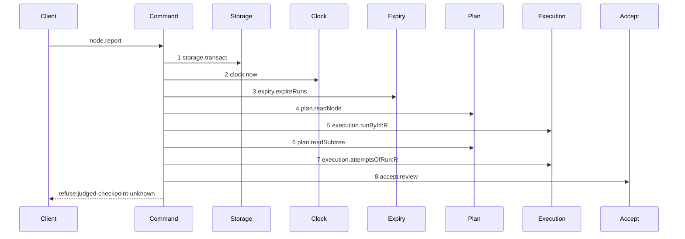
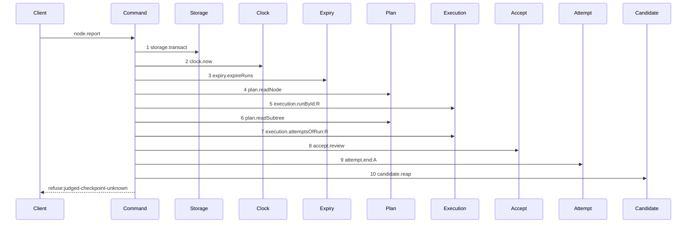

# Story 5 — A review rejection pays its attempt

Epic: `.agents/plan/epics/054.3-the-report-members-pay-their-attempt.md`
Depends on: Story 2 (`02-the-worker-failure-pays-its-attempt`), for the `attempt` dependency key and
the `decided` descriptor; Story 4 (`04-a-structural-rejection-pays-its-attempt`), for the `raise`
member of `decided`, the widened `settled` union and the returned-rejection pattern; EPIC 053.1
Story 3 (`03-an-oversized-reason-reaches-no-seam`), for `acceptReview`, `AcceptReviewRefusal` and
`AcceptReviewError`; EPIC 053.1 Story 10 (`10-the-report-route-carries-a-verdict`), for the
`accept.review` dependency member and the review arm of the route; EPIC 054 Story 6
(`06-the-evidence-union-and-the-classifiers`), for the `daemon-rejected` evidence member.
Kind: story-implement

Diagrams: report-review-rejection

Baselines: report-review-rejection <- baseline-report-review-rejection

Seams: report-review-rejection: +attempt.end:A, +candidate.reap

This story makes the same conversion Story 4 (`04-a-structural-rejection-pays-its-attempt`) made, on
the second nested accept, and it widens one union member rather than adding another. It leaves the
two rejection arms of the route settling identically, which is what Story 10
(`10-the-proposal-records-the-report-arms`) records.

## The shipped path

### `baseline-report-review-rejection`

Superseded by: EPIC 054.3 report-review-rejection

Shipped path: the review arm of `reportOutcome` as EPIC 053.1 Story 10
(`10-the-report-route-carries-a-verdict`) leaves it, over the refusal EPIC 053.1 Story 4
(`04-an-unusable-judged-checkpoint-refuses-after-one-read`) raises. **`acceptReview` does not exist
in this tree**, so step 8 and the refusal cite the story that decides them.

Fixture: review task `N` under objective `O`, running under a `review` run `R` with exactly one open
attempt `A`, `attemptLimit` of `3`, the authority prelude already passed, and the body is
`{ report: "reviewed", runId, runFence, verdict: "accept", judgedCheckpointId, reason }` where
`judgedCheckpointId` names a checkpoint id no row carries. **No run is expired**, and the review run
writes no candidate ref at all —
`.agents/plan/epics/053.1-the-review-checkpoint.md:72` — `claim-success-review`.



Citations, one per step, caller anchor then callee anchor, with the fixture state that reaches it:

1. `src/commands/outcome/report-outcome.ts:107` — `transact` is the caller;
   `src/services/storage/index.ts:1` — `Transaction` is the context it yields. Reached
   unconditionally.
2. `src/commands/outcome/report-outcome.ts:108` — `now` is the caller;
   `src/services/clock/index.ts:1` — `Clock` is the callee. Reached unconditionally.
3. `.agents/plan/stories/053.1-the-review-checkpoint/10-the-report-route-carries-a-verdict.md:43` —
   `expiry.expireRuns` is the drawn step; `src/commands/run/expire-runs.ts:25` — `expireRuns` is the
   callee. Reached unconditionally, and the fixture has no due run.
4. `src/commands/outcome/report-outcome.ts:110` — `readNode` is the caller;
   `src/services/plan/index.ts:70` — `PlanStore` is the callee. Reached unconditionally, and `N` is a
   task, so `src/commands/outcome/report-outcome.ts:116` — `initiative` is not taken.
5. `.agents/plan/stories/053.1-the-review-checkpoint/10-the-report-route-carries-a-verdict.md:45` —
   `execution.runById:R` is the drawn step; `src/services/execution/index.ts:101` —
   `activeRunOfNode` is the shipped read the prelude replaces with `runById`. Reached because the body
   carries a `runId`.
6. `.agents/plan/stories/053.1-the-review-checkpoint/10-the-report-route-carries-a-verdict.md:46` —
   `plan.readSubtree` is the drawn step; `src/services/plan/index.ts:70` — `PlanStore` is the callee.
   Reached because the authority check needs it.
7. `src/commands/outcome/report-outcome.ts:215` — `attemptsOfRun` is the caller;
   `src/services/execution/index.ts:115` — `attemptsOfRun` is the callee. Reached because the fixture
   holds one open attempt, and its list is also the `attempts` field
   `.agents/plan/stories/053.1-the-review-checkpoint/07-the-attestation-with-a-reason.md:259` —
   `AcceptReviewInput` gains passes into step 8.
8. `.agents/plan/stories/053.1-the-review-checkpoint/10-the-report-route-carries-a-verdict.md:48` —
   `accept.review` is the drawn step;
   `.agents/plan/stories/053.1-the-review-checkpoint/03-an-oversized-reason-reaches-no-seam.md:79` —
   `acceptReview` is the callee. Reached because the body is the eighth `nodeReportRequest` member and
   the node is a `review` task, so
   `.agents/plan/stories/053.1-the-review-checkpoint/10-the-report-route-carries-a-verdict.md:152` —
   `body-kind-mismatch` is not taken in either direction.

The terminal:
`.agents/plan/stories/053.1-the-review-checkpoint/04-an-unusable-judged-checkpoint-refuses-after-one-read.md:64`
— `AcceptReviewError` is thrown with the code at `:65` — `judged-checkpoint-unknown`, and
`test/helpers/sequence-conformance.ts:303` — `resultTerminal` reads
`refuse:judged-checkpoint-unknown` from the caught error.

**Re-verify this baseline against the real file before the first case opens.** The tree is at
EPIC 050.1, so the steps above are the composition six unshipped epics produce, not lines this
repository holds today. Read `src/commands/outcome/report-outcome.ts` at dispatch, confirm every
token and its order, and replace each plan-cited caller anchor with the `src/**` line that makes the
call. **Report a divergence rather than editing the diagram**: the diagram is authoritative over the
prose of its story, so a trace that disagrees with it makes the epic invalid and a human resolves
it.

**This baseline records the same three properties as Story 4's**, and the review story states two of
them itself:
`.agents/plan/stories/053.1-the-review-checkpoint/10-the-report-route-carries-a-verdict.md:159` —
`AcceptReviewError` says a throw inside the transaction rolls the expiry pass back and therefore
reaches no reap, "which is why every refusal diagram of Stories 3 to 6 ends before it". The third is
that the attempt closes nowhere: `report-review-gate` holds no `execution.closeAttempt:A`, and
`.agents/plan/stories/053.1-the-review-checkpoint/10-the-report-route-carries-a-verdict.md:72` —
`No terminal write appears on this route` pins the absence.

**Nothing replaces a removed read, because this story removes none.**

### `report-review-rejection`

Supersedes: EPIC 054.3 baseline-report-review-rejection

Fixture: the fixture of `baseline-report-review-rejection`, unchanged.



**Two steps are inserted and no step moves.** Steps 1 to 8 are the baseline's, token for token and in
its order, and they are also steps 1 to 8 of `report-review-gate` of EPIC 053.1 Story 10
(`10-the-report-route-carries-a-verdict`), whose own step 9 is `candidate.reap`. **That diagram is not
superseded**: it is the accepted arm, its nine tokens hold no `execution.closeAttempt:A` and no
`attempt.end:A`, and the close it delegates to is inside step 8 — which Stories 7 and 8 move, not
this one.

**Step 9 is one statement after the accept returns, and it is inside the transaction step 1 opens.**
`acceptReview` takes the caller's transaction and opens none — its dependency object at
`.agents/plan/stories/053.1-the-review-checkpoint/03-an-oversized-reason-reaches-no-seam.md:54` —
`AcceptReviewDependencies` holds no `storage` key — so the verdict is reached inside the prelude and
the termination write sits beside it. This command still opens exactly one span on this arm.

**Step 9 is one step, because a nested command is one step.**

**Step 10 is new to this path, and the returned disposition is what reaches it.** It reaches
`candidate.discardRun` zero times, because a review claim writes no candidate ref at all —
`.agents/plan/epics/053.1-the-review-checkpoint.md:72` — `cuts no candidate ref` — so
`decided.discard` is `null` on this arm. Case 4 asserts the count.

**Step 10 now deletes against committed state, and that is the point of moving the raise.**
`.agents/plan/stories/053.1-the-review-checkpoint/10-the-report-route-carries-a-verdict.md:239` —
`candidate.reap` runs outside states the hazard the rollback created; the commit removes it.

**The terminal is unchanged.** `test/helpers/sequence-conformance.ts:310` — `value.ok === false`
derives `refuse:<code>` from the returned rejection.

**The rejection writes no node state and ends no run, and the expiry is what recovers the node.**
`.agents/plan/epics/054.2-the-execution-accept-pays-its-attempt.md:50` —
`A gate refusal writes no node state` rules it for the whole EPIC 054 family, and Story 4
(`04-a-structural-rejection-pays-its-attempt`) states the mechanism for the sibling arm. A refused
review report therefore leaves the run `active`, the node `running` and no open attempt, and
`src/commands/run/expire-runs.ts:30` — `expireDueRuns` still ends the run at its deadline because it
reads no attempt row. The open product question — whether a worker may hand back a run it can no
longer report on — is recorded once in EPIC 054.2's tree and not again here.

**The drawn set is every branch of this path.** All five refusals of `AcceptReviewRefusal` stop
inside step 8 and produce the same three outer tokens at the same three positions, so one outer
diagram covers all five and the code that separates them is proven by the refusal test.
**Five refusals, four of them judged**: the union at
`.agents/plan/stories/053.1-the-review-checkpoint/03-an-oversized-reason-reaches-no-seam.md:125` —
`AcceptReviewRefusal` holds `reason-too-large` plus four `judged-` codes, because
`judged-checkpoint-unaccepted` was deleted as unreachable at
`.agents/plan/stories/053.1-the-review-checkpoint/index.md:172` —
`judged-checkpoint-unaccepted`. The accepted arm of the same route is `report-review-gate`, and its
two interior paths are Stories 7 and 8.

Add `test/sequence/scenarios/report-review-rejection.ts`.

## Change

**Edit `src/commands/checkpoint/accept-review.ts` to return its rejection, and the review arm of
`src/commands/outcome/report-outcome.ts` to settle it and raise it after the commit.**

### 1 — the returned rejection

Add the rejection type beside the union at
`.agents/plan/stories/053.1-the-review-checkpoint/03-an-oversized-reason-reaches-no-seam.md:125` —
`AcceptReviewRefusal`:

```ts
export type AcceptReviewRejection = Readonly<{
  ok: false;
  refusal: AcceptReviewRefusal;
  details: Readonly<Record<string, unknown>>;
}>;

export type AcceptReviewResult = NodeReportResult | AcceptReviewRejection;
```

`details` is required, not optional —
`.agents/plan/stories/053.1-the-review-checkpoint/03-an-oversized-reason-reaches-no-seam.md:183` —
`details` is required — so the rejection carries the same object the error carried.

**Replace every `throw new AcceptReviewError(...)` with a `return` of that shape.** Five sites:

- `.agents/plan/stories/053.1-the-review-checkpoint/03-an-oversized-reason-reaches-no-seam.md:198` — `AcceptReviewError`
- `.agents/plan/stories/053.1-the-review-checkpoint/04-an-unusable-judged-checkpoint-refuses-after-one-read.md:64` — `AcceptReviewError`
- `.agents/plan/stories/053.1-the-review-checkpoint/04-an-unusable-judged-checkpoint-refuses-after-one-read.md:71` — `AcceptReviewError`
- `.agents/plan/stories/053.1-the-review-checkpoint/05-an-undeclared-subject-refuses-after-the-dependency-read.md:64` — `AcceptReviewError`
- `.agents/plan/stories/053.1-the-review-checkpoint/06-a-superseded-subject-refuses-last.md:69` — `AcceptReviewError`

**Enumerate them against the implemented file before editing, and report a divergence rather than
assuming this list is complete.**

**`AcceptReviewError` survives, and `reportOutcome` is its only thrower.** The five codes, their
`409` and `400` statuses and their details schemas are unchanged, so the arm
`.agents/plan/stories/053.1-the-review-checkpoint/10-the-report-route-carries-a-verdict.md:159` —
`AcceptReviewError` in `src/http/server/node/refusals.ts` and the `details` union at
`:172` — `AcceptReviewError` both stay as they are.

**The placeholder `Error` of
`.agents/plan/stories/053.1-the-review-checkpoint/03-an-oversized-reason-reaches-no-seam.md:211` —
`acceptReview is incomplete` is already deleted** by EPIC 053.1 Story 7
(`07-the-attestation-with-a-reason`) at `:179` — `Delete the placeholder`. Do not reintroduce it, and
do not convert any plain `Error` in this file: only `AcceptReviewError` becomes a return.

### 2 — the settlement, in the prelude transaction

In the review arm, wrap the call of
`.agents/plan/stories/053.1-the-review-checkpoint/10-the-report-route-carries-a-verdict.md:128` — `accept.review` in the same discrimination Story 4
(`04-a-structural-rejection-pays-its-attempt`) uses:

```ts
const answered = dependencies.accept.review(transaction, reviewInput);
if ("ok" in answered) {
  dependencies.attempt.end(transaction, {
    attemptId: open.id,
    runId: run.id,
    nodeId: node.id,
    attemptNo: open.attemptNo,
    at: now,
    attemptLimit: run.attemptLimit,
    outcome: "rejected",
    evidence: { kind: "daemon-rejected", refusal: answered.refusal },
  });
  return {
    kind: "raise",
    expired,
    discard: null,
    raise: new AcceptReviewError(
      answered.refusal,
      `review report refused: ${answered.refusal}`,
      answered.details,
    ),
  };
}
return { kind: "result", result: answered, expired, discard: null };
```

`"rejected"` is a member of `src/domain/attempt.ts:7` — `attemptOutcomes`, and `daemon-rejected` is
`semantic` for both drivers at
`.agents/plan/epics/054-attempt-classification-and-the-supervisor.md:54` — `daemon-rejected`. **The
evidence carries the refusal code**, per
`.agents/plan/epics/054-attempt-classification-and-the-supervisor.md:65` — `daemon-rejected` carries,
so the five review codes stay distinguishable in the audit row. Case 1 asserts each by value.

**A `reject` verdict is not a rejection, and this arm never sees one.** A judged attestation with
`verdict: "reject"` is an **accepted** attestation: the review arm calls `taskReportEffect` with the
literal `"accepted"` and the node reaches `done` for both verdict values —
`.agents/plan/epics/053.1-the-review-checkpoint.md:48` — `The verdict is evidence`. It therefore
returns a `NodeReportResult`, carries no `ok` key, stores no termination and advances no count.
Cases 2 and 3 are that pair.

### 3 — `decided.raise` widens by one type

The `raise` field of the third `decided` member Story 4
(`04-a-structural-rejection-pays-its-attempt`) added becomes

```ts
raise: AcceptStructuralError | AcceptReviewError;
```

and the `settled` union's `refused` member becomes
`error: ReportOutcomeError | AcceptStructuralError | AcceptReviewError`. **Add no fourth `decided`
member and no second throw site.** The one raise of
`.agents/plan/stories/051.6-the-post-expiry-reap-on-the-run-operations/03-the-report-reaps-on-every-settled-terminal.md:192`
— `throw settled.error` carries both.

### 4 — the four scenario files of EPIC 053.1

**Edit `test/sequence/scenarios/accept-review-refusal-*.ts` — all four — to pass the returned
rejection through as `result` instead of catching an error.** They are
`accept-review-refusal-reason-too-large.ts`, `accept-review-refusal-judged-unknown.ts`,
`accept-review-refusal-judged-undeclared.ts` and `accept-review-refusal-judged-superseded.ts`.
**The four diagrams do not move**, because `test/helpers/sequence-conformance.ts:303` —
`resultTerminal` derives `refuse:<code>` from either shape. Case 6 replays all four.

## Constraints

- One transaction on this arm, and it is step 1's. `acceptReview` and `endAttempt` both take it and
  open none.
- The settlement is inside the transaction and the raise is after the reap. Do not raise from inside
  the callback.
- `AcceptReviewError` keeps its class, its required `details` field and every one of its five codes.
  Do not change `src/http/server/node/refusals.ts`.
- Five refusals, four of them judged. Do not add `judged-checkpoint-unaccepted`, which
  `.agents/plan/stories/053.1-the-review-checkpoint/index.md:172` —
  `judged-checkpoint-unaccepted` deleted as unreachable.
- A `verdict` of `"reject"` charges nothing. Do not read the verdict to decide a class, a termination
  or a node state.
- `decided.discard` is `null` on this arm. A review claim writes no candidate ref.
- Add no fourth `decided` member and no second throw site. Widen the `raise` field Story 4 added.
- Do not convert any plain `Error` in `accept-review.ts`. Only `AcceptReviewError` becomes a return.
- Do not add or remove a step of `report-review-gate` or of the four EPIC 053.1 refusal diagrams.
  Only their scenario files change.

## Verify

```
node --test src/commands/checkpoint/accept-review.test.ts src/commands/outcome/report-outcome.test.ts src/http/server/node/report-node.test.ts test/sequence/conformance.test.ts
```

Extend `src/commands/checkpoint/accept-review.test.ts` and
`src/commands/outcome/report-outcome.test.ts` over
`src/commands/outcome/report-outcome.test.ts:425` — `attemptRows`.

Add, each as a separate `it`:

1. `"each of the five review refusals stores a semantic termination with daemon-rejected evidence"` —
   drive the real `reportOutcome` once per refusal over the five fixtures EPIC 053.1 Stories 3 to 6
   build, with the clock fixed to the literal `1_700_000_000_000`; per refusal, catch the
   `AcceptReviewError` and assert the `attempt` row has `outcome === "rejected"`,
   `termination === "semantic"` and `endedAt === 1_700_000_000_000` by value, and that the one
   appended `attempt.ended` event's payload `evidence` deep-equals
   `{ kind: "daemon-rejected", refusal: <that code> }`. **Five assertions in one case, one per
   code**, so no refusal writes a class of its own and no two share an audit value. This is the first
   half of the epic's gate row 9.

2. `"a review verdict of reject stores no termination and advances no count"` — drive an accepted
   attestation with `verdict: "reject"` and assert the `attempt` row has `outcome === "accepted"` and
   `termination === null`, that the node reached `done`, and that `accountAttempts` over the stored
   rows reports the same `semanticCount` as before the report. **This is the control for case 1**: a
   negative verdict and a rejection differ in the payload and not in the class, and without it the
   assertion set passes for a command that charges every review report. This is the second half of
   the epic's gate row 9.

3. `"a reject verdict and an accept verdict store the same class and differ in one column"` — run
   both verdicts over the same fixture and assert the two `checkpoint` rows differ only in `verdict`
   and that both `attempt` rows carry `termination === null`. This is what proves the class is
   decided by the report and never by the verdict, per
   `.agents/plan/epics/053.1-the-review-checkpoint.md:48` — `The verdict is evidence`.

4. `"a review rejection calls candidate.discardRun zero times and candidate.reap once"` — substitute
   a `candidate` double counting both methods, run one refusal, and assert `discardRun` records `0`
   and `reap` records `1`. **The controls are two**: Story 2
   (`02-the-worker-failure-pays-its-attempt`) case 4's fixture records `1` on `discardRun`, and the
   throwing `accept.review` double — one that raises its `AcceptReviewError` instead of returning it,
   which is a substituted dependency and not a source edit — records `0` on `reap`. Both are asserted
   here. This is the epic's gate row 10, plus the reap this story newly
   reaches.

5. `"a review rejection still answers its shipped code and status over the route"` — in
   `src/http/server/node/report-node.test.ts`, extend
   `src/http/server/node/report-node.test.ts:170` — `cases`, one per `AcceptReviewError` refusal, and
   assert each response's status and code are the ones EPIC 053.1 Story 9
   (`09-the-contract-the-cli-and-the-proposal`) declares. This proves the settlement did not change
   the wire answer.

6. `"all eleven refusal diagrams of EPIC 052.1 and EPIC 053.1 replay unchanged after both conversions"`
   — edit the four review scenario files, then run
   `test/sequence/conformance.test.ts:278` — `every due scenario conforms` over **all eleven** —
   the seven `accept-structural-refusal-*` files Story 4
   (`04-a-structural-rejection-pays-its-attempt`) converted and the four
   `accept-review-refusal-*` files this story converts — and assert each replays. Then assert the
   comparison **fails** when one token is removed from each in turn, eleven mutations. **This case
   owns the epic's gate row 8, and it is the only case that can**: Story 4 converts seven and this
   story the other four, so only a case running after both can assert the set, and
   `.agents/plan/authoring.md:39` — `exactly one story` requires the owner to carry the whole
   assertion. Story 4 case 8 stays as the local regression proof of its own seven.

7. `"report-review-gate replays unchanged"` — run the shipped
   `test/sequence/scenarios/report-review-gate.ts` and assert its nine tokens replay in order.
   **The control is the mutation that inserts `attempt.end:A` into it**, which must fail; without it
   the assertion cannot tell a fenced diagram from a moved one. This is what proves the accepted arm
   of the same route did not gain the settlement this story adds to the refusing arm.

Add `test/sequence/scenarios/report-review-rejection.ts`, building the fixture the diagram names,
running the real `reportOutcome` over real SQLite behind the recorder, binding `expiry`, `accept`,
`attempt` and `candidate` to unrecorded dependencies, aliasing the node, the objective, the run and
the attempt as `N`, `O`, `R` and `A`, and returning the recorder and the raised `AcceptReviewError`
as `result`.

`pnpm run verify` exits 0.

Proof: PASS line delivered — `src/commands/checkpoint/accept-review.test.ts`,
`src/commands/outcome/report-outcome.test.ts` and `src/http/server/node/report-node.test.ts` in
`PASS EPIC-054.3`.
