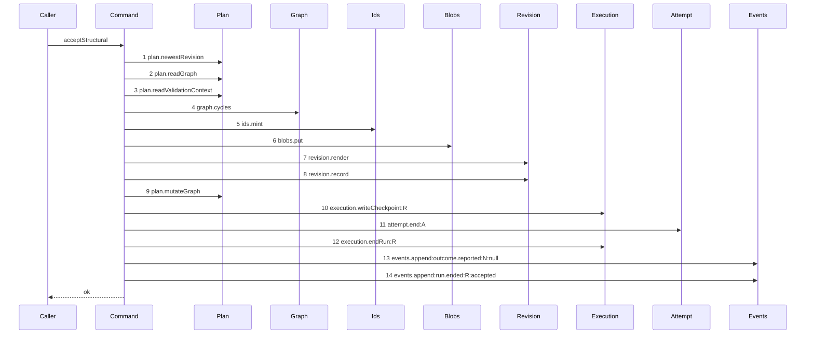

# Story 6 — The accepted structural patch closes through the command

Epic: `.agents/plan/epics/054.3-the-report-members-pay-their-attempt.md`
Depends on: Story 4 (`04-a-structural-rejection-pays-its-attempt`), for the returned-rejection shape
that leaves the accepted branch as the only `NodeReportResult` arm of this command; EPIC 052.1
Story 9 (`09-the-accepted-patch`), for the diagram this one supersedes and for the close it moves;
EPIC 054.1 Story 1 (`01-a-semantic-ending-and-an-accepted-one`), for the accepted member of
`EndAttemptInput`; EPIC 054 Story 8, for the `attempt.ended` type and its accepted payload member.
Kind: story-implement

Diagrams: accept-structural-success-paid

Supersedes: EPIC 052.1 accept-structural-success

Seams: accept-structural-success-paid: +attempt.end:A, -execution.closeAttempt:A

This story leaves `acceptStructural` with no direct close on either arm. Stories 7 and 8 do the same
for `acceptReview`, and Story 9 (`09-the-checkpoint-pair-is-derived`) fills the two audit columns of
the checkpoint each of the three writes.

## The path

`acceptStructural`'s accepted arm is drawn by EPIC 052.1, so this diagram has that diagram as its
prior set. It draws no `baseline-` diagram, and it declares `Supersedes:` where a first change
declares `Baselines:`. `.agents/plan/authoring.md:252` — `The two lines never appear together` states
it, and drawing a `baseline-` diagram for a path an earlier epic owns would claim that epic never
landed.

### `accept-structural-success-paid`

Supersedes: EPIC 052.1 accept-structural-success

Fixture: the fixture of `accept-structural-success`, unchanged — a claimed expansion node `N` running
under run `R` with one open attempt `A`, the pinned revision equal to the newest, `N` already holding
one child `C`, and the patch is one `update` of `C` naming only `title`.
`.agents/plan/stories/052.1-the-structural-acceptance/09-the-accepted-patch.md:35` — `Fixture` states
it, and `:37` — `The fixture states a length of one on purpose` states why the child count is one.



**One token changes, and every ordinal stays.** Step 11 was `execution.closeAttempt:A` and it is now
`attempt.end:A`. Every other step is EPIC 052.1's, unchanged, and this story signs none of them.
`Attempt` joins the participant list and `Execution` stays, because steps 10 and 12 are still
`Execution`'s.

**The accepted close appends the event, and that is a vocabulary decision and not a new effect.**
`.agents/plan/epics/054-attempt-classification-and-the-supervisor.md:117` —
`An acceptance is an ending` rules it: a vocabulary whose `attempt.ended` excluded the commonest
ending would make `type=attempt.ended` an unusable filter of
`src/http/contract/event.ts:14` — `type`. The `attempt.ended` append is inside step 11 and draws no
token here, because a nested command is one step.

**Step 11 appends a third event and step 13 and step 14 do not move.** The two `events.append` calls
of EPIC 052.1 keep their order, their subjects and their payloads, and the third append is inside the
nested command. Case 4 asserts the count of three by type.

**The accepted member carries `headOid: null`, and that is the value the shipped close writes.**
`.agents/plan/stories/052.1-the-structural-acceptance/09-the-accepted-patch.md:215` —
`closeAttempt` passes no `headOid` at all, so the column stays null; the patch blob reaches the
caller as `objectId` at `:284` — `objectId` and never as an attempt head. **The row therefore keeps a
null `termination`**, which the CHECK requires —
`.agents/plan/epics/054-attempt-classification-and-the-supervisor.md:42` —
`Only a non-accepted attempt carries a termination`.

**Step 11 is inside the caller's transaction, and this command still opens none.**
`.agents/plan/epics/052.1-the-structural-acceptance.md:35` — `takes the caller's transaction` states
it, and `endAttempt` opens none either —
`.agents/plan/epics/054.1-the-end-attempt-command.md:15` — `endAttempt`.

**The report route does not move.** `report-structural-gate` of EPIC 052.2 Story 2
(`02-the-report-route-carries-a-patch`) holds `accept.structural` as one token, and the close is
inside it.

**The drawn set is every branch of this arm.** `acceptStructural` has one accepted path: the same
fourteen steps run for an `add`, an `update` and a `delete` patch, and a longer patch repeats step 6
and step 9 over its own data, which is why
`.agents/plan/stories/052.1-the-structural-acceptance/09-the-accepted-patch.md:39` —
`The fixture states a length of one on purpose` fixes the length at one. The refusing branches are
Story 4 (`04-a-structural-rejection-pays-its-attempt`)'s at the route and EPIC 052.1 Stories 2 to 8's
inside the command, and none of them reaches step 11.

Add `test/sequence/scenarios/accept-structural-success-paid.ts`, and delete
`test/sequence/scenarios/accept-structural-success.ts` when Story 10
(`10-the-proposal-records-the-report-arms`) appends `"054.3"` to `shippedEpics`, and not before.

## Change

**Edit `src/commands/checkpoint/accept-structural.ts` to close the accepted attempt through the
command.**

### 1 — the `attempt` dependency key

`AcceptStructuralDependencies` at
`.agents/plan/stories/052.1-the-structural-acceptance/02-an-unparsable-patch-reaches-no-seam.md:60`
— `AcceptStructuralDependencies` holds seven keys. It gains one:

```ts
attempt: Readonly<{
  end(transaction: Transaction, input: EndAttemptInput): EndAttemptResult;
}>;
```

**Add no `storage` key and no `clock` key.**
`.agents/plan/stories/052.1-the-structural-acceptance/02-an-unparsable-patch-reaches-no-seam.md:89`
— `There is no` forbids both, and this story needs neither: `endAttempt` joins the caller's
transaction and `input.now` is the instant.

### 2 — the swap

Replace `.agents/plan/stories/052.1-the-structural-acceptance/09-the-accepted-patch.md:215` —
`closeAttempt` with

```ts
dependencies.attempt.end(transaction, {
  attemptId: input.attemptId,
  runId: input.run.id,
  nodeId: input.node.id,
  attemptNo: input.attemptNo,
  at: input.now,
  attemptLimit: input.run.attemptLimit,
  outcome: "accepted",
  headOid: null,
});
```

**`AcceptStructuralInput` gains no field.** `attemptId`, `attemptNo`, `node`, `run` and `now` are all
already members at
`.agents/plan/stories/052.1-the-structural-acceptance/02-an-unparsable-patch-reaches-no-seam.md:70`
— `AcceptStructuralInput`, and `attemptLimit` is on the run row at
`src/services/execution/index.ts:16` — `attemptLimit`, which `input.run` carries.

**Discard the `EndAttemptResult`.** `.agents/plan/stories/052.1-the-structural-acceptance/09-the-accepted-patch.md:238`
— `attemptsRemaining` returns `null` on this command, and `:283` — `attemptId` and `:284` —
`attemptNo` read the input and not the closed record, so nothing here needs `semanticCountAfter`.
`"already-settled"` is unreachable: the route proved the attempt open in the same transaction at
`src/commands/outcome/report-outcome.ts:220` — `open`.

### 3 — no other step moves

`plan.newestRevision`, `plan.readGraph`, `plan.readValidationContext`, `graph.cycles`, `ids.mint`,
`blobs.put`, `revision.render`, `revision.record`, `plan.mutateGraph`,
`execution.writeCheckpoint`, `execution.endRun` and the two `events.append` calls keep their order
and their inputs, and the returned `NodeReportResult` of
`.agents/plan/stories/052.1-the-structural-acceptance/09-the-accepted-patch.md:129` — `return` is
unchanged.

### 4 — the composition root

**Edit `src/main.ts` to pass `attempt: boundEndAttempt` into the `acceptStructural` dependency
object** EPIC 052.2 Story 2 (`02-the-report-route-carries-a-patch`) builds at
`.agents/plan/stories/052.2-the-structural-report-route/02-the-report-route-carries-a-patch.md:106`
— `boundReportObjective`, which passes `{ plan, blobs, graph, revision, execution, events, ids }`
today. `boundEndAttempt` is Story 2 (`02-the-worker-failure-pays-its-attempt`)'s binding; reuse it and
declare no second one.

## Constraints

- No transaction. `acceptStructural` holds no `storage` key before this story and holds none after.
- Step 11 stays between `execution.writeCheckpoint:R` and `execution.endRun:R`. Neither neighbour
  moves.
- The accepted member carries `headOid: null` and no `evidence`. The row keeps a null `termination`,
  which the CHECK requires.
- Do not pass the patch blob as `headOid`. The shipped close writes null, and the blob is the
  response's `objectId`.
- Do not call `execution.closeAttempt` from this file after this story.
- Do not add a `clock` key. `input.now` is the instant.
- Do not change the two `events.append` calls, their subjects or their payloads.
- Do not delete `test/sequence/scenarios/accept-structural-success.ts` in this story.

## Verify

```
node --test src/commands/checkpoint/accept-structural.test.ts src/commands/outcome/report-outcome.test.ts src/main.test.ts test/sequence/conformance.test.ts
```

Extend `src/commands/checkpoint/accept-structural.test.ts`.

Add, each as a separate `it`:

1. `"an accepted patch stores the acceptance with a null termination and a null head"` — run the real
   `acceptStructural` on the accepted fixture inside one `storage.transact`, read the `attempt` row
   and assert `outcome === "accepted"`, `termination === null` and `headOid === null`, each by value.
   This is the first third of the epic's gate row 10a.

2. `"an accepted patch appends exactly one attempt.ended carrying the accepted member"` — assert
   exactly one event of type `attempt.ended` was appended, that its `subjectKind` is `"attempt"` and
   its `subjectId` is `input.attemptId`, and that its payload deep-equals the accepted member by
   value — `attemptId`, `runId`, `nodeId`, `attemptNo`, `outcome: "accepted"`, `headOid: null`,
   `semanticCountAfter`, `attemptLimit`, `ambiguousUsedAfter` and `ambiguousBudget`, with **no**
   `termination` key and **no** `evidence` key, asserted by key set. This is the second third of the
   epic's gate row 10a.

3. `"the accepted patch reaches execution.closeAttempt only through endAttempt"` — substitute an
   `Execution` double recording the caller frame of each `closeAttempt` call, run the real
   `acceptStructural` with `attempt.end` bound to the real `endAttempt`, and assert exactly one
   `closeAttempt` call whose caller frame is `end-attempt.ts`. **The control is the same case with
   `attempt.end` bound to a recording no-op**, where the count is `0` and the no-op records `1`;
   without it the assertion passes for a command that still closes directly.

4. `"an accepted patch appends exactly three events, in order"` — assert the appended types are
   `attempt.ended`, `outcome.reported`, `run.ended` — the first inside step 11 and the other two at
   steps 13 and 14 — and assert the `outcome.reported` payload and the `run.ended` payload are
   byte-identical to the values EPIC 052.1 Story 9 (`09-the-accepted-patch`) writes. **The control is
   the same case with `attempt.end` bound to a no-op**, which appends two; without it the assertion
   cannot tell the added event from a moved one. This is the last third of the epic's gate row 10a,
   and it is what proves every step of `accept-structural-success` stayed where EPIC 052.1 drew it.

5. `"a failure at the attempt.ended append leaves the whole acceptance unwritten"` — wrap
   `events.append` in a proxy that throws on the call whose `type` is `attempt.ended`, run the
   command inside one `storage.transact`, catch, and assert the `attempt` row, the `checkpoint` row,
   the graph revision, the run row and the event count are byte-identical to their pre-call values.
   **The control is the same case without the injected failure**, which writes all five. This proves
   the settlement joined the caller's transaction and opened none of its own.

6. `"the response still carries the attempt the caller named and a null attemptsRemaining"` — assert
   `result.attemptId === input.attemptId`, `result.attemptNo === input.attemptNo`,
   `result.attemptsRemaining === null` and `result.objectId` equals the patch blob, each by value.
   Without it the two attempt fields silently become `undefined` when the close stops returning a
   record.

7. `"acceptStructural holds no storage key after this story"` — assert
   `Object.hasOwn(dependencies, "storage") === false`, in the shape of
   `.agents/plan/stories/052.1-the-structural-acceptance/02-an-unparsable-patch-reaches-no-seam.md:226`
   — `Object.hasOwn`. This is the ceiling EPIC 052.1 pinned, and this story must not break it.

Add `test/sequence/scenarios/accept-structural-success-paid.ts`, building the fixture the diagram
names, running the real `acceptStructural` over real SQLite behind the recorder inside one
`storage.transact`, binding `attempt.end` to the real `endAttempt` over **unrecorded** dependencies,
aliasing the node, the run and the attempt as `N`, `R` and `A`, and returning the recorder and the
result.

`pnpm run verify` exits 0.

Proof: PASS line delivered — `src/commands/checkpoint/accept-structural.test.ts` and
`src/commands/outcome/report-outcome.test.ts` in `PASS EPIC-054.3`.
