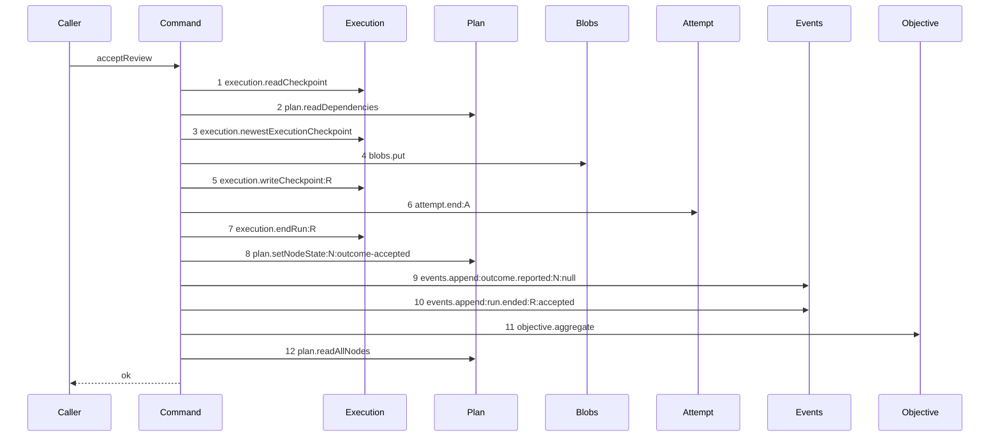

# Story 7 — The accepted review attestation with a reason closes through the command

Epic: `.agents/plan/epics/054.3-the-report-members-pay-their-attempt.md`
Depends on: Story 5 (`05-a-review-rejection-pays-its-attempt`), for the returned-rejection shape that
leaves the accepted branch as the only `NodeReportResult` arm of this command; EPIC 053.1 Story 7
(`07-the-attestation-with-a-reason`), for the diagram this one supersedes and for the close it moves;
EPIC 054.1 Story 1 (`01-a-semantic-ending-and-an-accepted-one`), for the accepted member of
`EndAttemptInput`; Story 6 (`06-the-accepted-patch-closes-through-the-command`), for the
`boundEndAttempt` reuse pattern at the composition root.
Kind: story-implement

Diagrams: accept-review-success-with-reason-paid

Supersedes: EPIC 053.1 accept-review-success-with-reason

Seams: accept-review-success-with-reason-paid: +attempt.end:A, -execution.closeAttempt:A

This story makes the one production edit that serves both accepted review paths. Story 8
(`08-the-attestation-with-no-reason-closes-through-the-command`) draws the second path and adds no
production statement.

## The path

`acceptReview`'s reasoned accepted arm is drawn by EPIC 053.1, so this diagram has that diagram as
its prior set. It draws no `baseline-` diagram, and it declares `Supersedes:` where a first change
declares `Baselines:`.

### `accept-review-success-with-reason-paid`

Supersedes: EPIC 053.1 accept-review-success-with-reason

Fixture: the fixture of `accept-review-success-with-reason`, unchanged — a claimed review task `N`
under objective `O` running under run `R` with one open attempt `A`, the authority prelude already
passed, one edge `N -> X`, exactly one `execution` checkpoint on `X` whose `accepted_oid` is `"a1"`
repeated twenty times, `judgedCheckpointId` naming it, `verdict` of `"accept"`, and `reason` the
eleven-byte string `"looks good\n"`. `N` is the only task under `O`, so the aggregation reaches its
own terminal in one pass.
`.agents/plan/stories/053.1-the-review-checkpoint/07-the-attestation-with-a-reason.md:22` —
`Fixture` states it.



**One token changes, and every ordinal stays.** Step 6 was `execution.closeAttempt:A` and it is now
`attempt.end:A`. Every other step is EPIC 053.1's, unchanged, and this story signs none of them.
Step 11 still sits after step 8 and before step 12, which is the ordering EPIC 053.1 copied from
EPIC 053's `land-settle-aggregate` —
`.agents/plan/stories/053.1-the-review-checkpoint/07-the-attestation-with-a-reason.md:54` —
`The tail order is copied` — and this story does not touch it.

**The accepted member carries `headOid: null`, and that is the value the shipped close already
passes.** `.agents/plan/stories/053.1-the-review-checkpoint/07-the-attestation-with-a-reason.md:193`
— `headOid: null` writes it explicitly, so the attempt row keeps a null head and a null
`termination`, which the CHECK requires —
`.agents/plan/epics/054-attempt-classification-and-the-supervisor.md:42` —
`Only a non-accepted attempt carries a termination`. The judged oid the attestation names reaches the
`checkpoint` row as `judged_oid` at
`.agents/plan/stories/053.1-the-review-checkpoint/07-the-attestation-with-a-reason.md:122` —
`judgedOid` and never the attempt.

**The outcome is the literal `"accepted"` and not `effect.attemptOutcome`.**
`src/domain/outcome-report.ts:47` — `attemptOutcome` returns `"accepted"` for the `"accepted"` input
this command passes at
`.agents/plan/stories/053.1-the-review-checkpoint/07-the-attestation-with-a-reason.md:187` —
`taskReportEffect`, so the two are provably equal; but the accepted member of `EndAttemptInput` is
keyed on the literal at
`.agents/plan/stories/054.1-the-end-attempt-command/01-a-semantic-ending-and-an-accepted-one.md:159`
— `outcome: "accepted"`, and a widened `AttemptOutcome` would not narrow to it. `taskReportEffect`
still decides `nodeState`, `trigger`, `runEnd` and `blockReason`, so no domain rule moves into the
command.

**Step 6 is one step, because a nested command is one step.** The scenario binds `endAttempt` to
unrecorded dependencies, so its two reads, the close and the `attempt.ended` append produce no token
here.

**Step 6 is inside the caller's transaction, and this command still opens none.**
`.agents/plan/stories/053.1-the-review-checkpoint/03-an-oversized-reason-reaches-no-seam.md:54` —
`AcceptReviewDependencies` holds no `storage` key, and `endAttempt` opens none either.

**The report route does not move.** `report-review-gate` of EPIC 053.1 Story 10
(`10-the-report-route-carries-a-verdict`) holds `accept.review` as one token, and
`.agents/plan/stories/053.1-the-review-checkpoint/10-the-report-route-carries-a-verdict.md:72` —
`No terminal write appears on this route` is why that diagram keeps its nine tokens.

**The drawn set is every branch of this arm.** A `verdict` of `"reject"` takes the same twelve steps
with one `checkpoint` column changed, because the command calls `taskReportEffect` with the literal
`"accepted"` and no code reads the verdict to decide a state —
`.agents/plan/epics/053.1-the-review-checkpoint.md:48` — `The verdict is evidence`. That is a value
and not a call set, and case 3 asserts it. The reasonless branch calls one seam fewer, which is a
call-set difference, and Story 8
(`08-the-attestation-with-no-reason-closes-through-the-command`) draws it. The refusing branches are
Story 5 (`05-a-review-rejection-pays-its-attempt`)'s at the route and EPIC 053.1 Stories 3 to 6's
inside the command.

Add `test/sequence/scenarios/accept-review-success-with-reason-paid.ts`, and delete
`test/sequence/scenarios/accept-review-success-with-reason.ts` when Story 10
(`10-the-proposal-records-the-report-arms`) appends `"054.3"` to `shippedEpics`, and not before.

## Change

**Edit `src/commands/checkpoint/accept-review.ts` to close the accepted attempt through the
command.**

### 1 — the `attempt` dependency key

`AcceptReviewDependencies` at
`.agents/plan/stories/053.1-the-review-checkpoint/03-an-oversized-reason-reaches-no-seam.md:54` —
`AcceptReviewDependencies` holds five keys. It gains one:

```ts
attempt: Readonly<{
  end(transaction: Transaction, input: EndAttemptInput): EndAttemptResult;
}>;
```

**It is an object capability beside `objective`, and for the same reason.**
`.agents/plan/stories/053.1-the-review-checkpoint/03-an-oversized-reason-reaches-no-seam.md:99` —
`objective` is an object capability rules it: a bare callable is returned unwrapped by
`test/helpers/sequence-conformance.ts:113` — `typeof capability` and draws no step.

**Add no `storage` key and no `clock` key.** `input.at` is the instant, and `endAttempt` joins the
caller's transaction.

### 2 — `AcceptReviewInput` gains one field

```ts
attemptNo: number;
```

`.agents/plan/stories/053.1-the-review-checkpoint/07-the-attestation-with-a-reason.md:259` —
`AcceptReviewInput` gains three already adds `attempts`, `attemptLimit` and `revision`; this is a
fourth. **It is a new input field and never a new read**, so no drawn path moves: the value is
`open.attemptNo` from the route's step 7 read at
`src/commands/outcome/report-outcome.ts:215` — `attemptsOfRun`, and the caller already passes
`attemptId` from the same list. Pass it at the review call site of
`.agents/plan/stories/053.1-the-review-checkpoint/10-the-report-route-carries-a-verdict.md:128` — `accept.review`.

**Do not derive it from `input.attempts` inside the command.** A `find` over the list would put a
lookup in the command for a value the caller already holds, and it would answer `undefined` for an
attempt id the list does not carry.

### 3 — the swap

Replace `.agents/plan/stories/053.1-the-review-checkpoint/07-the-attestation-with-a-reason.md:189`
— `closeAttempt` with

```ts
dependencies.attempt.end(transaction, {
  attemptId: input.attemptId,
  runId: input.runId,
  nodeId: input.nodeId,
  attemptNo: input.attemptNo,
  at: input.at,
  attemptLimit: input.attemptLimit,
  outcome: "accepted",
  headOid: null,
});
```

**The two values the close returned come from the input.**
`.agents/plan/stories/053.1-the-review-checkpoint/07-the-attestation-with-a-reason.md:217` —
`attempt.id` and `:218` — `attempt.attemptNo` build the `outcome.reported` payload from the closed
record, and `:250` and `:251` read the same two into the response. Both sites read `input.attemptId`
and `input.attemptNo` after this change — the same two values this call passes.

**Discard the `EndAttemptResult`.** `attemptsRemaining` is `null` on this command at
`.agents/plan/stories/053.1-the-review-checkpoint/07-the-attestation-with-a-reason.md:252` —
`attemptsRemaining`, so nothing needs `semanticCountAfter`. `"already-settled"` is unreachable: the
route proved the attempt open in the same transaction.

### 4 — no other step moves

`execution.readCheckpoint`, `plan.readDependencies`, `execution.newestExecutionCheckpoint`,
`blobs.put`, `execution.writeCheckpoint`, `execution.endRun`, `plan.setNodeState`, the two
`events.append` calls, `objective.aggregate` and `plan.readAllNodes` keep their order and their
inputs. `taskReportEffect` and `accountAttempts` stay where
`.agents/plan/stories/053.1-the-review-checkpoint/07-the-attestation-with-a-reason.md:183` —
`accountAttempts` puts them, and both are pure, so neither draws a token.

### 5 — the composition root

**Edit `src/main.ts` to pass `attempt: boundEndAttempt` into the `acceptReview` dependency object**
EPIC 053.1 Story 10 (`10-the-report-route-carries-a-verdict`) builds. Reuse Story 2
(`02-the-worker-failure-pays-its-attempt`)'s binding and declare no second one.

## Constraints

- No transaction. `acceptReview` holds no `storage` key before this story and holds none after.
- Step 6 stays between `execution.writeCheckpoint:R` and `execution.endRun:R`. Neither neighbour
  moves.
- Step 11 stays after step 8 and before step 12. EPIC 053.1 owns that ordering.
- The accepted member carries `headOid: null` and no `evidence`. Do not pass the judged oid.
- The outcome is the literal `"accepted"`. Do not pass `effect.attemptOutcome`.
- `taskReportEffect` still decides `nodeState`, `trigger`, `runEnd` and `blockReason`. Do not inline
  any of the four.
- Do not read the verdict to decide a class, a termination or a node state.
- `AcceptReviewInput` gains `attemptNo` and nothing else. Do not add a read to derive it.
- Do not call `execution.closeAttempt` from this file after this story, on either branch.
- Do not make `blobs.put` conditional here. EPIC 053.1 Story 8
  (`08-the-attestation-with-no-reason`) already did, and Story 8
  (`08-the-attestation-with-no-reason-closes-through-the-command`) draws that branch.
- Do not delete `test/sequence/scenarios/accept-review-success-with-reason.ts` in this story.

## Verify

```
node --test src/commands/checkpoint/accept-review.test.ts src/commands/outcome/report-outcome.test.ts src/main.test.ts test/sequence/conformance.test.ts
```

Extend `src/commands/checkpoint/accept-review.test.ts`.

Add, each as a separate `it`:

1. `"a reasoned attestation stores the acceptance with a null termination and a null head"` — run the
   real `acceptReview` on the reasoned fixture inside one `storage.transact`, read the `attempt` row
   and assert `outcome === "accepted"`, `termination === null` and `headOid === null`, each by value;
   in the same case assert the `checkpoint` row's `judged_oid` equals the twenty-fold `"a1"` string,
   which is where the judged oid does land. This is the first half of the epic's gate row 10b.

2. `"a reasoned attestation appends exactly one attempt.ended carrying the accepted member"` — assert
   exactly one event of type `attempt.ended`, that its `subjectKind` is `"attempt"` and its
   `subjectId` is `input.attemptId`, and that its payload deep-equals the accepted member by value —
   `attemptId`, `runId`, `nodeId`, `attemptNo`, `outcome: "accepted"`, `headOid: null`,
   `semanticCountAfter`, `attemptLimit`, `ambiguousUsedAfter` and `ambiguousBudget`, with **no**
   `termination` key and **no** `evidence` key, asserted by key set. This is the second half of the
   epic's gate row 10b.

3. `"a reject verdict stores no termination and writes the same rows but one column"` — run the same
   fixture with `verdict: "reject"` and assert the `attempt` row carries
   `outcome === "accepted"` and `termination === null`, the node reached `done`, and the two
   `checkpoint` rows differ only in `verdict`. **This is the control for case 1**: an acceptance and
   a negative verdict differ in the payload and not in the class, and without it the assertion set
   passes for a command that charges the negative verdict. This is the epic's gate row 10b control.

4. `"the reasoned attestation reaches execution.closeAttempt only through endAttempt"` — substitute
   an `Execution` double recording the caller frame of each `closeAttempt` call, run with
   `attempt.end` bound to the real `endAttempt`, and assert exactly one `closeAttempt` call whose
   caller frame is `end-attempt.ts`. **The control is the same case with `attempt.end` bound to a
   recording no-op**, where the count is `0` and the no-op records `1`.

5. `"a reasoned attestation appends exactly three events, in order"` — assert the appended types are
   `attempt.ended`, `outcome.reported`, `run.ended`, and that the `outcome.reported` payload holds
   `attemptId === input.attemptId`, `attemptNo === input.attemptNo`, `outcome === "accepted"`,
   `reason === null`, `objectId === null` and `attemptsRemaining === null`, by value. **The control
   is the same case with `attempt.end` bound to a no-op**, which appends two. Without the payload
   half, the two attempt fields silently become `undefined` when the close stops returning a record.

6. `"the aggregation still runs after the node transition and before the sibling scan"` — assert the
   recorded seam order places `objective.aggregate` after `plan.setNodeState` and before
   `plan.readAllNodes`, and assert `result.objectiveState` equals the post-transition value on the
   last `done` task. **This case needs no control**: both oracles are positive — an index comparison
   over recorded seam calls and a value read off the result — so
   `.agents/plan/authoring.md:317` — `a proof whose only oracle is absence` does not ask for one, and
   a reorder is additionally caught by the diagram replay of the epic's gate row 13. This is the
   property EPIC 053.1 Story 7 (`07-the-attestation-with-a-reason`) owns and this story must not
   break.

7. `"a failure at the attempt.ended append leaves the whole attestation unwritten"` — wrap
   `events.append` in a proxy that throws on the call whose `type` is `attempt.ended`, run the
   command inside one `storage.transact`, catch, and assert the `attempt` row, the `checkpoint` row,
   the `blob` row, the node state, the run row and the event count are byte-identical to their
   pre-call values. **The control is the same case without the injected failure**, which writes all
   six.

8. `"acceptReview holds no storage key after this story"` — assert
   `Object.hasOwn(dependencies, "storage") === false`. This is the ceiling EPIC 053.1 pinned.

Add `test/sequence/scenarios/accept-review-success-with-reason-paid.ts`, building the fixture the
diagram names, running the real `acceptReview` over real SQLite behind the recorder inside one
`storage.transact`, binding `objective.aggregate` to the real `aggregateObjective` and `attempt.end`
to the real `endAttempt`, both over **unrecorded** dependencies, aliasing the node, the objective, the
run and the attempt as `N`, `O`, `R` and `A`, and returning the recorder and the result.

`pnpm run verify` exits 0.

Proof: PASS line delivered — `src/commands/checkpoint/accept-review.test.ts` and
`src/commands/outcome/report-outcome.test.ts` in `PASS EPIC-054.3`.
