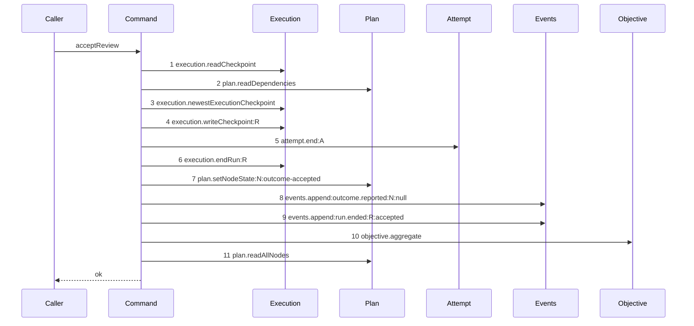

# Story 8 — The accepted review attestation with no reason closes through the command

Epic: `.agents/plan/epics/054.3-the-report-members-pay-their-attempt.md`
Depends on: Story 7 (`07-the-attestation-with-a-reason-closes-through-the-command`), for the
`attempt` dependency key, the `attemptNo` input field, the swap and the composition-root binding;
EPIC 053.1 Story 8 (`08-the-attestation-with-no-reason`), for the diagram this one supersedes and for
the conditional `blobs.put` that makes it a second path.
Kind: story-implement

Diagrams: accept-review-success-no-reason-paid

Supersedes: EPIC 053.1 accept-review-success-no-reason

Seams: accept-review-success-no-reason-paid: +attempt.end:A, -execution.closeAttempt:A

This story is the last drawing story of the epic, and it adds no production statement: Story 7
(`07-the-attestation-with-a-reason-closes-through-the-command`) edited the one close both accepted
review branches run. It draws the second path because that path calls one seam fewer, and a call-set
difference is a diagram.

## The path

`acceptReview`'s reasonless accepted arm is drawn by EPIC 053.1, so this diagram has that diagram as
its prior set. It draws no `baseline-` diagram, and it declares `Supersedes:` where a first change
declares `Baselines:`.

### `accept-review-success-no-reason-paid`

Supersedes: EPIC 053.1 accept-review-success-no-reason

Fixture: the fixture of `accept-review-success-no-reason`, unchanged — the fixture of Story 7
(`07-the-attestation-with-a-reason-closes-through-the-command`) with `reason` **absent** from the
input. Every other value is identical, so the two diagrams differ by exactly one token.
`.agents/plan/stories/053.1-the-review-checkpoint/08-the-attestation-with-no-reason.md:20` —
`Fixture` states it.



**One token changes, and every ordinal stays.** Step 5 was `execution.closeAttempt:A` and it is now
`attempt.end:A`. Every other step is EPIC 053.1's, unchanged.

**`Blobs` is not a participant, and that absence is the whole assertion.**
`.agents/plan/stories/053.1-the-review-checkpoint/08-the-attestation-with-no-reason.md:46` — `Blobs`
states it, and `:47` — `only by calling nothing` states that this path differs from Story 7's only by
calling nothing where that one calls `blobs.put`. Any `blobs.put` the implementation makes on a
reasonless report fails the comparison, and case 2 asserts the count of zero over a control that
records one.

**This story ships no production edit.** The conditional at
`.agents/plan/stories/053.1-the-review-checkpoint/08-the-attestation-with-no-reason.md:65` —
`reasonBlob` is EPIC 053.1 Story 8's, and the close is Story 7
(`07-the-attestation-with-a-reason-closes-through-the-command`)'s. **Verify both are in place and
report a divergence rather than editing either.**

**Step 5 is inside the caller's transaction, and this command still opens none.**

**The drawn set is every branch of this arm.** A `verdict` of `"reject"` with no reason takes the same
eleven steps with one `checkpoint` column changed — a value and not a call set, asserted by case 3.
The reasoned branch is Story 7
(`07-the-attestation-with-a-reason-closes-through-the-command`)'s diagram, and the refusing branches
are Story 5 (`05-a-review-rejection-pays-its-attempt`)'s and EPIC 053.1 Stories 3 to 6's.

Add `test/sequence/scenarios/accept-review-success-no-reason-paid.ts`, and delete
`test/sequence/scenarios/accept-review-success-no-reason.ts` when Story 10
(`10-the-proposal-records-the-report-arms`) appends `"054.3"` to `shippedEpics`, and not before.

## Change

**No production edit.** Both statements this path needs are already written.

### 1 — confirm the two statements this branch depends on

`.agents/plan/stories/053.1-the-review-checkpoint/08-the-attestation-with-no-reason.md:65` —
`reasonBlob` is the conditional that tests `input.reason === undefined` and makes `reasonBlob` null
rather than the hash of zero bytes, and `:88` — `=== undefined` is the constraint that it tests
identity and never falsiness. Story 7
(`07-the-attestation-with-a-reason-closes-through-the-command`) change step 3 is the `attempt.end`
call. **Verify both, and report a divergence rather than re-applying either.**

### 2 — the scenario fixture

**Add `test/sequence/scenarios/accept-review-success-no-reason-paid.ts`.** It is Story 7's scenario
with `reason` omitted from the input and `Blobs` absent from the recorded dependency object, so the
recorder cannot emit a `blobs.put` token even by accident. **Omit `reason`, never pass `undefined`
explicitly and never pass an empty string**: an empty string is a defined reason and takes Story 7's
branch, writing the hash of zero bytes.

## Constraints

- Add no production statement in this story. A change to `src/commands/checkpoint/accept-review.ts`
  is out of scope, and a divergence there is reported.
- `blobs.put` is reached zero times on this path. Do not add a `Blobs` participant.
- The accepted member carries `headOid: null` and no `evidence`, exactly as on Story 7's branch.
- The fixture omits `reason`. Do not pass `undefined` and do not pass `""`.
- Step 10 stays after step 7 and before step 11.
- Do not delete `test/sequence/scenarios/accept-review-success-no-reason.ts` in this story.

## Verify

```
node --test src/commands/checkpoint/accept-review.test.ts test/sequence/conformance.test.ts
```

Extend `src/commands/checkpoint/accept-review.test.ts`.

Add, each as a separate `it`:

1. `"a reasonless attestation stores the acceptance with a null termination and a null head"` — run
   the real `acceptReview` with `reason` omitted, inside one `storage.transact`, read the `attempt`
   row and assert `outcome === "accepted"`, `termination === null` and `headOid === null`, each by
   value; assert exactly one `attempt.ended` event whose payload deep-equals the accepted member,
   with **no** `termination` key and **no** `evidence` key, by key set. This is the first half of the
   epic's gate row 10c.

2. `"a reasonless attestation reaches blobs.put zero times and writes no blob row"` — substitute a
   `Blobs` double counting `put`, run the reasonless fixture, and assert the count is `0`, that the
   `checkpoint` row's `reason_blob` is `null`, and that the `blob` table gained no row. **The control
   is Story 7's reasoned fixture over the same double**, which records `1` and writes one `blob` row;
   both are asserted here, beside the assertion they control, because `/work` dispatches one case per
   turn and a control in another story does not exist at this turn. This is the second half of the
   epic's gate row 10c, and it is the call-set difference that made EPIC 053.1 draw two accepted
   review paths.

3. `"a reasonless reject verdict is a complete attestation and charges nothing"` — run the reasonless
   fixture with `verdict: "reject"` and assert the `attempt` row carries `termination === null`, the
   `checkpoint` row carries `verdict === "reject"` and `reason_blob === null`, and the node reached
   `done`. This is the control that a negative verdict and a rejection differ, on the branch that
   holds no reason at all.

4. `"the reasonless attestation reaches execution.closeAttempt only through endAttempt"` — substitute
   an `Execution` double recording the caller frame of each `closeAttempt` call, run with
   `attempt.end` bound to the real `endAttempt`, and assert exactly one `closeAttempt` call whose
   caller frame is `end-attempt.ts`. **The control is the same case with `attempt.end` bound to a
   recording no-op**, where the count is `0` and the no-op records `1`. With Story 7 case 4 this
   proves the swap covers both accepted review branches, which is what makes this story's production
   change set empty.

5. `"an empty-string reason is a reason and takes the other branch"` — run the fixture with
   `reason: ""` and assert `blobs.put` records `1` and the `checkpoint` row's `reason_blob` is not
   null. **This is the control for the fixture rule** of change step 2: without it a scenario author
   may pass `""` for "no reason" and replay Story 7's diagram against this story's id.

Add `test/sequence/scenarios/accept-review-success-no-reason-paid.ts`, building the fixture the
diagram names — Story 7's fixture with `reason` omitted — running the real `acceptReview` over real
SQLite behind the recorder inside one `storage.transact`, binding `objective.aggregate` to the real
`aggregateObjective` and `attempt.end` to the real `endAttempt`, both over **unrecorded**
dependencies, aliasing the node, the objective, the run and the attempt as `N`, `O`, `R` and `A`, and
returning the recorder and the result.

`pnpm run verify` exits 0.

Proof: PASS line delivered — `src/commands/checkpoint/accept-review.test.ts` in `PASS EPIC-054.3`.
