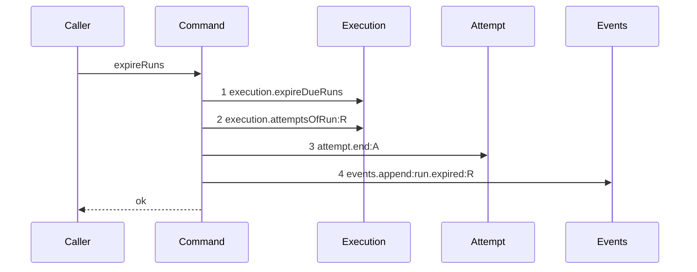

# Story 1 — The expiry pass ends the attempt

Epic: `.agents/plan/epics/054.4-the-run-lifecycle-pays-its-attempt.md`
Depends on: EPIC 054 Story 1 (`01-migration-16`), for `attempt.termination` and `node.ambiguous_used`; EPIC 054 Story 6 (`06-the-evidence-union-and-the-classifiers`), for the `run-expired` evidence member; EPIC 054.1 Story 1 (`01-a-semantic-ending-and-an-accepted-one`), for the command this story calls and for the `attempt.end` projection EPIC 054.2 Story 1 (`01-the-unreachable-candidate-pays-its-attempt`) adds to the harness; EPIC 050.1 Story 2 (`02-the-expiry-pass`), for `expireRuns` and for the diagram this one supersedes; EPIC 051.5 Story 10 (`10-the-conformance-harness-admits-an-incremental-supersession`), for the per-diagram supersession this story relies on to retire `expiry-pass-one-due`.
Kind: story-implement

Diagrams: expiry-pass-one-due-paid

Supersedes: EPIC 050.1 expiry-pass-one-due

Seams: expiry-pass-one-due-paid: +execution.attemptsOfRun:R, +attempt.end:A

This story leaves the release to Story 2 (`02-the-release-pays-no-attempt`), the external sweep to Story 3 (`03-the-external-sweep-pays-its-attempt`) and the startup recovery to Story 4 (`04-the-startup-recovery-pays-its-attempt`).

**A path an earlier epic already drew has no `baseline-` diagram.** Its prior set is `expiry-pass-one-due`, so this story declares `Supersedes:` where a first change declares `Baselines:`.

**It inserts the epic into the authored range.** Insert `"054.4"` into `scripts/epic-sequence-range.ts:1` — `authoredEpics`, after the last entry, and into the pinned literal at `test/sequence/conformance.test.ts:255` — `assert.deepEqual(authoredEpics`. Story 6 (`06-the-proposal-records-the-lifecycle`) appends it to `shippedEpics`, and `test/sequence/conformance.test.ts:275` — `authoredEpics.slice` requires `shippedEpics` to stay a prefix, so the insert lands here and the append lands last.

## The path

### `expiry-pass-one-due-paid`

Supersedes: EPIC 050.1 expiry-pass-one-due

Fixture: the fixture of `expiry-pass-one-due`, plus one open attempt. **One** `external` run `R` over the seeded task, `state = 'active'`, `expires_at = now`, `fence = 3`, carrying exactly **one** open `attempt` row `A` with `outcome IS NULL`, and the node's `ambiguous_used` null. The pass is called with the caller's transaction, so it opens none. The fixture holds one run and one open attempt, because two of either produce a repeated token the parser refuses.



Steps 2 and 3 are new, and they sit **before** the event append of the run they belong to. That is the assertion: the attempt is settled inside the same iteration that reports the run's end, and in the same order the sweep of Story 3 and the recovery verdict of Story 4 use — read the attempts, end the attempt, then write. A rewrite that appended `run.expired` first, or that ended every attempt in a second loop after every append, fails the comparison.

**`events.append:run.expired:R` carries no sign.** It appears in both token lists at one count and one label, and `.agents/plan/authoring.md:289` — `A renumbered call is not a moved call` makes an ordinal shift caused by an insertion no move at all. Its position relative to `execution.expireDueRuns` is unchanged.

**The drawn set is every branch of this path.** `expireRuns` has no refusal and no second arm: `src/services/execution/sqlite.ts:145` — `UPDATE run SET state = 'ended'` returns the affected rows and the body walks them, so the only variation is the length of that list and the number of open attempts per run. A list of length zero reaches no step and is case 6; a longer list repeats these tokens and is case 7. Neither is a branch of the call set.

**No `Storage` participant appears**, because the pass receives the transaction its caller opened at `src/commands/node/claim-node.ts:145` — `storage.transact`. **No `Git` and no `Candidate` participant appears**, and the epic's Non-goals forbid adding either.

**Add `test/sequence/scenarios/expiry-pass-one-due-paid.ts`**, and **delete `test/sequence/scenarios/expiry-pass-one-due.ts`** in the same turn.

## Change

**Edit `src/commands/run/expire-runs.ts` — end the open attempt of every run this pass expired, inside the caller's transaction.** The boundary is the existing loop body. The pass keeps its signature, its synchrony, its single conditional update and its return value; the whole change is one narrowed dependency, two statements inside the loop, and nothing after the loop.

### 1 — the narrowed `attempt` dependency

Add one key to `src/commands/run/expire-runs.ts:19` — `ExpireRunsDependencies`:

```ts
type AttemptEnd = Readonly<{
  end(
    transaction: Transaction,
    input: Readonly<{
      attemptId: string;
      runId: string;
      nodeId: string;
      attemptNo: number;
      outcome: "cancelled";
      evidence: Readonly<{ kind: "run-expired" }>;
    }>,
  ): void;
}>;

export type ExpireRunsDependencies = Readonly<{
  events: EventLog;
  execution: ExecutionExpiry;
  attempt: AttemptEnd;
  instanceId: string;
}>;
```

**The key is `attempt` and the method is `end`, so the token is `attempt.end`.** The key must be object-valued: `test/helpers/sequence-conformance.ts:113` — `typeof capability !== "object"` returns a function-valued dependency unwrapped, so a bare `endAttempt` key records nothing and the diagram could not hold the call. The method name is `end` and not `endAttempt`, matching the shipped nested-command idiom `objective.aggregate` at `.agents/plan/stories/053-node-state-ownership/08-the-accepted-settle-aggregates-the-parent.md:14` — `Seams`.

**The type is narrowed here and not imported.** `eslint.config.js:221` — `command` forbids a command importing another command, so `expire-runs.ts` declares the shape it passes and never `EndAttemptInput`. `evidence` is narrowed to the one member this path produces, exactly as `src/commands/node/release-node.ts` narrows `Expiry` rather than reusing `src/commands/node/claim-node.ts:75` — `Expiry`, whose return is `src/commands/node/claim-node.ts:79` — `readonly unknown[]`.

**Add no `Git` and no `Candidate` key.** `src/commands/run/expire-runs.ts:25` — `expireRuns` stays synchronous and stays inside the caller's transaction, and a git call there would put git I/O inside a storage transaction. EPIC 051.5 owns the candidate discard of an expired run, out of the claim.

### 2 — the loop body ends the one open attempt

`src/commands/run/expire-runs.ts:32` — `for` walks the affected rows in the bytewise run-id order `src/services/execution/sqlite.ts:155` — `sort` fixed. Inside that loop, **before** the existing `src/commands/run/expire-runs.ts:33` — `append`, insert:

```ts
const open = dependencies.execution
  .attemptsOfRun(transaction, row.runId)
  .filter((attempt) => attempt.outcome === null);
if (open.length > 1) {
  throw new Error(`run ${row.runId} holds more than one open attempt`);
}
const attempt = open[0];
if (attempt !== undefined) {
  dependencies.attempt.end(transaction, {
    attemptId: attempt.id,
    runId: row.runId,
    nodeId: row.nodeId,
    attemptNo: attempt.attemptNo,
    outcome: "cancelled",
    evidence: { kind: "run-expired" },
  });
}
```

`attemptsOfRun` is the shipped reader of an attempt row — `src/services/execution/index.ts:115` — `attemptsOfRun` returns `AttemptRecord`, whose `attemptNo` is at `src/services/execution/index.ts:32` — `attemptNo`. **`ExpiredRun` cannot supply either value**: `src/commands/run/expire-runs.ts:6` — `ExpiredRun` carries `runId`, `nodeId` and `fence` and nothing else, and `src/services/execution/index.ts:54` — `ExpireDueRun` is the same three fields. Widening `expireDueRuns` was rejected: it is the one statement that ends a run, and a join onto `attempt` there would make one write also a read of a second table.

**The more-than-one-open-attempt throw copies the shipped invariant** at `src/commands/node/release-node.ts:104` — `holds more than one open attempt`. It is an `Error` and not a refusal, because this pass has no refusal vocabulary.

**A run with no open attempt is skipped and still ends.** `src/services/execution/sqlite.ts:145` — `UPDATE run SET state = 'ended'` already ended it, and the `run.expired` append is unconditional. A run whose attempt another operation closed is exactly the settled case EPIC 054.1 makes a no-op, and skipping it here keeps the pass from calling the command with an attempt id that no longer opens.

**Do not move `execution.expireDueRuns`, do not add a second loop, and do not change the return.** `src/commands/run/expire-runs.ts:48` — `return` keeps its shape and its order.

### 3 — the composition root binds the callable

`src/main.ts:388` — `const expiry: Expiry = {` builds the one production caller's closure, and `src/main.ts:390` — `expireRuns` names the command. Add `attempt: { end: boundEndAttempt }` to the dependency literal at `src/main.ts:391` — `instanceId`, where `boundEndAttempt` is the callable EPIC 054.2 Story 1 (`01-the-unreachable-candidate-pays-its-attempt`) already constructs for `acceptExecution`. **Do not change `src/commands/node/claim-node.ts:75` — `Expiry`**: the caller's narrowed view of this command is unchanged, because the new key is a dependency and not an input.

### 4 — the range and the retired scenario

**Edit `scripts/epic-sequence-range.ts`** — insert `"054.4"` into `scripts/epic-sequence-range.ts:1` — `authoredEpics` as the last entry, and **edit `test/sequence/conformance.test.ts`** — add it to the pinned literal at `test/sequence/conformance.test.ts:255` — `assert.deepEqual(authoredEpics`. Do not touch `scripts/epic-sequence-range.ts:20` — `shippedEpics`.

**Delete `test/sequence/scenarios/expiry-pass-one-due.ts`.** EPIC 051.5 Story 10 keys supersession on the superseding scenario file over an epic in `authoredEpics`, so `expiry-pass-one-due` becomes superseded the moment `"054.4"` is authored and `test/sequence/scenarios/expiry-pass-one-due-paid.ts` exists. Both files existing leaves a scenario naming a superseded diagram, which `test/sequence/conformance.test.ts:115` — `names a superseded live diagram` refuses. Insert the range entry, add the new file and delete the old one in the same turn. **The `Add \`test/sequence/scenarios/expiry-pass-one-due.ts\`.`line of`.agents/plan/stories/050.1-the-claim/02-the-expiry-pass.md:36`—`Add`stays**, because deleting it would leave EPIC 050.1 owning a live diagram that names no scenario, which`scripts/verify-epic-sequence.ts:759`—`owner.source.includes` refuses.

## Constraints

- `expireRuns` stays synchronous and opens no transaction. Do not call `storage.transact`, and do not add a `Storage` key.
- `ExpireRunsDependencies` holds no `Git` and no `Candidate` key. The expiry path deletes no candidate ref.
- Do not read the clock. `now` stays an input, read once by the caller at `src/commands/node/claim-node.ts:147` — `expireRuns`.
- Reproduce steps 1 to 4 in the order this diagram draws. `execution.attemptsOfRun` and `attempt.end` sit inside the existing loop, before the `run.expired` append of the same row.
- Do not compute a termination, a class or a counter here. `attempt.end` receives the evidence and `endAttempt` classifies, converts and increments. A `termination` field on this call is a defect.
- Do not change `src/commands/run/expire-runs.ts:6` — `ExpiredRun`, the return value, or the bytewise ordering.
- Do not touch `src/services/execution/sqlite.ts:140` — `expireDueRuns` or `src/services/execution/index.ts:54` — `ExpireDueRun`.
- Do not add the `attempt.end` entry to `test/helpers/sequence-conformance.ts:50` — `projections`. EPIC 054.2 Story 1 (`01-the-unreachable-candidate-pays-its-attempt`) owns it, and its six diagrams draw the token first.
- Append no second event. `run.expired` stays the only event of this pass, and `attempt.ended` is appended by `endAttempt` inside step 3.

## Verify

```
node --test src/commands/run/expire-runs.test.ts src/commands/node/claim-node.test.ts test/sequence/conformance.test.ts
```

Extend `src/commands/run/expire-runs.test.ts`, suite at `src/commands/run/expire-runs.test.ts:82` — `describe`, whose fixture builders are `src/commands/run/expire-runs.test.ts:38` — `expiryDependencies` over `test/helpers/execution.ts:220` — `createBackedExecutionFake` and `src/commands/run/expire-runs.test.ts:48` — `seedExpiredRun` over real SQLite through `test/helpers/database.ts:32` — `createMigratedStorage`. Seed the open attempt with `test/helpers/rows.ts:789` — `seedAttemptRow`, and the byte oracle is `test/helpers/database.ts:117` — `databaseBytes`. Extend `expiryDependencies` with an `attempt` double whose `end` records its calls and delegates to the real `endAttempt` over the same transaction.

Add, each as a separate `it`:

1. `"an expiry pass stores ambiguous with the run-expired evidence and increments the node counter to one"` — seed one active run `expires_at: NOW - 1` with one open attempt, and the node's `ambiguous_used` null, with `ambiguousBudget` at its default `2`. Run the pass inside a `storage.transact`. Read the rows and assert `attempt.outcome === "cancelled"`, `attempt.termination === "ambiguous"`, `attempt.ended_at === NOW`, the appended `attempt.ended` event's payload `evidence` deep-equals `{ kind: "run-expired" }`, and `node.ambiguous_used === 1`. Gate row 1.

2. `"an expiry of a node whose ambiguous_used already equals the budget stores semantic"` — the same fixture with `node.ambiguous_used` seeded to `2` and `ambiguousBudget` at `2`. Assert `attempt.termination === "semantic"`, read from the row, and `node.ambiguous_used === 3`. **Case 1 is the control**, storing `ambiguous` under the budget from the same command over the same fixture shape. Gate row 2.

3. `"the expiry pass reaches no candidate discard and leaves the candidate ref of the run it ended"` — seed the run of case 1 with a `candidate` row and its ref `refs/kanthord/candidate/run_expired/1` present, and pass a `candidate` double and a `git` double to the fixture. Run the pass and assert the `candidate` double recorded exactly `0` calls, the `git` double recorded exactly `0` calls, and `refs/kanthord/candidate/run_expired/1` is still present. EPIC 051.5 owns the deletion and proves it. Gate row 3.

4. `"ExpireRunsDependencies holds no Git and no Candidate"` — assert by type that `Parameters<typeof expireRuns>[0]` has no `git` and no `candidate` key, with a `// @ts-expect-error` construction per key, **and** assert in the same case that the `git` double of case 3 recorded `0` calls. Both, because a type says nothing about a service reached another way. Gate row 4.

5. `"the pass ends exactly one attempt.ended per run it expired, and appends run.expired after it"` — seed one run with one open attempt. Assert exactly one `attempt.ended` event whose `subjectKind` is `"attempt"` and `subjectId` is the attempt id, exactly one `run.expired` event, and that the `attempt.ended` event id sorts before the `run.expired` event id, which is the stored order of the two appends.

6. `"a pass that expires no run ends no attempt"` — seed one active run `expires_at: NOW + 1` with one open attempt. Assert the returned array is empty, the `attempt` double recorded `0` calls, `attempt.outcome` is still null and `attempt.termination` is still null. Case 1 is the control that the assertion detects a close.

7. `"two expired runs each end their own open attempt, in bytewise run id order"` — seed active runs `run_a` and `run_b`, both past due, each with one open attempt. Assert the `attempt` double's recorded `runId` values deep-equal `["run_a", "run_b"]`, both attempts store `termination = "ambiguous"`, and `node.ambiguous_used` of each node is `1`.

8. `"a run whose only attempt another operation already closed still ends and ends no attempt"` — seed one past-due active run whose single attempt row carries `outcome = 'accepted'`. Assert the run row is `ended` with `outcome = 'expired'`, the `attempt` double recorded `0` calls, and the attempt row's `outcome` is still `"accepted"` and its `termination` still null.

9. `"a run holding two open attempts throws and writes nothing"` — seed one past-due active run with two attempt rows whose `outcome` is null. Capture `databaseBytes(fixture.storage)`, wrap the `storage.transact` in `assert.throws` matching `/holds more than one open attempt/`, then assert `databaseBytes(fixture.storage)` deep-equals the capture.

10. `"a failure injected at attempt.end leaves the run active and the fence unchanged"` — build an `attempt` double whose `end` throws on the first call. Capture `databaseBytes(fixture.storage)`, wrap the `storage.transact` in `assert.throws`, then read the run row in a fresh transaction and assert `state === "active"` and `fence === 3`, and assert `databaseBytes(fixture.storage)` deep-equals the capture. This proves the expiry, the attempt close and the event are one transaction.

11. `"an internal run's expiry stores ambiguous with run-expired, exactly as an external run's does"` — the fixture of case 1 with `driver: "internal"` on the run and on its attempt. Assert the attempt row stores `termination === "ambiguous"`, its `attempt.ended` payload `evidence` deep-equals `{ kind: "run-expired" }`, and the node's `ambiguous_used === 1` — the same three values case 1 asserts on an `external` run. **`src/services/execution/sqlite.ts:146` — `WHERE state = 'active' AND expires_at <= ?` carries no driver predicate**, so this pass expires both drivers and the internal arm is not a hypothetical. `.agents/plan/epics/054-attempt-classification-and-the-supervisor.md:60` — `run-expired` carries the driver `both`, which is what makes this case classifiable at all; case 1 is the external control.

12. `"the claim's expiry pass ends the attempt of the run it expires, inside the claim's one transaction"` — in `src/commands/node/claim-node.test.ts`, suite at `src/commands/node/claim-node.test.ts:2094` — `closeAttempt`'s fixture. Seed a second task whose run is past due with one open attempt, claim the first task, and assert the second run's attempt stores `termination = "ambiguous"` with `run-expired`, and that a storage double recorded exactly **one** transaction span across the whole claim.

Add `test/sequence/scenarios/expiry-pass-one-due-paid.ts`, building the fixture the diagram names — one due `external` run `R` with one open attempt `A` — running the real `expireRuns` over real SQLite behind the recorder `test/helpers/sequence-conformance.ts:99` — `recordSeams`, aliasing the run id to `R` and the attempt id to `A`, binding `attempt` to an **unrecorded** `endAttempt` per `.agents/plan/authoring.md:208` — `A nested command is one step`, and returning the recorder and the result. `test/sequence/scenarios/expiry-pass-one-due.ts:48` — `expiryPassOneDue` is the shape. Delete `test/sequence/scenarios/expiry-pass-one-due.ts` in the same turn.

`pnpm run verify` exits 0.

Proof: PASS line delivered — `src/commands/run/expire-runs.test.ts`, `src/commands/node/claim-node.test.ts` and `test/sequence/conformance.test.ts` in `PASS EPIC-054.4`.
