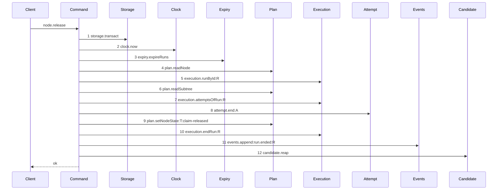

# Story 2 — The release pays no attempt

Epic: `.agents/plan/epics/054.4-the-run-lifecycle-pays-its-attempt.md`
Depends on: Story 1 (`01-the-expiry-pass-ends-the-attempt`), for `"054.4"` in `authoredEpics`; EPIC 054 Story 1 (`01-migration-16`), for `attempt.termination`; EPIC 054 Story 6 (`06-the-evidence-union-and-the-classifiers`), for the `worker-released` and `ancestor-ended` evidence members; EPIC 054.1 Story 1 (`01-a-semantic-ending-and-an-accepted-one`), for the command and for the `attempt.end` projection EPIC 054.2 Story 1 (`01-the-unreachable-candidate-pays-its-attempt`) adds; EPIC 051.6 Story 2 (`02-the-release-reaps`), for `release-reap`, the diagram this one supersedes, and for the `candidate` key and the `Expiry` tightening it applies to this command; EPIC 050.4 Story 5 (`05-the-release-drops-the-lease`), for the removal of the three `lease` calls.
Kind: story-implement

Diagrams: release-reap-paid

Supersedes: EPIC 051.6 release-reap

Seams: release-reap-paid: -execution.closeAttempt:A, +attempt.end:A

**The removal carries no `@file:line` anchor, and that is correct.** `.agents/plan/authoring.md:302` — `A removal from a path no baseline draws cites its source` reaches a token the prior diagram does not hold. This diagram's prior set is the live diagram it supersedes, and that diagram draws `execution.closeAttempt:A`, so the subtraction has its evidence in the pair itself. `.agents/plan/stories/050.4-the-node-lease-removal/05-the-release-drops-the-lease.md:11` — `lease.read` is the precedent: it anchors the one removal its prior diagram lacks and leaves `-lease.release:T` unanchored, over the same `Supersedes:`-without-`Baselines:` shape.

This story leaves the external sweep to Story 3 (`03-the-external-sweep-pays-its-attempt`) and the startup recovery to Story 4 (`04-the-startup-recovery-pays-its-attempt`).

**A path an earlier epic already drew has no `baseline-` diagram.** Its prior set is `release-reap`, so this story declares `Supersedes:` where a first change declares `Baselines:`.

## The path

### `release-reap-paid`

Supersedes: EPIC 051.6 release-reap

Fixture: the fixture of `release-reap`. Task `T` running under run `R`, **one** open attempt `A`, the attempt limit not reached, and the node's `ambiguous_used` null. Beside it sits one **active** run `E` over a second task whose `expires_at` is behind `now`, whose `run_base` row names the loopback bare repository and whose candidate ref exists, so the expiry pass of step 3 is what ends it and step 12 receives a one-element list.



**Step 8 is the only change, and nothing else moves.** `execution.closeAttempt:A` becomes `attempt.end:A` at the same position. Steps 1 to 7 and 9 to 12 keep the tokens, the labels and the order `release-reap` draws, and every one of them is a context token no story declares. A rewrite that moved the close after the node write, or that dropped the attempt read of step 7, fails the comparison.

**The exhausted arm is not a second diagram.** `.agents/plan/stories/050.2-the-run-renew-release-and-report/05-the-release.md:16` — `projected.exhausted` already ruled it: after the release story its token set equals the drawn one and only its outcome value differs, and `.agents/plan/authoring.md:166` — `A branch that changes a value and not the call` is not a diagram. `attempt.end` enters both arms as one token, at one label, so the ruling holds unchanged. What proves the exhausted arm is case 3.

**The objective release arm is undrawable, and its cascade close is stated in prose.** `.agents/plan/stories/050.4-the-node-lease-removal/05-the-release-drops-the-lease.md:11` — `lease.read` states why: the arm's per-child calls repeat with no projection to separate them. The cascade close at `src/commands/node/release-node.ts:262` — `closeAttempt` therefore belongs to no `Seams:` line of this story, and section 3 of `## Change` names it with its line. Case 4 asserts it by value.

**The drawn set is every branch of this path that this story changes.** `node.release` has three arms — the drawn task arm, the exhausted task arm at `src/commands/node/release-node.ts:123` — `projected.exhausted`, and the objective arm at `src/commands/node/release-node.ts:203` — `releaseObjective`. All three reach `attempt.end` and no other new call, and the two undrawn arms are asserted by cases 3 and 4.

**Add `test/sequence/scenarios/release-reap-paid.ts`**, and **delete `test/sequence/scenarios/release-reap.ts`** in the same turn.

## Change

**Edit `src/commands/node/release-node.ts` — close every attempt through `end-attempt`, and charge the class each site observed.** The boundary is the three `execution.closeAttempt` call sites. No read moves, no write moves, no arm gains or loses a step, and the transaction of `src/commands/node/release-node.ts:62` — `storage.transact` still holds every one of them.

### 1 — the narrowed `attempt` dependency

Add one key beside the `candidate` key EPIC 051.6 Story 2 puts on `src/commands/node/release-node.ts:24` — `ReleaseNodeDependencies`:

```ts
type AttemptEnd = Readonly<{
  end(
    transaction: Transaction,
    input: Readonly<{
      attemptId: string;
      runId: string;
      nodeId: string;
      attemptNo: number;
      outcome: "cancelled";
      evidence:
        | Readonly<{ kind: "worker-released" }>
        | Readonly<{ kind: "ancestor-ended"; ancestorRunId: string }>;
    }>,
  ): void;
}>;
```

**The key is `attempt` and the method is `end`.** The reason is the one Story 1 states: `test/helpers/sequence-conformance.ts:113` — `typeof capability !== "object"` records nothing for a function-valued key, and `objective.aggregate` is the shipped nested-command idiom. **The type is narrowed here and not imported**, because `eslint.config.js:221` — `command` forbids a command importing another command. The union holds the two members this command produces and no third.

### 2 — the two task closes become `worker-released`

Replace the exhausted-arm close at `src/commands/node/release-node.ts:124` — `closeAttempt` and the ready-arm close at `src/commands/node/release-node.ts:166` — `closeAttempt`, each with the same call:

```ts
dependencies.attempt.end(transaction, {
  attemptId: open.id,
  runId: run.id,
  nodeId: node.id,
  attemptNo: open.attemptNo,
  outcome: "cancelled",
  evidence: { kind: "worker-released" },
});
```

`open` is bound at `src/commands/node/release-node.ts:106` — `openAttempts[0]`, and `AttemptRecord` carries `attemptNo` at `src/services/execution/index.ts:32` — `attemptNo`, so both values are already in scope at both sites. **Both arms charge the same evidence.** A worker that returns its claim reports no failure of the work, and EPIC 054's ruling of 2026-09-03 makes that `infrastructure` whether or not the run's limit is already spent.

**Do not touch the accounting projection.** `src/commands/node/release-node.ts:113` — `accountAttempts` already carries `termination: "infrastructure"` from EPIC 054, and it runs **before** the close because it decides the arm. Its projection of the still-open attempt is what makes `src/commands/node/release-node.ts:134` — `attempt-limit` reachable only when an **earlier** attempt of the same run carried a semantic termination. Case 2 asserts both directions.

**Do not touch `src/commands/node/release-node.ts:138` — `endRun`** or the exhausted arm's `blocked` outcome. The class this story writes lives on the attempt row, and the run outcome is a different fact.

### 3 — the objective cascade close becomes `ancestor-ended`

`src/commands/node/release-node.ts:262` — `closeAttempt` sits in the per-child loop of `releaseObjective`, one call per still-open attempt of each active child run. Replace it with:

```ts
dependencies.attempt.end(transaction, {
  attemptId: attempt.id,
  runId: childRun.id,
  nodeId: child.id,
  attemptNo: attempt.attemptNo,
  outcome: "cancelled",
  evidence: { kind: "ancestor-ended", ancestorRunId: run.id },
});
```

`run` is the objective's **own** run, read at `src/commands/node/release-node.ts:240` — `activeRunOfNode`, and `childRun` is read at `src/commands/node/release-node.ts:248` — `activeRunOfNode`. `attempt` is the loop variable of `src/commands/node/release-node.ts:255` — `attemptsOfRun`.

**`ancestorRunId` is the objective's run and never the child's.** EPIC 054 defines the member as the run whose ending closed this attempt, and `src/commands/node/release-node.ts:274` — `endRun` is the objective's own run ending.

**A cascade close charges `ancestor-ended` and never the ancestor's own kind.** The descendant worker produced no failure and made no claim, so it pays neither an attempt nor an ambiguous budget. Case 4 asserts the descendant node's `ambiguous_used` is unchanged, which is what proves the budget was not charged.

**This loop is not drawn, and no `Seams:` token covers it.** Two children produce two `attempt.end` calls whose only difference is the attempt id, and one projection cannot separate them, so the arm stays undrawn exactly as EPIC 050.4 left it.

### 4 — the composition root binds the callable

`src/main.ts:602` — `node.release` is the handler entry, and its closure at `src/main.ts:604` — `releaseNode` calls the command. Add `attempt: { end: boundEndAttempt }` to the dependency literal at `src/main.ts:605` — `execution`, beside the `candidate` key EPIC 051.6 Story 2 adds there. `src/http/server/node/release-node.ts` and `src/cli/node/release.ts` do not change: no signature moves and the result keeps its shape.

### 5 — the retired scenario

**Delete `test/sequence/scenarios/release-reap.ts`.** `release-reap` becomes superseded the moment `test/sequence/scenarios/release-reap-paid.ts` exists, because `"054.4"` is in `authoredEpics` after Story 1. Both files existing leaves a scenario naming a superseded diagram, which `test/sequence/conformance.test.ts:115` — `names a superseded live diagram` refuses. Add the new file and delete the old one in the same turn. **The `Add \`test/sequence/scenarios/release-reap.ts\`.`line of`.agents/plan/stories/051.6-the-post-expiry-reap-on-the-run-operations/02-the-release-reaps.md:120`—`Add`stays**, because deleting it would leave EPIC 051.6 owning a live diagram that names no scenario, which`scripts/verify-epic-sequence.ts:759`—`owner.source.includes` refuses.

Do not touch `scripts/epic-sequence-range.ts`. Story 1 inserted `"054.4"` into `authoredEpics`, and Story 6 appends it to `shippedEpics`.

## Constraints

- Reproduce steps 1 to 12 in the order this diagram draws. Only step 8's token changes, and no read, write, event or reap moves.
- Both task arms pass `evidence: { kind: "worker-released" }`. Neither arm passes a `termination`, a class or a counter; `endAttempt` derives all three.
- The objective cascade passes `ancestorRunId: run.id`, the objective's own run. Passing `childRun.id` is a defect.
- Do not touch `src/commands/node/release-node.ts:113` — `accountAttempts`, its projection, or the position of `src/commands/node/release-node.ts:123` — `projected.exhausted`. The accounting decides the arm and must stay before the close.
- Do not touch `src/commands/node/release-node.ts:138` — `endRun`, `src/commands/node/release-node.ts:268` — `endRun`, `src/commands/node/release-node.ts:274` — `endRun`, or the `blocked` outcome with `attempt-limit`.
- Do not add a filter over the child loop and do not add a second `attempt.end` for a child that holds no open attempt. `src/commands/node/release-node.ts:259` — `attempt.outcome !== null` keeps its shipped guard.
- Append no event on any arm beyond the one `run.ended` of step 11. `attempt.ended` is appended by `endAttempt` inside step 8.
- Do not add the `attempt.end` entry to `test/helpers/sequence-conformance.ts:50` — `projections`. EPIC 054.2 Story 1 (`01-the-unreachable-candidate-pays-its-attempt`) owns it.
- `releaseNode` keeps the `async` signature EPIC 051.6 Story 2 gives it, and the reap stays a plain statement after the transaction returns.

## Verify

```
node --test src/commands/node/release-node.test.ts test/sequence/conformance.test.ts
```

Extend `src/commands/node/release-node.test.ts`, suite at `src/commands/node/release-node.test.ts:318` — `describe`, whose fixture is `src/commands/node/release-node.test.ts:80` — `createFixture` over real SQLite through `test/helpers/database.ts:32` — `createMigratedStorage`, whose run and attempt rows come from the real claim at `src/commands/node/release-node.test.ts:115` — `claim`, whose attempt reader is `src/commands/node/release-node.test.ts:258` — `attemptRows` (extend its column list with `termination`), whose run reader is `src/commands/node/release-node.test.ts:234` — `runRows`, and whose byte oracle is `test/helpers/database.ts:117` — `databaseBytes`.

Add, each as a separate `it`:

1. `"a task release stores infrastructure with the worker-released evidence on the branch that returns the node to ready"` — claim `T`, release it, and assert in one case: `attemptRows` shows `outcome === "cancelled"` and `termination === "infrastructure"`; the appended `attempt.ended` event's payload `evidence` deep-equals `{ kind: "worker-released" }`; `nodeState(fixture, T) === "ready"`; and `node.ambiguous_used` is still null, because an infrastructure class charges no ambiguous budget. Gate row 5.

2. `"a run whose every attempt is a release never reports exhausted, and one earlier semantic attempt still reaches the attempt-limit write"` — two halves in one case, both over the stored attempt rows of **one** run and not over a projection. **The fixture is seeded, not driven by repeated releases**: `src/commands/node/release-node.ts:138` — `endRun` and step 10 of the drawn diagram end the run, so a second claim opens a **new** run and `src/commands/node/release-node.ts:115` — `attemptsOfRun` would see one attempt each time. A release-driven fixture makes both halves vacuous.

   First half, with `ATTEMPT_LIMIT` at `3`: seed one active run `R` over `T` with `attempt_limit = 3` and exactly four attempt rows — `attemptNo` 1, 2 and 3 carrying `outcome = 'cancelled'` and `termination = 'infrastructure'`, and `attemptNo` 4 open. Release `T`, and assert `nodeState(fixture, T) === "ready"`, `nodeBlockReason(fixture, T) === null`, and that all four attempt rows store `termination === "infrastructure"`.

   Second half: the same run with `attemptNo` 1 carrying `outcome = 'failed'` and `termination = 'semantic'`, `attemptNo` 2 and 3 carrying `'cancelled'` with `'infrastructure'`, and `attemptNo` 4 open — so `accountAttempts`' `semanticCount` over the projected set is `1` at a limit of `1`. Set `attempt_limit = 1` on the run. Release, and assert `nodeState(fixture, T) === "blocked"` and `nodeBlockReason(fixture, T) === "attempt-limit"`, reaching `src/commands/node/release-node.ts:134` — `attempt-limit`. **Seed the complete ordered attempt set of both halves by value**, because `accountAttempts` reads every row of the run and a partial fixture leaves the exhaustion undecided. Gate row 6.

3. `"the exhausted release branch stores the same class as the ready branch"` — one case. Drive the fixture of case 2's second half to the exhausted arm, and assert the closed attempt stores `termination === "infrastructure"` and its `attempt.ended` payload `evidence` deep-equals `{ kind: "worker-released" }` — the same two values case 1 asserts on the ready arm — while `nodeState` is `"blocked"`. The branch that blocks the node charges no differently. Gate row 7.

4. `"an objective release stores infrastructure with ancestor-ended on the descendant attempt and leaves the descendant counter unchanged"` — claim objective `O`, claim its two child tasks so each runs under an active child run with one open attempt, release the child leases, then release `O`. Assert in one case: each descendant attempt row stores `outcome === "cancelled"` and `termination === "infrastructure"`; each `attempt.ended` payload `evidence` deep-equals `{ kind: "ancestor-ended", ancestorRunId: <O's run id> }`, by value and with `O`'s run id and not the child's; and each descendant node's `ambiguous_used` is unchanged from its seeded value. **The unchanged counter is what proves the descendant pays no crash-loop budget**, and case 1 of Story 1, which increments it on an expiry, is the control that the counter assertion detects an increment. Gate row 8.

5. `"a release reaches execution.closeAttempt only through attempt.end"` — give the command an `execution` whose `closeAttempt` throws `new Error("direct seam close")`, and bind `attempt.end` to the real `endAttempt` over a **second**, working `execution` built on the same storage. Release `T` and assert `closeAttempt` was recorded exactly once, from `src/commands/attempt/end-attempt.ts`, and that the `attempt` double recorded exactly one call.

6. `"a release whose presented run its own expiry pass ended refuses run-ended and ends no attempt"` — seed run `R` itself with `expires_at` behind `now`. Capture `databaseBytes(fixture.storage)`, release `T`, and assert the refusal is `run-ended`, the `attempt` double recorded `0` calls, and `databaseBytes(fixture.storage)` deep-equals the capture. Case 1 is the same-command control.

Add `test/sequence/scenarios/release-reap-paid.ts`, building the fixture the diagram names, running the real `releaseNode` over real SQLite and the loopback git fixture behind the recorder `test/helpers/sequence-conformance.ts:99` — `recordSeams`, aliasing `R`, `A` and the second run, binding `expiry`, `candidate` and `attempt` to **unrecorded** dependencies per `.agents/plan/authoring.md:208` — `A nested command is one step`, and returning the recorder and the result. `test/sequence/scenarios/release-reap.ts` is the shape, and the scenario is asynchronous. Delete `test/sequence/scenarios/release-reap.ts` in the same turn.

`pnpm run verify` exits 0.

Proof: PASS line delivered — `src/commands/node/release-node.test.ts` and `test/sequence/conformance.test.ts` in `PASS EPIC-054.4`.
