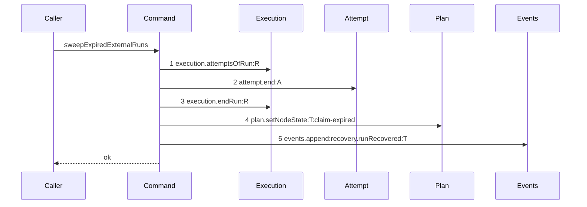

# Story 3 — The external sweep pays its attempt

Epic: `.agents/plan/epics/054.4-the-run-lifecycle-pays-its-attempt.md`
Depends on: Story 1 (`01-the-expiry-pass-ends-the-attempt`), for `"054.4"` in `authoredEpics`; EPIC 054 Story 1 (`01-migration-16`), for `attempt.termination`; EPIC 054 Story 6 (`06-the-evidence-union-and-the-classifiers`), for the `run-expired` and `ancestor-ended` evidence members; EPIC 054.1 Story 1 (`01-a-semantic-ending-and-an-accepted-one`), for the command and for the `attempt.end` projection EPIC 054.2 Story 1 (`01-the-unreachable-candidate-pays-its-attempt`) adds; EPIC 050.5 Story 1 (`01-the-external-sweep-scans-runs`), for the `git mv` to `src/commands/startup/recover-expired-runs.ts`, the rename to `sweepExpiredExternalRuns`, the run-based candidate query, the `recovery.runRecovered` event type, the case suite this story extends, and the diagram this one supersedes.
Kind: story-implement

Diagrams: sweep-external-runs-paid

Supersedes: EPIC 050.5 sweep-external-runs

Seams: sweep-external-runs-paid: -execution.closeAttempt:A, +attempt.end:A

**The removal carries no `@file:line` anchor, and that is correct.** `.agents/plan/authoring.md:302` — `A removal from a path no baseline draws cites its source` reaches a token the prior diagram does not hold. This diagram's prior set is the live diagram it supersedes, and that diagram draws `execution.closeAttempt:A`, so the subtraction has its evidence in the pair itself. `.agents/plan/stories/050.4-the-node-lease-removal/05-the-release-drops-the-lease.md:11` — `lease.read` is the precedent: it anchors the one removal its prior diagram lacks and leaves `-lease.release:T` unanchored, over the same `Supersedes:`-without-`Baselines:` shape.

This story leaves the startup recovery to Story 4 (`04-the-startup-recovery-pays-its-attempt`) and the closure count to Story 5 (`05-the-closure-is-asserted`).

**A path an earlier epic already drew has no `baseline-` diagram.** Its prior set is `sweep-external-runs`, so this story declares `Supersedes:` where a first change declares `Baselines:`.

## The path

### `sweep-external-runs-paid`

Supersedes: EPIC 050.5 sweep-external-runs

Fixture: the fixture of `sweep-external-runs`. Task `T` under objective `O`, `T` is `running`, one **active** `external` run `R` over `T` whose `expires_at` is at or behind `now`, **one** open attempt `A`, and `T`'s `ambiguous_used` null. The caller passes its own transaction, so the sweep opens none. **The fixture holds one task, one run and one open attempt**, so the descendant close of `endActiveTaskRunsUnderObjective` never runs on it.



**Step 2 is the only change, and nothing else moves.** `execution.closeAttempt:A` becomes `attempt.end:A` at the same position. The sweep still ends the attempt before it ends the run, and ends the run before it moves the node, which is the order EPIC 050.5 fixed for both recovery paths.

**No `Storage` participant appears**, because the sweep receives the transaction its caller opened at `src/commands/startup/recover-expired-leases.ts:232` — `storage.transact`. Case 1 asserts that by value.

**The sweep's cascade close is off the drawn fixture, and it is stated in prose.** `.agents/plan/stories/050.5-the-lease-table-removal/01-the-external-sweep-scans-runs.md:21` — `Fixture` states one task, one run and one open attempt, so the descendant close at `src/commands/startup/recover-expired-leases.ts:196` — `closeAttempt` never runs on it. A second `attempt.end` on one live diagram would repeat a token, which `test/helpers/sequence-conformance.ts:284` — `duplicate token in diagram` refuses, so the cascade stays undrawn, belongs to no `Seams:` line, and section 3 of `## Change` names it with its line. Case 2 asserts it by value.

**The drawn set is every branch of this path that this story changes.** The sweep's per-row loop has two arms — the task arm the diagram draws, and the objective arm at `src/commands/startup/recover-expired-leases.ts:97` — `row.kind !== "task"` that reaches the cascade first. Both reach `attempt.end` for their own run, and the objective arm's extra per-child calls are the undrawable set above. A row whose `driver` is not `external` is skipped at `src/commands/startup/recover-expired-leases.ts:94` — `row.driver !== "external"` and reaches no step at all, which EPIC 050.5 Story 1 case 5 already proves.

**Add `test/sequence/scenarios/sweep-external-runs-paid.ts`**, and **delete `test/sequence/scenarios/sweep-external-runs.ts`** in the same turn.

## Change

**Edit `src/commands/startup/recover-expired-runs.ts` — close both attempts through `end-attempt`, and charge `run-expired` for the recovered run and `ancestor-ended` for its descendants.** The file is `src/commands/startup/recover-expired-leases.ts` until EPIC 050.5 Story 1 moves it; every citation below names the shipped path and the shipped line. The boundary is the two `execution.closeAttempt` call sites, plus one field on a private function's input.

### 1 — the narrowed `attempt` dependency

Add one key to `src/commands/startup/recover-expired-leases.ts:63` — `SweepExpiredExternalLeasesDependencies`, which EPIC 050.5 Story 1 renames to `SweepExpiredExternalRunsDependencies`:

```ts
type AttemptEnd = Readonly<{
  end(
    transaction: Transaction,
    input: Readonly<{
      attemptId: string;
      runId: string;
      nodeId: string;
      attemptNo: number;
      outcome: "cancelled";
      evidence:
        | Readonly<{ kind: "run-expired" }>
        | Readonly<{ kind: "ancestor-ended"; ancestorRunId: string }>;
    }>,
  ): void;
}>;
```

**The key is `attempt` and the method is `end`**, for the reason Story 1 states. `endActiveTaskRunsUnderObjective` already shares this dependency type at `src/commands/startup/recover-expired-leases.ts:164` — `SweepExpiredExternalLeasesDependencies`, so the one key serves both call sites.

### 2 — the recovered run's close becomes `run-expired`

`src/commands/startup/recover-expired-leases.ts:106` — `attemptsOfRun` walks the attempts of `row.run_id` and skips a closed one at `src/commands/startup/recover-expired-leases.ts:110` — `attempt.outcome !== null`. Replace the close at `src/commands/startup/recover-expired-leases.ts:113` — `closeAttempt` with:

```ts
dependencies.attempt.end(transaction, {
  attemptId: attempt.id,
  runId: row.run_id,
  nodeId: row.node_id,
  attemptNo: attempt.attemptNo,
  outcome: "cancelled",
  evidence: { kind: "run-expired" },
});
```

`row.node_id` is the node id. The shipped column is `subject_id`, at `src/commands/startup/recover-expired-leases.ts:33` — `subject_id`, and EPIC 050.5 Story 1 renames it to `node_id` and re-sources it from `r.node_id` — see `.agents/plan/stories/050.5-the-lease-table-removal/01-the-external-sweep-scans-runs.md:141` — `node_id`. Use the renamed column; a story written against `subject_id` does not compile after that rename. `attemptNo` comes from `AttemptRecord` at `src/services/execution/index.ts:32` — `attemptNo`.

**The sweep runs inside the claim's transaction, and `attempt.end` joins it.** `src/commands/startup/recover-expired-leases.ts:82` — `transaction: Transaction` is the caller's, and `endAttempt` opens none of its own. **Do not wrap the call in a `storage.transact`**, and do not add a `Storage` key.

**Keep the loop.** The `for` of `src/commands/startup/recover-expired-leases.ts:106` — `attemptsOfRun` stays a loop, and `attempt.end` replaces the close inside it. Do not narrow it to a single-attempt read: this path's shipped contract closes every open attempt of the recovered run, and Story 1's single-attempt shape is `expireRuns`' own invariant, not this one's.

### 3 — the cascade close becomes `ancestor-ended`

`src/commands/startup/recover-expired-leases.ts:196` — `closeAttempt` sits in `endActiveTaskRunsUnderObjective`, one call per still-open attempt of each active child run. That function has no access to the ancestor's run id today, so **add one field to its input** at `src/commands/startup/recover-expired-leases.ts:166` — `Readonly<{`:

```ts
input: Readonly<{
  objectiveId: string;
  ancestorRunId: string;
  skipTaskIds: ReadonlySet<string>;
  outcome: string;
  at: number;
}>,
```

Pass it at the one call site, `src/commands/startup/recover-expired-leases.ts:98` — `endActiveTaskRunsUnderObjective`, as `ancestorRunId: row.run_id`.

**`row.run_id` is non-null on this path, and the field is therefore `string`.** The shipped column is nullable at `src/commands/startup/recover-expired-leases.ts:37` — `run_id`, because the shipped `CANDIDATE_SQL` selects `FROM lease l` and `LEFT JOIN run`. EPIC 050.5 Story 1 (`01-the-external-sweep-scans-runs`) replaces it with a statement whose driving table is the run itself and whose projection is `r.id AS run_id`, at `.agents/plan/stories/050.5-the-lease-table-removal/01-the-external-sweep-scans-runs.md:126` — `FROM run r`, so every candidate row after that story carries a run. **Add no null check, no `string | null` and no new `Error`**: an invariant this epic did not decide is not one to invent here, and the shipped guard at `src/commands/startup/recover-expired-leases.ts:105` — `row.run_id !== null` keeps its position and becomes dead-but-harmless narrowing that EPIC 050.5 Story 1 owns. Report a surviving nullable `run_id` on the candidate row as an EPIC 050.5 defect rather than repairing it here.

Then replace the close with:

```ts
dependencies.attempt.end(transaction, {
  attemptId: attempt.id,
  runId: childRun.id,
  nodeId: child.id,
  attemptNo: attempt.attemptNo,
  outcome: "cancelled",
  evidence: { kind: "ancestor-ended", ancestorRunId: input.ancestorRunId },
});
```

`childRun` is read at `src/commands/startup/recover-expired-leases.ts:182` — `activeRunOfNode` and `child` is the loop variable of `src/commands/startup/recover-expired-leases.ts:181` — `children`.

**`ancestorRunId` is the swept objective's run and never the child's.** The descendant worker produced no failure and made no claim, so it pays neither an attempt nor an ambiguous budget. Case 2 asserts the descendant node's `ambiguous_used` is unchanged.

**This loop is not drawn, and no `Seams:` token covers it.** Two children produce two `attempt.end` calls that one projection cannot separate.

### 4 — the composition root binds the callable

`src/main.ts:383` — `sweepExpiredExternalLeases` is the one production construction of the sweep's dependency literal, at `src/main.ts:384` — `execution`. Add `attempt: { end: boundEndAttempt }` there. The two injection sites, `src/main.ts:526` — `sweepExpiredExternalLeases` and `src/main.ts:652` — `sweepExpiredExternalLeases`, pass the same closure and do not change, and neither does `src/queries/node/list-node.ts` or `src/queries/node/list-project-node.ts`: the closure's signature is unchanged.

### 5 — the retired scenario

**Delete `test/sequence/scenarios/sweep-external-runs.ts`.** `sweep-external-runs` becomes superseded the moment `test/sequence/scenarios/sweep-external-runs-paid.ts` exists, because `"054.4"` is in `authoredEpics` after Story 1. Add the new file and delete the old one in the same turn, for the reason `test/sequence/conformance.test.ts:115` — `names a superseded live diagram` states. **The `Add \`test/sequence/scenarios/sweep-external-runs.ts\`.`line of`.agents/plan/stories/050.5-the-lease-table-removal/01-the-external-sweep-scans-runs.md:85`—`Add`stays**, because`scripts/verify-epic-sequence.ts:759`—`owner.source.includes` requires EPIC 050.5's story to name a scenario for the diagram it owns.

Do not touch `scripts/epic-sequence-range.ts`. Story 1 inserted `"054.4"` into `authoredEpics`, and Story 6 appends it to `shippedEpics`.

## Constraints

- The sweep opens no transaction. Do not add a `Storage` key and do not call `storage.transact`.
- Reproduce steps 1 to 5 in the order this diagram draws. Close the attempt before ending the run, and end the run before moving the node.
- The recovered run's close passes `evidence: { kind: "run-expired" }`. The cascade close passes `{ kind: "ancestor-ended", ancestorRunId: input.ancestorRunId }`. Neither passes a `termination` or a counter.
- `ancestorRunId` is the swept objective's own run id. Passing `childRun.id` is a defect.
- Do not move `src/commands/startup/recover-expired-leases.ts:98` — `endActiveTaskRunsUnderObjective` or `src/commands/startup/recover-expired-leases.ts:105` — `row.run_id !== null`. The cascade still runs before the row's own close, and the null guard keeps its shipped position.
- Do not touch `src/commands/startup/recover-expired-leases.ts:119` — `endRun`, `src/commands/startup/recover-expired-leases.ts:202` — `endRun`, the raw `UPDATE lease` at `src/commands/startup/recover-expired-leases.ts:126` — `UPDATE lease`, or the candidate query.
- Do not touch `recoverExpiredRuns`, `writeRecoveryVerdict` or the three transaction call sites. Story 4 owns the per-run verdict.
- Append no event beyond the one `recovery.runRecovered` of step 5. `attempt.ended` is appended by `endAttempt` inside step 2.
- Do not add the `attempt.end` entry to `test/helpers/sequence-conformance.ts:50` — `projections`. EPIC 054.2 Story 1 (`01-the-unreachable-candidate-pays-its-attempt`) owns it.
- Delete no candidate ref and add no `Git` or `Candidate` key. A run this sweep itself ends is in no expiry list and is reaped by `candidate.sweep` at startup.

## Verify

```
node --test src/commands/startup/recover-expired-runs.test.ts test/sequence/conformance.test.ts
```

Extend `src/commands/startup/recover-expired-runs.test.ts`, whose case suite and run fixture EPIC 050.5 Story 1 creates — its cases 1, 6 and 5 are the fixtures these cases reuse. That file is `src/commands/startup/recover-expired-leases.test.ts` today and holds only the lint case at `src/commands/startup/recover-expired-leases.test.ts:13` — `src/commands/startup/recover-expired-leases.test`, so **do not extend the shipped file**: extend the suite EPIC 050.5 Story 1 adds under the moved name. Seed attempt rows with `test/helpers/rows.ts:789` — `seedAttemptRow`, run rows with `test/helpers/rows.ts:759` — `seedRunRow`, over real SQLite through `test/helpers/database.ts:32` — `createMigratedStorage`, and the byte oracle is `test/helpers/database.ts:117` — `databaseBytes`.

Add, each as a separate `it`:

1. `"the external sweep stores ambiguous with run-expired on the recovered run's attempt, appends one attempt.ended, and opens no transaction of its own"` — the fixture of EPIC 050.5 Story 1 case 1: `R` active on `T`, `driver: "external"`, `expires_at: NOW - 1`, one open attempt `A`, `T`'s `ambiguous_used` null, `ambiguousBudget` at its default `2`. Call the sweep inside one `storage.transact` over a storage double that records its spans. Assert in one case: the attempt row stores `outcome === "cancelled"` and `termination === "ambiguous"`; exactly one `attempt.ended` event exists, whose `subjectKind` is `"attempt"`, whose `subjectId` is `A` and whose payload `evidence` deep-equals `{ kind: "run-expired" }`; `T`'s `ambiguous_used === 1`; and the storage double recorded **zero** spans opened by the sweep itself. Gate row 8a.

2. `"the sweep's cascade close of a descendant task run stores ancestor-ended and leaves the descendant counter unchanged"` — the fixture of EPIC 050.5 Story 1 case 6, which the drawn diagram does not hold: an expired `external` **objective** run over `O`, plus two child tasks each `running` under an active child run with one open attempt, and each child node's `ambiguous_used` seeded to `0`. Call the sweep and assert in one case: each descendant attempt row stores `outcome === "cancelled"` and `termination === "infrastructure"`; each `attempt.ended` payload `evidence` deep-equals `{ kind: "ancestor-ended", ancestorRunId: <O's run id> }`, by value and with the objective's run id and not the child's; and each descendant node's `ambiguous_used` is still `0`. **The unchanged counter is what proves the descendant pays no crash-loop budget**, and case 1's increment to `1` is the control that the counter assertion detects an increment. Gate row 8b.

3. `"a swept objective closes its own attempt with run-expired and its descendants with ancestor-ended, in one pass"` — the fixture of case 2 with the objective's own run carrying one open attempt. Assert the objective's attempt stores `evidence` `{ kind: "run-expired" }` while each descendant attempt stores `ancestor-ended`. This is the control that the two evidence kinds are not swapped, which case 1 and case 2 alone cannot detect.

4. `"a swept run whose only attempt is already closed writes no termination"` — seed the fixture of case 1 with the single attempt row carrying `outcome = 'accepted'` and a null `termination`. Assert the run still ends with `outcome = 'expired'`, the node still returns to `ready`, and the attempt row's `outcome` is still `"accepted"` and its `termination` still null. Case 1 is the control that the assertion detects a written termination.

5. `"an internal expired run reaches no attempt.end"` — the fixture of EPIC 050.5 Story 1 case 5, `driver: "internal"`, with one open attempt. Capture `databaseBytes`, call the sweep, and assert the `attempt` double recorded `0` calls and `databaseBytes` deep-equals the capture. The internal half is Story 4's, and this case is the guard that this story did not take it.

6. `"a sweep of a node whose ambiguous_used already equals the budget stores semantic"` — the fixture of case 1 with `T`'s `ambiguous_used` seeded to `2` and `ambiguousBudget` at `2`. Assert the attempt row stores `termination === "semantic"` and `T`'s `ambiguous_used === 3`. Case 1 is the control, storing `ambiguous` under the budget over the same fixture. **This case is what lets Story 6's closure table state `semantic` at a spent budget for the sweep row**, which the epic's gate row 15 requires each class column to have a stored-value proof for.

7. `"the sweep reaches execution.closeAttempt only through attempt.end"` — give the command an `execution` whose `closeAttempt` throws `new Error("direct seam close")`, and bind `attempt.end` to the real `endAttempt` over a **second**, working `execution` built on the same storage. Run the fixture of case 1 and assert the command succeeds and the attempt row stores its termination. **The oracle is the throwing stub and not a stack walk**: a direct seam call from the command reaches the throwing `closeAttempt` and fails the case, while the close routed through `endAttempt` reaches the working one. Do not inspect a call stack for the caller file — that is neither hermetic nor deterministic, and `05-the-closure-is-asserted.md` case 1 owns the static caller identity.

Add `test/sequence/scenarios/sweep-external-runs-paid.ts`, building the fixture the diagram names — one task, one due `external` run `R`, one open attempt `A` — running the real `sweepExpiredExternalRuns` over real SQLite behind the recorder `test/helpers/sequence-conformance.ts:99` — `recordSeams`, aliasing `R`, `A` and `T`, binding `attempt` to an **unrecorded** `endAttempt` per `.agents/plan/authoring.md:208` — `A nested command is one step`, and returning the recorder and the result. `test/sequence/scenarios/sweep-external-runs.ts` is the shape. Delete `test/sequence/scenarios/sweep-external-runs.ts` in the same turn.

`pnpm run verify` exits 0.

Proof: PASS line delivered — `src/commands/startup/recover-expired-runs.test.ts` and `test/sequence/conformance.test.ts` in `PASS EPIC-054.4`.
