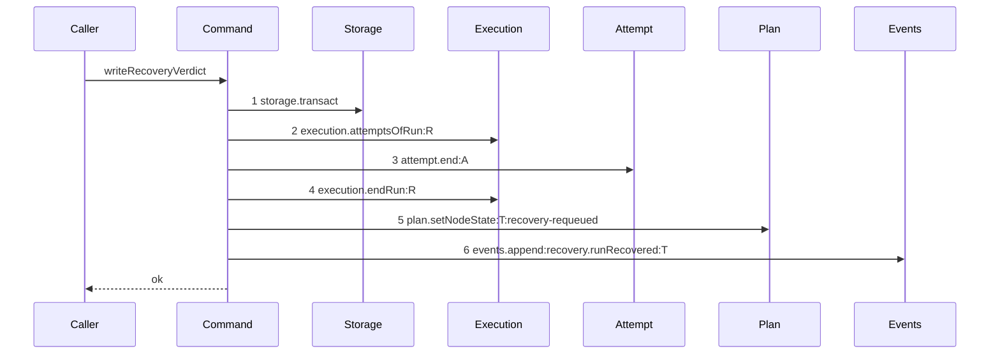

# Story 4 — The startup recovery pays its attempt

Epic: `.agents/plan/epics/054.4-the-run-lifecycle-pays-its-attempt.md`
Depends on: Story 1 (`01-the-expiry-pass-ends-the-attempt`), for `"054.4"` in `authoredEpics`; EPIC 054 Story 1 (`01-migration-16`), for `attempt.termination` and `node.ambiguous_used`; EPIC 054 Story 6 (`06-the-evidence-union-and-the-classifiers`), for the `run-expired` evidence member **and for the amendment that gives it the driver `both`** — see the ruling below; EPIC 054.1 Story 1 (`01-a-semantic-ending-and-an-accepted-one`), for the command and for the `attempt.end` projection EPIC 054.2 Story 1 (`01-the-unreachable-candidate-pays-its-attempt`) adds; EPIC 050.5 Story 2 (`02-startup-recovery-scans-runs`), for the rename to `recoverExpiredRuns`, the exported nested command `writeRecoveryVerdict`, the three seam calls it adds to the verdict, and the diagram this one supersedes; EPIC 050.5 Story 1 (`01-the-external-sweep-scans-runs`), for the moved file and the case suite this story extends.
Kind: story-implement

Diagrams: recovery-verdict-run-paid

Supersedes: EPIC 050.5 recovery-verdict-run

Seams: recovery-verdict-run-paid: -execution.closeAttempt:A, +attempt.end:A

**The removal carries no `@file:line` anchor, and that is correct.** `.agents/plan/authoring.md:302` — `A removal from a path no baseline draws cites its source` reaches a token the prior diagram does not hold. This diagram's prior set is the live diagram it supersedes, and that diagram draws `execution.closeAttempt:A`, so the subtraction has its evidence in the pair itself. `.agents/plan/stories/050.4-the-node-lease-removal/05-the-release-drops-the-lease.md:11` — `lease.read` is the precedent: it anchors the one removal its prior diagram lacks and leaves `-lease.release:T` unanchored, over the same `Supersedes:`-without-`Baselines:` shape.

This story leaves the closure count to Story 5 (`05-the-closure-is-asserted`) and the proposal to Story 6 (`06-the-proposal-records-the-lifecycle`).

**A path an earlier epic already drew has no `baseline-` diagram.** Its prior set is `recovery-verdict-run`, so this story declares `Supersedes:` where a first change declares `Baselines:`.

**This path's runs are `internal`, and `run-expired` must therefore carry the driver `both`.** `src/commands/startup/recover-expired-leases.ts:229` — `internalRows` is the set the per-run verdict walks, and `src/commands/startup/recover-expired-leases.ts:228` — `externalRows` goes to Story 3's sweep instead. `endAttempt` selects `classifyInternal` or `classifyExternal` from the run row, so an `external`-only kind could not classify this path's evidence at all. **EPIC 054 carries the driver `both`**, at `.agents/plan/epics/054-attempt-classification-and-the-supervisor.md:60` — `run-expired`, and `internalEvidenceKinds` holds the kind at `.agents/plan/stories/054-attempt-classification-and-the-supervisor/06-the-evidence-union-and-the-classifiers.md:61` — `run-expired`. The epic's gate row 9 names `run-expired` as the value this path stores, and the classifier now accepts it.

## The path

### `recovery-verdict-run-paid`

Supersedes: EPIC 050.5 recovery-verdict-run

Fixture: the fixture of `recovery-verdict-run`. Task `T` `running` with an active **`internal`** run `R` whose `expires_at` is at or behind `now`, **one** open attempt `A`, a `run_base` row holding the recorded base, a workspace whose worktree is clean at that base so the verdict is `ready`, and `T`'s `ambiguous_used` null. The verdict opens its own transaction, so `Storage` is step 1.



**Step 3 is the only change, and nothing else moves.** `execution.closeAttempt:A` becomes `attempt.end:A` at the same position. The verdict still opens one transaction per candidate, still ends the attempt before the run and the run before the node, and every write still sits inside step 1, so a failure at step 6 leaves the run `active`, the fence unchanged and the node `running`.

**The `blocked` verdict is not a second diagram.** `src/commands/startup/recover-expired-leases.ts:333` — `verdict.target` branches only the node target, the trigger and the event type, all of them **after** step 3. The close is unconditional and sits before the branch, so both arms hold this diagram's token at one label. `.agents/plan/authoring.md:166` — `A branch that changes a value and not the call` keeps the pair at one diagram, and drawing the blocked arm would give this story a second live diagram. Case 3 asserts it by value.

**The outer pass stays undrawable, and this diagram is the drawn unit.** `.agents/plan/stories/050.5-the-lease-table-removal/02-startup-recovery-scans-runs.md:15` — `storage.transact` states that the outer pass opens three transaction spans and would need a discriminator the parser refuses outside a baseline. Case 4 asserts the three spans by value instead.

**The drawn set is every branch of this path.** `writeRecoveryVerdict` has two arms — the `ready` arm the diagram draws and the `blocked` arm above — and no refusal. A candidate whose workspace is unreadable reaches the `blocked` arm through `src/commands/startup/recover-expired-leases.ts:285` — `writeVerdict`, which is the same arm at a different call site and not a third branch.

**No cascade close exists on this path.** `src/commands/startup/recover-expired-leases.ts:249` — `row.kind !== "task"` refuses a non-task internal candidate with the finding `lease-expired-on-non-task` and never reaches the verdict, so the internal pass has no descendant run to close. The epic's gate row 10 states this in its own text and asks for no cascade close here; the one cascade of that file is the sweep's, at `src/commands/startup/recover-expired-leases.ts:196` — `closeAttempt`, which gate row 8b assigns to Story 3. This story therefore carries row 10's transaction-span half and no cascade case.

**Add `test/sequence/scenarios/recovery-verdict-run-paid.ts`**, and **delete `test/sequence/scenarios/recovery-verdict-run.ts`** in the same turn.

## Change

**Edit `src/commands/startup/recover-expired-runs.ts` — close the recovered run's attempt through `end-attempt`, charging `run-expired`.** The file is `src/commands/startup/recover-expired-leases.ts` until EPIC 050.5 Story 1 moves it; every citation below names the shipped path and the shipped line. The boundary is the one close EPIC 050.5 Story 2 adds to the verdict, plus one dependency key on two types.

### 1 — the narrowed `attempt` dependency, on the verdict and on the pass

Add one key to the `WriteRecoveryVerdictDependencies` that EPIC 050.5 Story 2 creates:

```ts
type AttemptEnd = Readonly<{
  end(
    transaction: Transaction,
    input: Readonly<{
      attemptId: string;
      runId: string;
      nodeId: string;
      attemptNo: number;
      outcome: "cancelled";
      evidence: Readonly<{ kind: "run-expired" }>;
    }>,
  ): void;
}>;
```

**The key is `attempt` and the method is `end`**, for the reason Story 1 states. **The type is narrowed here and not imported**, because `eslint.config.js:221` — `command` forbids a command importing another command, and `evidence` holds the one member this path produces.

Add the same key to `src/commands/startup/recover-expired-leases.ts:13` — `RecoverExpiredLeasesDependencies`, which EPIC 050.5 Story 2 renames to `RecoverExpiredRunsDependencies`, and pass it into the injected `writeRecoveryVerdict` there. **Do not add it to `SweepExpiredExternalRunsDependencies`**: Story 3 owns that key, and the outer pass already builds the sweep's literal separately at `src/commands/startup/recover-expired-leases.ts:235` — `plan`.

### 2 — the verdict's close becomes `run-expired`

EPIC 050.5 Story 2 adds an attempt read, a close and an `endRun` to the verdict, in the order `sweepExpiredExternalRuns` uses. Replace that close with:

```ts
dependencies.attempt.end(transaction, {
  attemptId: attempt.id,
  runId: run.id,
  nodeId: row.node_id,
  attemptNo: attempt.attemptNo,
  outcome: "cancelled",
  evidence: { kind: "run-expired" },
});
```

`row.node_id` is the node id after EPIC 050.5 Story 1 renames the shipped `subject_id` at `src/commands/startup/recover-expired-leases.ts:33` — `subject_id` and re-sources it from `r.node_id`. `attemptNo` comes from `AttemptRecord` at `src/services/execution/index.ts:32` — `attemptNo`. `run` is the active run EPIC 050.5 Story 2's read binds; the candidate row already carries its id at `src/commands/startup/recover-expired-leases.ts:37` — `run_id`.

**The close stays unconditional and stays before `src/commands/startup/recover-expired-leases.ts:330` — `setNodeState`.** Do not move it inside the `verdict.target` branch: both arms charge the same class, and a branched close would make the blocked arm a second diagram.

**Keep the transaction where it is.** `src/commands/startup/recover-expired-leases.ts:329` — `storage.transact` is step 1 of this diagram, and `attempt.end` runs inside it. One transaction per candidate is what lets one unreadable workspace block one node without failing the pass. **Do not fold the three call sites of the outer pass into one**, and do not move the git reads at `src/commands/startup/recover-expired-leases.ts:278` — `worktreeClean` and `src/commands/startup/recover-expired-leases.ts:279` — `resolveRef` inside a transaction.

### 3 — the composition root binds the callable

`src/main.ts:343` — `recoverExpiredLeases` is the one production call of the pass, and its dependency literal is at `src/main.ts:344` — `execution`. Add `attempt: { end: boundEndAttempt }` there. `src/main.ts:342` — `leases` keeps its step name, because `.agents/plan/stories/050.5-the-lease-table-removal/02-startup-recovery-scans-runs.md` forbids renaming the `leases` step, `LeasesStep`, `LeasesResultLike` and `RecoverHomeDependencies.leases`.

### 4 — the retired scenario

**Delete `test/sequence/scenarios/recovery-verdict-run.ts`.** `recovery-verdict-run` becomes superseded the moment `test/sequence/scenarios/recovery-verdict-run-paid.ts` exists, because `"054.4"` is in `authoredEpics` after Story 1. Add the new file and delete the old one in the same turn, for the reason `test/sequence/conformance.test.ts:115` — `names a superseded live diagram` states. **The `Add \`test/sequence/scenarios/recovery-verdict-run.ts\`.`line of`.agents/plan/stories/050.5-the-lease-table-removal/02-startup-recovery-scans-runs.md:116`—`Add`stays**, because`scripts/verify-epic-sequence.ts:759`—`owner.source.includes` requires EPIC 050.5's story to name a scenario for the diagram it owns.

Do not touch `scripts/epic-sequence-range.ts`. Story 1 inserted `"054.4"` into `authoredEpics`, and Story 6 appends it to `shippedEpics`.

## Constraints

- Reproduce steps 1 to 6 in the order this diagram draws. The verdict keeps its own `storage.transact` as step 1, and ends the attempt before the run and the run before the node.
- The close is unconditional and sits before the `verdict.target` branch. Both arms charge the same class.
- The call passes `evidence: { kind: "run-expired" }` and no `termination`, no class and no counter. `endAttempt` derives all three.
- Do not add a cascade close. The internal pass reaches no descendant run, and `src/commands/startup/recover-expired-leases.ts:252` — `lease-expired-on-non-task` is why.
- Keep the three transaction call sites of the outer pass: the candidate read at `src/commands/startup/recover-expired-leases.ts:219` — `storage.transact`, the sweep at `src/commands/startup/recover-expired-leases.ts:232` — `storage.transact`, and one per internal candidate at `src/commands/startup/recover-expired-leases.ts:329` — `storage.transact`.
- Do not touch `sweepExpiredExternalRuns` or `endActiveTaskRunsUnderObjective`. Story 3 owns both.
- Do not change the git verdict. `clean && head === base` decides `ready` against `blocked`, per `src/commands/startup/recover-expired-leases.ts:302` — `clean && head === row.base_oid`.
- Do not change `RecoveryReport`'s field names, the `leases` step name, or `src/domain/recovery.ts`'s finding codes.
- Do not add the `attempt.end` entry to `test/helpers/sequence-conformance.ts:50` — `projections`. EPIC 054.2 Story 1 (`01-the-unreachable-candidate-pays-its-attempt`) owns it.
- Append no event beyond the one of step 6. `attempt.ended` is appended by `endAttempt` inside step 3.

## Verify

```
node --test src/commands/startup/recover-expired-runs.test.ts test/sequence/conformance.test.ts
```

Extend `src/commands/startup/recover-expired-runs.test.ts`, whose case suite and run fixture EPIC 050.5 Stories 1 and 2 create. That file is `src/commands/startup/recover-expired-leases.test.ts` today and holds only the lint case at `src/commands/startup/recover-expired-leases.test.ts:13` — `src/commands/startup/recover-expired-leases.test`, so **do not extend the shipped file**. Seed attempt rows with `test/helpers/rows.ts:789` — `seedAttemptRow`, run rows with `test/helpers/rows.ts:759` — `seedRunRow`, workspaces with `test/helpers/rows.ts:717` — `seedWorkspaceOnNode`, over real SQLite through `test/helpers/database.ts:32` — `createMigratedStorage`, and the byte oracle is `test/helpers/database.ts:117` — `databaseBytes`.

Add, each as a separate `it`:

1. `"a startup recovery of an expired run stores ambiguous with run-expired and appends one attempt.ended per recovered run"` — seed **two** internal candidates, each `running` under an active `internal` run whose `expires_at` is behind `now`, each with one open attempt, each workspace clean at its recorded base, and each node's `ambiguous_used` null, with `ambiguousBudget` at its default `2`. Run the pass and assert in one case: both attempt rows store `outcome === "cancelled"` and `termination === "ambiguous"`; exactly **two** `attempt.ended` events exist, one per recovered run, each with `subjectKind === "attempt"` and its own attempt id as `subjectId`, and each payload `evidence` deep-equals `{ kind: "run-expired" }`; and each node's `ambiguous_used === 1`. Two candidates, because one cannot tell one event per run from one event per pass. Gate row 9.

2. `"a recovery of a node whose ambiguous_used already equals the budget stores semantic"` — the fixture of case 1 with one candidate whose `ambiguous_used` is seeded to `2` and `ambiguousBudget` at `2`. Assert the attempt row stores `termination === "semantic"` and the node's `ambiguous_used === 3`. Case 1 is the control, storing `ambiguous` under the budget over the same fixture shape.

3. `"the blocked verdict stores the same class as the ready verdict"` — the fixture of case 1 with one candidate whose worktree is dirty, so `src/commands/startup/recover-expired-leases.ts:302` — `clean && head === row.base_oid` yields `blocked`. Assert in one case that the node is `blocked` with `block_reason === "dirty-recovery"`, **and** that its attempt row stores `termination === "ambiguous"` with an `attempt.ended` payload `evidence` of `{ kind: "run-expired" }` — the same two values case 1 asserts on the ready arm. The branch that blocks the node charges no differently.

4. `"the recovery pass still opens the three transaction spans EPIC 050.5 pinned"` — seed one **external** candidate and one **internal** candidate, both past due, so the sweep arm and the verdict arm both run. Drive the pass over a storage double that records each `transact` span, and assert the recorded count is exactly `3`: the candidate read, the sweep, and one verdict. Then seed a second internal candidate and assert the count is exactly `4`, which is what proves the third span is per candidate and not per pass. Gate row 10, transaction-span half.

5. `"a recovered run whose only attempt is already closed writes no termination"` — the fixture of case 1 with the single attempt row carrying `outcome = 'accepted'` and a null `termination`. Assert the node still reaches its verdict, the run still ends, and the attempt row's `outcome` is still `"accepted"` and its `termination` still null. Case 1 is the control that the assertion detects a written termination.

6. `"the verdict reaches execution.closeAttempt only through attempt.end"` — give the command an `execution` whose `closeAttempt` throws `new Error("direct seam close")`, and bind `attempt.end` to the real `endAttempt` over a **second**, working `execution` built on the same storage. Run the fixture of case 1 with one candidate and assert the command succeeds and the attempt row stores its termination. **The oracle is the throwing stub and not a stack walk**: a direct seam call from the command reaches the throwing `closeAttempt` and fails the case, while the close routed through `endAttempt` reaches the working one. Do not inspect a call stack for the caller file — that is neither hermetic nor deterministic, and `05-the-closure-is-asserted.md` case 1 owns the static caller identity.

7. `"a failure injected at attempt.end leaves the recovered run active and the node running"` — build an `attempt` double whose `end` throws. Capture `databaseBytes`, run the pass over one internal candidate, and assert the run row is still `active`, the node is still `running`, its `ambiguous_used` still null, and `databaseBytes` deep-equals the capture. This proves the close, the run end, the node write and the event are one transaction.

Add `test/sequence/scenarios/recovery-verdict-run-paid.ts`, building the fixture the diagram names — one `internal` due run `R` over task `T`, one open attempt `A`, a clean worktree at the recorded base — running the real `writeRecoveryVerdict` over real SQLite and the loopback git fixture behind the recorder `test/helpers/sequence-conformance.ts:99` — `recordSeams`, aliasing `R`, `A` and `T`, binding `attempt` to an **unrecorded** `endAttempt` per `.agents/plan/authoring.md:208` — `A nested command is one step`, and returning the recorder and the result. `test/sequence/scenarios/recovery-verdict-run.ts` is the shape. Delete `test/sequence/scenarios/recovery-verdict-run.ts` in the same turn.

`pnpm run verify` exits 0.

Proof: PASS line delivered — `src/commands/startup/recover-expired-runs.test.ts` and `test/sequence/conformance.test.ts` in `PASS EPIC-054.4`.
