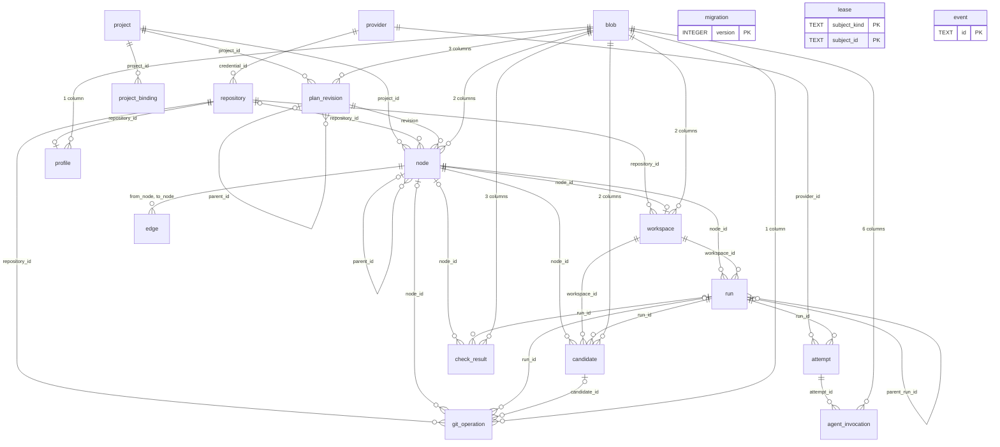
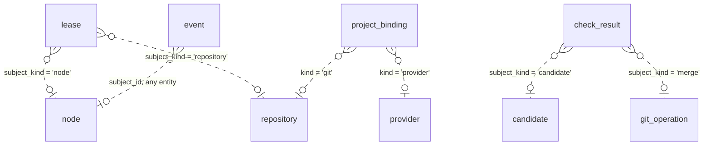

# 00 — Overview

Every table, and every table-to-table dependency. A column-level edge belongs to a detail diagram. Read this one for orientation.

Two tables hold no relation to the others. `migration` records the schema version. `event` names any entity through a polymorphic column, so it appears in [05-cross-cutting](05-cross-cutting.md).

## The four relations with no foreign key

The diagram above draws foreign keys only. Four relations are real, and the database enforces none of them. Each one needs a test.

A prefixed id makes each polymorphic value self-describing. `lease.subject_id` holds `node_`-kind or `repo_`. `project_binding.target_id` holds `repo_` or `provider_`. `check_result.subject_id` holds `candidate_` or `gitop_`. `event.subject_id` holds any prefix, and `event.subject_kind` carries no `CHECK` clause.

## Where each table is owned

| Table                                                             | Owner                                                         |
| ----------------------------------------------------------------- | ------------------------------------------------------------- |
| `provider`, `project`, `project_binding`, `repository`, `profile` | [01-registration](01-registration.md)                         |
| `plan_revision`, `node`, `edge`                                   | [02-plan-graph](02-plan-graph.md)                             |
| `workspace`, `run`, `attempt`, `agent_invocation`, `lease`        | [03-execution](03-execution.md)                               |
| `candidate`, `check_result`, `git_operation`                      | [04-verification-integration](04-verification-integration.md) |
| `blob`, `event`                                                   | [05-cross-cutting](05-cross-cutting.md)                       |
| `migration`                                                       | this file; it holds no relation                               |
