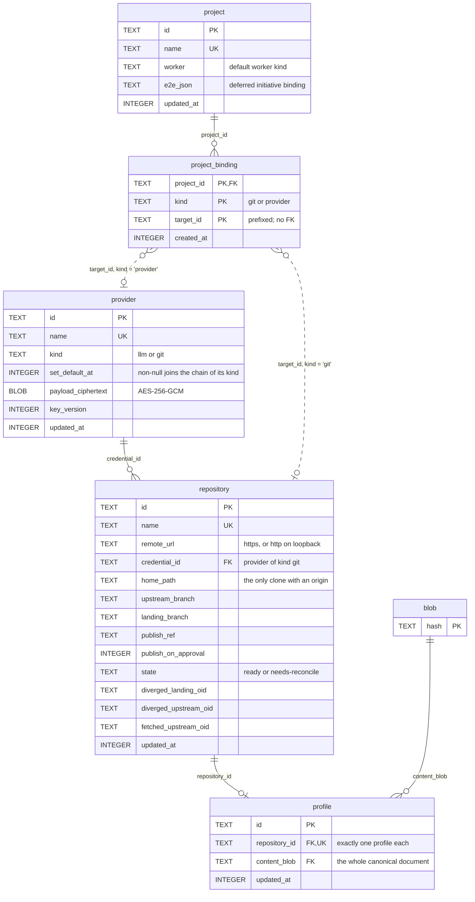

# 01 — Registration

What a human registers before any work exists. Owns [`provider`](../proposal/database/provider.md), [`project`](../proposal/database/project.md), [`project_binding`](../proposal/database/project_binding.md), [`repository`](../proposal/database/repository.md) and [`profile`](../proposal/database/profile.md).

Three questions land here. Which external accounts exist? Which project uses which repository? Which repository has which profile?

## What the shape says

**A provider row holds its own secret.** No `credential` table exists. One registration holds one credential, and `payload_ciphertext` holds the credential and the connection fields together. Every read of `provider` names its columns.

**A binding is a composite key, not an id.** `project_binding` mints no id, so it carries `created_at`. `target_id` is polymorphic and has no foreign key. The prefix makes the value self-describing, and application code holds the rule.

**A repository has zero or one profile.** `profile.repository_id` is `NOT NULL UNIQUE`. The schema does not require a profile to exist.

**A profile keeps no derived column.** `content_blob` addresses the whole document. Every reader parses the pinned document, so a check command has one truth.

**The `repository` state clause is a relation rule.** `state = 'needs-reconcile'` holds exactly when both divergence object ids are set. A repository in that state refuses every new objective clone, which stops [03-execution](03-execution.md) at the clone.

## Boundary

`blob` is a reference node. [05-cross-cutting](05-cross-cutting.md) owns it.

`node.repository_id` binds an objective to a repository. [02-plan-graph](02-plan-graph.md) owns that edge. The repository of an objective must be bound to the project of that objective through a `project_binding` row of `kind = 'git'`. No foreign key holds that rule.
