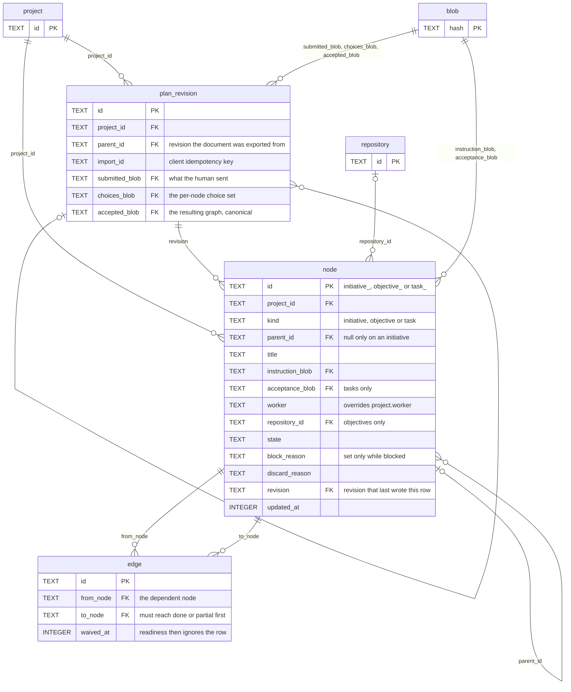
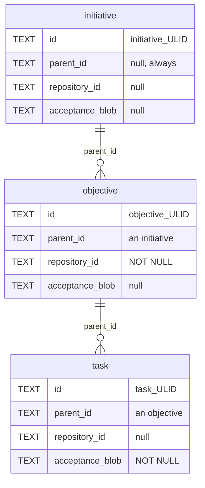

# 02 — Plan graph

The work tree, and the import that wrote it. Owns [`plan_revision`](../proposal/database/plan_revision.md), [`node`](../proposal/database/node.md) and [`edge`](../proposal/database/edge.md).

Two self-references carry this diagram. `node.parent_id` is containment. `plan_revision.parent_id` is import lineage. They are different trees over different things.

## The containment tree

`node` holds three levels in one table, and the `CHECK` clauses tie each level to its own columns.

Four `CHECK` clauses hold that shape, and each is an equality rather than an implication.

- `(kind = 'initiative') = (parent_id IS NULL)`
- `(kind = 'objective') = (repository_id IS NOT NULL)`
- `(kind = 'task') = (acceptance_blob IS NOT NULL)`
- `state <> 'awaiting_approval' OR kind = 'objective'`, and `state <> 'partial' OR kind <> 'task'`

The id prefix repeats the kind. A reference to the wrong level is visible in plan frontmatter, in a `depends_on` list and in a log line, with no lookup.

## What the shape says

**`edge` is dependency, never containment.** Containment lives in `parent_id`. `edge` connects two siblings, and no foreign key holds that rule. `UNIQUE (from_node, to_node)` blocks a duplicate, and `CHECK (from_node <> to_node)` blocks a self-edge. Neither blocks a cycle, so the import checks it.

**A waive is a column, not a delete.** `edge.waived_at` keeps the row and removes it from readiness, so the decision stays auditable.

**Every node names the revision that wrote it.** `node.revision` is `NOT NULL`. The concurrency check reads `plan_revision.parent_id`, and `UNIQUE (project_id, import_id)` makes a retry return the same revision.

**`ORDER BY id` is not creation order in `node`.** Three prefixes sort before each other bytewise. Creation order holds inside one kind, which is what the tie-break of the state machine compares. Creation order across kinds comes from `event`.

## Boundary

`project` and `repository` are reference nodes. [01-registration](01-registration.md) owns them. `blob` is a reference node. [05-cross-cutting](05-cross-cutting.md) owns it.
