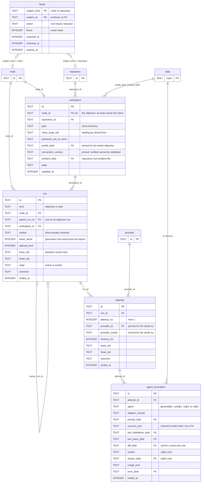
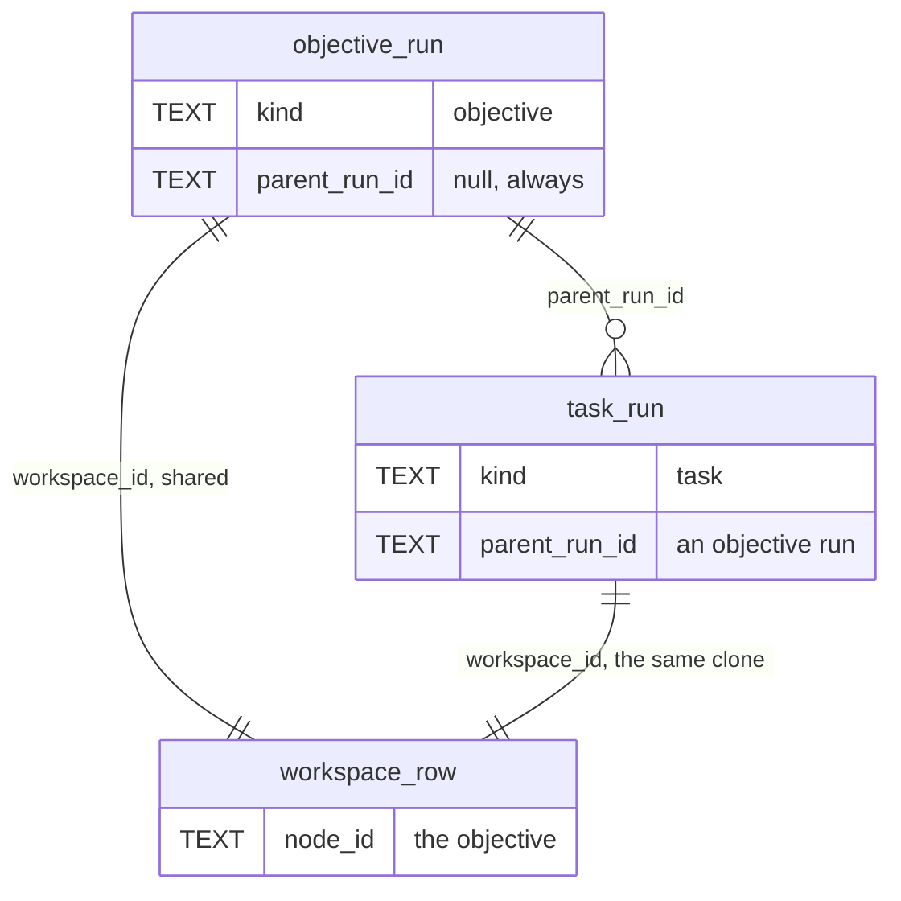

# 03 — Execution

One objective, its clone, its runs and its tries. Owns [`workspace`](../proposal/database/workspace.md), [`run`](../proposal/database/run.md), [`attempt`](../proposal/database/attempt.md), [`agent_invocation`](../proposal/database/agent_invocation.md) and [`lease`](../proposal/database/lease.md).

The spine is one chain. An objective gets one clone. A run executes a node in that clone. A task run holds tries. A try holds model calls.

## The run tree

An objective run schedules task runs. `CHECK ((kind = 'objective') = (parent_run_id IS NULL))` holds that, so a task run always has a parent and an objective run never does.

Every run under one objective points at the same `workspace` row, because `workspace.node_id` is unique on the objective. No foreign key holds that a task run and its parent share a clone, so application code holds it.

## The fence

`lease` has no foreign key to anything, and two columns elsewhere carry its generation.

| Column                      | Lease it fences                                                 |
| --------------------------- | --------------------------------------------------------------- |
| `run.lease_fence`           | the `node` lease of the objective                               |
| `git_operation.lease_fence` | the `repository` lease, in [04](04-verification-integration.md) |

`fence` never resets, so a stale holder cannot write. The fence is the reason `lease` sits beside execution rather than in a diagram of its own. It is also why the same lease reaches integration.

## What the shape says

**One clone per objective.** `workspace.node_id` is `NOT NULL UNIQUE`. Every task of that objective works in that directory.

**The pin is on the clone, not on the run.** `profile_blob`, `convention_version` and `ambient_blob` freeze at clone time. A later profile edit cannot redefine what verified meant for this objective.

**A try pins one registration and one model.** `attempt.provider_id` and `attempt.provider_model` hold for the whole try. `UNIQUE (run_id, attempt_no)` makes the attempt counter exact, and `run.attempt_limit` is the limit in force for that execution rather than the current configuration.

**Two agents run in one try.** `agent_invocation` exists because one attempt holds more than one model call. `verdict` and `reason_blob` are `re@1` only, and `diff_blob` is null for a read-only role.

**`sources_json` is not a relation.** It maps a channel to a blob hash and a provenance label. No query searches by source blob, so no join table exists and no foreign key is declared.

**One active run per node.** `run.state` is `active` or `ended`, and a partial index holds the rule.

## Boundary

`node` belongs to [02-plan-graph](02-plan-graph.md). `repository` and `provider` belong to [01-registration](01-registration.md). `blob` belongs to [05-cross-cutting](05-cross-cutting.md).

A task-diagnostic `check_result` is attributed to a run through `check_result.run_id`. [04-verification-integration](04-verification-integration.md) owns that table and that edge. `authoritative = 0` marks the diagnostic, and it gates nothing.
