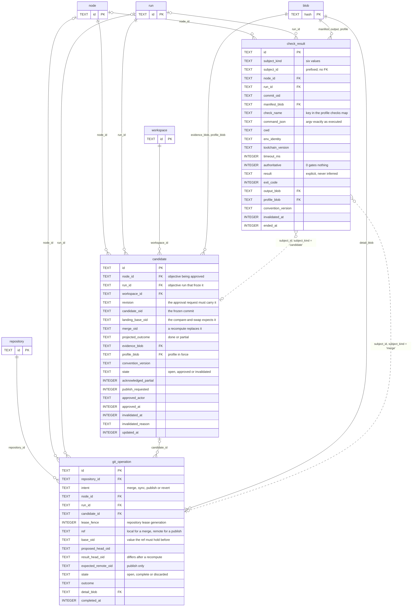

# 04 — Verification and integration

Freeze the work, judge it, write the refs. Owns [`candidate`](../proposal/database/candidate.md), [`check_result`](../proposal/database/check_result.md) and [`git_operation`](../proposal/database/git_operation.md).

The name says verification, not approval. `check_result` covers six subject kinds, and only two of them are about a candidate. A task diagnostic belongs to the execution story of [03-execution](03-execution.md), and a profile gate belongs to no run at all.

## What `check_result` judges

`subject_kind` holds six values, and they do not map one to one onto six tables. Only two of them fill `subject_id`.

| `subject_kind`    | `subject_id`      | Attributed through          |
| ----------------- | ----------------- | --------------------------- |
| `candidate`       | a `candidate_` id | `node_id`, `run_id`         |
| `merge`           | a `gitop_` id     | `node_id`, `run_id`         |
| `task-diagnostic` | null              | `run_id` of the task run    |
| `reconcile`       | null              | `node_id` may be null       |
| `profile-gate`    | null              | neither                     |
| `initiative-e2e`  | null              | `node_id` of the initiative |

`node_id` and `run_id` are both nullable, so a profile gate needs neither. `CHECK (result = 'not-applicable' OR commit_oid IS NOT NULL OR manifest_blob IS NOT NULL)` says a real check names either a commit or a manifest. A deferred initiative check uses the manifest.

## What the shape says

**A candidate freezes the evidence.** `evidence_blob`, `profile_blob` and `convention_version` are all `NOT NULL`. A later profile edit cannot redefine an approval. `UNIQUE (node_id, revision)` gives one candidate per objective revision, and the approval request must carry that revision.

**An approval is a state, not a table.** No `approval` table exists. `state`, `approved_actor` and `approved_at` sit on `candidate`. `CHECK (state <> 'approved' OR projected_outcome = 'done' OR acknowledged_partial = 1)` blocks a silent partial approval.

**An invalidation is a column pair.** `invalidated_at` and `invalidated_reason` fire when the workspace stops matching the freeze. `check_result.invalidated_at` does the same for a result whose subject changed.

**`git_operation` is a journal, not a log.** A row opens before the write and closes after git answers. `state = 'open'` is the recovery signal, and startup reconciles every open row. `base_oid` and `proposed_head_oid` are the compare-and-swap, and `result_head_oid` differs after a recompute.

**The publish is chained, not separate.** `candidate.publish_requested` asks for it, and `repository.publish_on_approval` is the default. Both produce a `git_operation` row of `intent = 'publish'`, with `expected_remote_oid` holding what the remote ref had. A null there means the ref must not exist.

**`lease_fence` is the write authority.** It is the `repository` lease generation from [03-execution](03-execution.md). A stale holder cannot write a ref.

## Boundary

`node` belongs to [02-plan-graph](02-plan-graph.md). `run` and `workspace` belong to [03-execution](03-execution.md). `repository` belongs to [01-registration](01-registration.md). `blob` belongs to [05-cross-cutting](05-cross-cutting.md).
