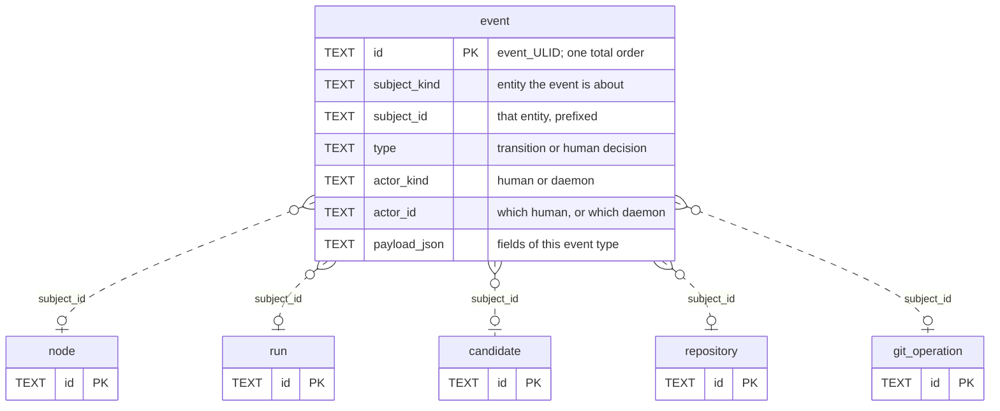

# 05 — Cross-cutting storage and audit

Two tables reach the whole schema. [`blob`](../proposal/database/blob.md) is the payload store every writer cites. [`event`](../proposal/database/event.md) is the append-only journal. Neither belongs to one lifecycle stage, and either one drawn on a lifecycle diagram hides the domain relation behind it.

## `blob` — 20 inbound columns from 8 tables

```mermaid
erDiagram
  blob {
    TEXT hash PK "sha256:<lowercase hex> of content"
    INTEGER size "refuse an oversized payload before loading"
    BLOB content "immutable once written"
    INTEGER created_at "a content hash carries no time"
  }
  profile {
    TEXT content_blob FK "the whole canonical profile document"
  }
  node {
    TEXT instruction_blob FK "what the agent is told"
    TEXT acceptance_blob FK "what re@1 judges against"
  }
  plan_revision {
    TEXT submitted_blob FK "what the human sent"
    TEXT choices_blob FK "the per-node choice set"
    TEXT accepted_blob FK "the resulting graph, canonical"
  }
  workspace {
    TEXT profile_blob FK "pinned for the objective"
    TEXT ambient_blob FK "repository root ambient file"
  }
  agent_invocation {
    TEXT prompt_blob FK "messages exactly as sent"
    TEXT tool_definitions_blob FK "tools offered to the model"
    TEXT tool_trace_blob FK "every call and its result"
    TEXT diff_blob FK "what the call produced"
    TEXT reason_blob FK "re@1 reason per criterion"
    TEXT error_blob FK "provider or adapter failure"
  }
  candidate {
    TEXT evidence_blob FK "diff, commits, discarded tasks"
    TEXT profile_blob FK "profile in force at freeze"
  }
  check_result {
    TEXT manifest_blob FK "repository-to-commit manifest"
    TEXT output_blob FK "captured output"
    TEXT profile_blob FK "profile that declared the command"
  }
  git_operation {
    TEXT detail_blob FK "verbatim git output"
  }

  blob ||--o{ profile : "1"
  blob ||--o{ node : "2"
  blob ||--o{ plan_revision : "3"
  blob ||--o{ workspace : "2"
  blob ||--o{ agent_invocation : "6"
  blob ||--o{ candidate : "2"
  blob ||--o{ check_result : "3"
  blob ||--o{ git_operation : "1"
```

| Table              | Columns | Not null                               |
| ------------------ | ------- | -------------------------------------- |
| `profile`          | 1       | `content_blob`                         |
| `node`             | 2       | `instruction_blob`                     |
| `plan_revision`    | 3       | all three                              |
| `workspace`        | 2       | `profile_blob`                         |
| `agent_invocation` | 6       | `prompt_blob`, `tool_definitions_blob` |
| `candidate`        | 2       | both                                   |
| `check_result`     | 3       | none                                   |
| `git_operation`    | 1       | none                                   |
| **Total**          | **20**  |                                        |

**A blob is never deleted while a row cites it.** No foreign key direction expresses that, because every edge points at `blob`. The rule needs application code and a test, and this picture is what the test covers.

**The address is the content.** `hash` is `sha256:` and lowercase hex. A blob is immutable, and nothing updates a row. The key carries no time, so `created_at` is a real column, unlike every table keyed by a ULID.

**A column suffix says the shape.** `_blob` holds a `blob.hash`. `_json` holds a small fixed-shape document in the row itself, and it is not a relation. `agent_invocation.sources_json` maps a channel to a blob hash and a provenance label, and it is deliberately not a join table, because no query searches by source blob.

## `event` — one journal, any subject

The targets above are examples, not a closed set. `event.subject_kind` carries no `CHECK` clause, so the schema constrains neither the kind nor the target. The prefix on `subject_id` makes a value self-describing, and nothing enforces it.

**`event` keeps one prefix and one total order.** Every other id table mints one prefix too, but `node` mints three. Creation order across node kinds therefore comes from `event` rather than from `ORDER BY node.id`.

**Append only.** Nothing updates a row and nothing deletes one. `actor_kind` and `actor_id` answer who decided, which is the audit question the table exists for.
